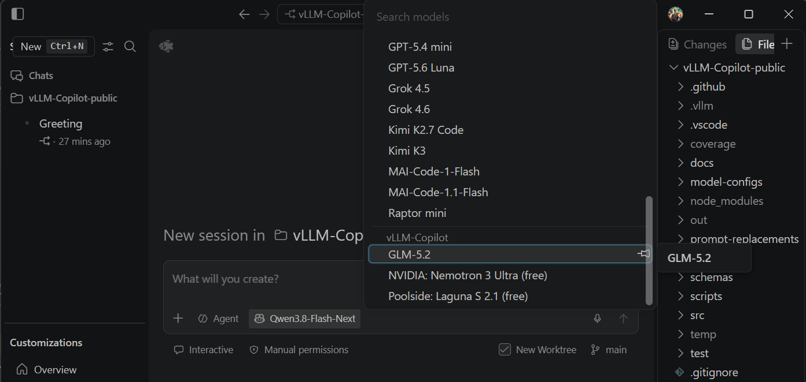

# Use vLLM models in the Agents window ("Open in Agents")

VS Code 1.135 added the **Agents window** — the `Open in Agents` button in the
title bar opens a dedicated window for orchestrating agent sessions across your
workspaces. Its sessions run in a **separate Agent Host process**, which by
default does not see models from extension providers — so your vLLM models are
simply absent there.

vLLM-Copilot changes that: since v1.35.0 it auto-enables the two VS Code
settings that expose our models to Agent Host sessions. You configure nothing —
just restart once.

| Surface | What talks to your vLLM server |
|---|---|
| VS Code Copilot Chat (ask / edit / agent) | **vLLM-Copilot** — normal chat, everything works |
| **Agents window** (`Open in Agents`, Copilot harness) | **vLLM-Copilot** via Agent Host BYOK (this guide) |
| Terminal agent (`copilot`) | **Copilot CLI BYOK** ([guide](./copilot-cli.md)) |
| Scripts / CI / your own apps | **Copilot SDK** ([guide](./copilot-cli.md#scripting-and-ci-the-copilot-sdk)) |

---

## What the extension sets for you

| Setting | Why |
|---|---|
| `chat.agentHost.byokModels.enabled: true` | Experimental VS Code switch that lets Agent Host sessions use BYOK / extension-provider models. Without it the model picker in the Agents window never asks us for models. |
| `extensions.supportAgentsWindow: { "System-Sciences.vllm-copilot": true }` | The Agents window only activates extensions you opt in by ID; our provider must run there to serve the requests. |

Rules the bootstrap follows:

- **Your explicit values win.** If you have ever written either setting yourself
  in `settings.json` — including a deliberate `false` — the extension never
  touches it. For `supportAgentsWindow` (a map of extensions), only our own
  entry is added; other extensions' entries are preserved.
- **Older VS Code is untouched.** On builds that don't know these settings,
  nothing is written.
- **Idempotent.** Written once at activation when you have at least one model
  configured.

## Requirements

1. **VS Code 1.135 or newer** (the Agent Host and both settings ship there).
2. **A fully restarted VS Code** — not just *Reload Window*. The Agent Host is
   its own process, and both settings are documented as taking effect only
   after that process restarts. Quit and relaunch.
3. **A tool-calling model** — agent sessions hide models that don't declare
   tool calling, exactly like Agent mode in the normal chat. Your server must
   serve it accordingly (`--enable-auto-tool-choice --tool-call-parser …`), the
   same requirement as the [Copilot CLI guide](./copilot-cli.md#vllm-server-requirements).
4. **Roomy context** — the agent accumulates file contents and tool results
   fast; 128k+ tokens recommended.

## Use it

1. Restart VS Code (step 2 above).
2. Click **Open in Agents** in the title bar (or `Chat: Open Agents Window`).
3. Start a new session: pick your workspace folder, Session Target =
   **Copilot**.
4. Open the model picker — your vLLM-Copilot models are listed there. Pick one,
   prompt, and your GPU does the agent loop.

## Personalities work there too

The Agents window ships its own system prompt (the Copilot CLI runtime prompt,
a different text from classic chat). Your configured **personality preset**
applies there as well: the model gets your persona's voice, the safety block is
replaced by the user-owned security protocol (risks are surfaced to you, you
decide), and the "Co-authored-by: Copilot" commit trailer instruction is
removed. **Default** (no personality) leaves that prompt untouched, as always.
See [Personalities](./custom-system-prompt.md) for the replacement mechanics.

## Fine print

- **Experimental.** Microsoft documents both settings as experimental;
  behavior may change between VS Code versions, and agent-host sessions are
  still preview territory. If the picker stays empty after a full restart,
  that is worth a bug report — to VS Code first, this extension second.
- **Model Mode / Output Length dropdowns** are rendered by VS Code from the
  metadata we provide; whether the Agents window surfaces them the same way the
  main chat does depends on the host version. If a mode seems ignored, check
  the request with `vllm-copilot.enableFileLogging` before blaming the model.
- **Utility tasks** (titles, commit messages): `chat.byokUtilityModelDefault`
  is already set to `mainAgent` by the extension, so utility flows follow your
  vLLM model instead of failing when you're signed out of Copilot.
- **The Local harness** (VS Code's built-in harness that consumes VS Code
  models directly) remains a main-window feature — the Agents window itself
  lists it as unsupported there. The Copilot harness + BYOK models is the path
  for vLLM models in that window.
- Sessions in the Agents window can use **worktree isolation**, MCP servers,
  hooks and the usual agent customizations — all harness features, none of them
  provided or affected by this extension.
