# Structural Complexity Audit

Goal: walk every main functional path of the extension, draw it as a mermaid
graph, and judge it by graph shape. Complexity that only forwards data,
duplicates ownership, or fans out without paying for it gets named and
amputated.

Started: 2026-09-03. Live document until the queue runs dry.

## Method (agreed 2026-09-03)

0. Every path section starts with **Intent**: what this flow is trying to
   do, in big-picture terms. Over-engineering can only be judged against a
   stated purpose, so no diagram without one.
1. One mermaid flow diagram per path (call flow, not file inventory).
2. Verdict from graph shape:
   - **Fan-out**: a node with many outgoing edges that could be one dispatch.
   - **Pass-through layers**: nodes that only forward data to the next node.
   - **Back-edges / loops**: state read from downstream and written back upstream.
   - **Dual ownership**: two nodes mutating the same state.
   - **Special-case branches**: one-off if-branches inside generic pipelines.
3. Each finding gets a severity and a named amputation candidate
   (file + function + what deleting/merging it would cost).
4. Nothing gets edited during diagramming. Fixes happen only after the
   findings are agreed on.
5. **Reuse-or-absorb law (pass 2, agreed 2026-09-03).** Every named thing
   (function, module, file) pays rent to exist: it must be genuinely large
   or called from at least 2 independent production sites. Rulings: unit
   tests do NOT count as a caller; "large" is judged per case (phases and
   branches, no line quota); scope covers `src/**`, `resources/*.js`,
   `scripts/*.mjs`, and test helpers. A small helper with a single caller
   gets absorbed into that caller. A sequential chain of small single-caller
   functions that performs one job collapses into ONE function; sub-steps
   become separate functions again only where something else reuses them.
   LOC is a signal, not the metric: structural simplicity is the goal,
   immense LOC growth is an anti-goal.

### Execution model: cluster-analyze, cluster-fix (agreed 2026-09-03)

Fixing per-path immediately deposits archaeology layers (shared organs get
half-fixed); analyzing all 19 before fixing anything makes early findings
stale in memory. So paths are grouped into coupling clusters. Within a
cluster: diagram all paths, merge findings, user rules on each, execute
amputations as one coherent change, tests, one commit unit. Cross-cluster
findings go to the queue and wait for the cluster that owns the organ.

| Cluster | Paths | Rationale |
|---|---|---|
| A. State layer | 7, 5 | Registry/config/migrations. Everyone reads it, settle it first |
| B. Core pipeline | 1, 2, 3, 4 | One organism; `streamOrchestrator` straddles all four |
| C. Discovery/UI surface | 6, 9, 10 | Model list + settings webview + management commands share config shape |
| D. Onboarding | 8, 19 | Preset/pick/add-server chain |
| E. Observability | 11, 12, 13, 14, 15 | Read-only consumers, low blast radius, batched late |
| F. Cross-cutting | 16, 17, 18 | Standalone, mostly independent |

Order: **A → B → C → D → E → F**. (Revised from "path 1 first": path 1's
shape is partly dictated by path 7's resolution API; diagramming 1 before 7
risks drawing fog.)

## Path inventory

| # | Path | Cluster | Main files | Status |
|---|------|---------|-----------|--------|
| 1 | Prompt processing / outbound request | B | `provider.ts`, `provider/streamOrchestrator`, `provider/systemMessagePipeline`, `provider/requestBuilder`, `tokenBudget`, `chatTransport` | diagrammed |
| 2 | Response receiving / inbound stream | B | `streamReader`, `sseParser`, `provider/consumeStream`, `provider/chatProtocol`, `provider/postStream`, `provider/outcome` | diagrammed |
| 3 | Auto-continue | B | `provider/streamOrchestrator` | diagrammed |
| 4 | Tool-call accumulation + repair | B | `sseParser`, `jsonrepair` call sites | diagrammed |
| 5 | Activation + migrations | A | `extension.ts`, `registryMigration`, `serverRegistryMigration`, `dedupeServerIds`, `outputLengthMigration`, `byok` | agreed (no commit) |
| 6 | Model discovery + Copilot model list | C | `provider/discovery`, `modelInfo`, modes, output-length menu, banners | diagrammed |
| 7 | Server registry + config storage | A | `serverRegistry`, `configStore`, `config` | agreed (no commit) |
| 8 | Add Server / Add Model flow | D | `commands/addServerFlow`, `commands/presets`, `presetRemote`, `commands/hfDiscovery`, `commands/autoConfigureFlow` | diagrammed |
| 9 | Server Settings webview | C | `serverSettingsView`, `resources/serverSettings.js` | diagrammed |
| 10 | Server management commands | C | `serverAuth`, `renameServer`, `removeServer`, `removeModel`, `testAndRefresh` | diagrammed |
| 11 | Server dashboard | E | `vllmMetrics`, `dashboard` | diagrammed |
| 12 | Deep Dive webview | E | `deepDiveView`, `resources/deepDive.js` | diagrammed |
| 13 | Diagnose Connection | E | `diagnostics` | diagrammed |
| 14 | Usage + cost reporting | E | `usageReporting`, `usageStore` | diagrammed |
| 15 | Logging | E | `logger` | diagrammed |
| 16 | OpenRouter integration (cross-cutting) | F | `openRouter`, touch points in 1/2/6/8/11 | diagrammed |
| 17 | Personality system | F | `personalityStore`, `promptReplacer`, persona/common merge | diagrammed |
| 18 | Copilot session janitor | F | `sessionManager` | diagrammed |
| 19 | Presets pipeline (dev-side) | D | `model-configs/`, `gen-preset-index`, drift canaries | diagrammed |

Decisions:
- 16 and 17 get their own standalone diagrams (agreed: yes, they have their own weirdness).
- Cluster execution model replaces the old flat order, see Method above.

## Status legend

- not started: no diagram yet
- diagrammed: graph drawn, findings pending agreement
- agreed: findings accepted/rejected, amputations extracted into the queue
- done: queue items for this path executed (or explicitly waived)

---

## Path 1: Prompt processing / outbound request

**Intent**: Take a Copilot Chat request (message history + Copilot's own
options) and turn it into a valid OpenAI-compatible chat completion POST to
the model's registered server. That means: find the model's config and server
entry, apply the selected model mode, run personality/prompt replacements
over system messages, compute the token budget for the context window,
resolve the output budget (mode/defaultParams/picker pick), and hand a
finished request to the transport. User-visible contract: what Copilot shows
in the picker must match what goes on the wire.

Status: diagrammed, findings pending verdicts

### Diagram

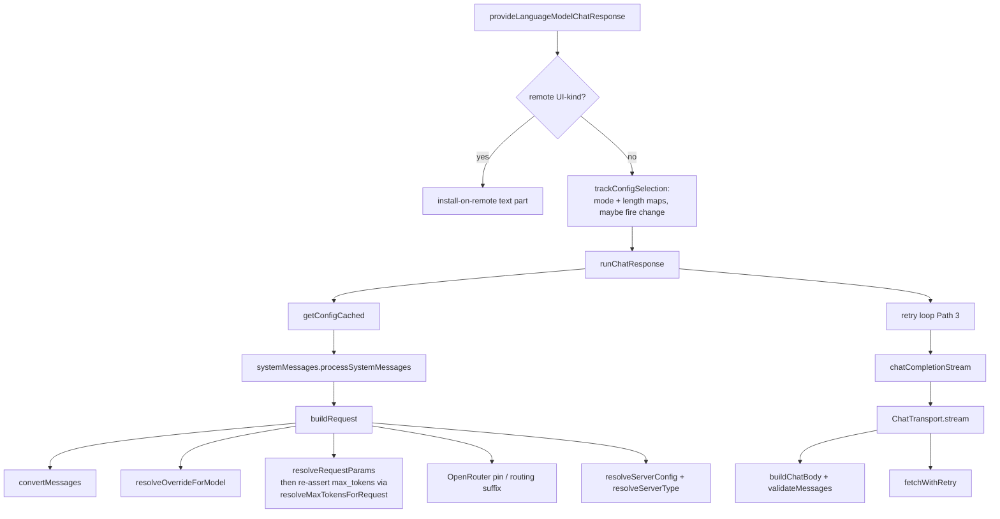

`modelConfiguration.reasoningEffort` and `maxOutputTokens` are read twice:
once in the provider (for `trackConfigSelection`) and once in `buildRequest`
(for the wire). Same `(options as any)` cast, same two fields.

### Findings

| ID | Finding | Severity |
|----|---------|----------|
| P1-1 | **`modelConfiguration` parsed twice.** Provider reads `reasoningEffort` + `maxOutputTokens` to track picker state; `buildRequest` re-reads the same two fields to build the body. Two `(options as any)` casts, two type-narrowings, two floor/finite checks that already disagree slightly (provider floors, builder does not). One `readPickerSelection(options)` returning `{mode, pickerTokens}` is the only honest helper: two call sites, same shape, already drifting. | low-med |
| P1-2 | **`resolveRequestParams` then immediately overwrites `max_tokens`.** Layering puts Copilot `modelOptions.max_tokens` into the merge, then `resolveMaxTokensForRequest` stomps it. The stomp is load-bearing (advertised == wire). The first write is wasted. Dropping `max_tokens` from the `runtimeOptions` spread (or omitting Copilot's) would shrink the comment essay that currently has to explain the stomp. | low |
| P1-3 | **P7-3 deferred here, still not Path 1's graph.** Request math (`resolveRequestParams`, `resolveMaxTokensForRequest`, `resolveModelSettings`) lives in `config.ts`. Moving it to `requestParams.ts` changes no Path 1 edges. Same Cluster A conclusion: file-size, not path complexity. | defer |

### Minimal graph

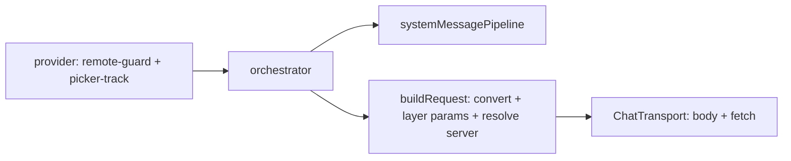

Current graph matches this. Extra nodes are OpenRouter pin/suffix (Path 16)
and the retry loop (Path 3). Neither is Path 1 fat.

## Path 2: Response receiving / inbound stream

**Intent**: Turn the server's SSE byte stream back into Copilot response
parts as it arrives: text deltas, reasoning/thinking deltas, tool calls,
usage. Parse SSE lines, JSON-parse each chunk, surface errors mid-stream,
and finish cleanly on `[DONE]`, abort, or timeout. User-visible contract:
tokens appear live and a broken stream produces an honest error, never a
silent truncation.

Status: diagrammed, findings pending verdicts

### Diagram

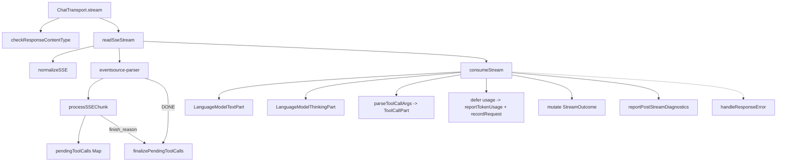

### Findings

| ID | Finding | Severity |
|----|---------|----------|
| P2-1 | **`messageConverter.ts` is four modules in one file.** Conversion (`convertMessages` and friends), tool-arg repair (`parseToolCallArgs`), error classification (`formatError` / `isTransportFailure` / TLS), image helpers. Path 2 only needs repair + a couple of error predicates. Splitting would be file hygiene, not a Path 2 graph change: consumeStream still calls `parseToolCallArgs` from somewhere. Same class as P7-3. | defer / hygiene |
| P2-2 | **Two inactivity timers.** `ChatTransport` arms a pre-fetch inactivity timer that aborts the POST; `readSseStream` races `reader.read()` against its own inactivity timer. Different phases (headers vs body), both load-bearing. Not duplication. | none |
| P2-3 | **`VllmClient.chatCompletionStream` is a pass-through** to `ChatTransport.stream`. 4-line facade, keeps `ProviderClient` stable. Deleting it would push `ChatTransport` onto every test fake. Keep. | none |

### Minimal graph

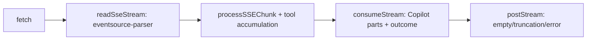

Current graph is this plus `normalizeSSE` (spec mismatch, load-bearing) and
the usage deferral (vLLM sends usage on every chunk). No extra layer.

## Path 3: Auto-continue

**Intent**: When a model returns an empty or truncation-cut response, retry
the request with an assistant prefill so the user gets an answer instead of
a blank bubble. Bounded by `autoContinueRetries`. Nothing more.

Status: diagrammed, findings pending verdicts

### Diagram

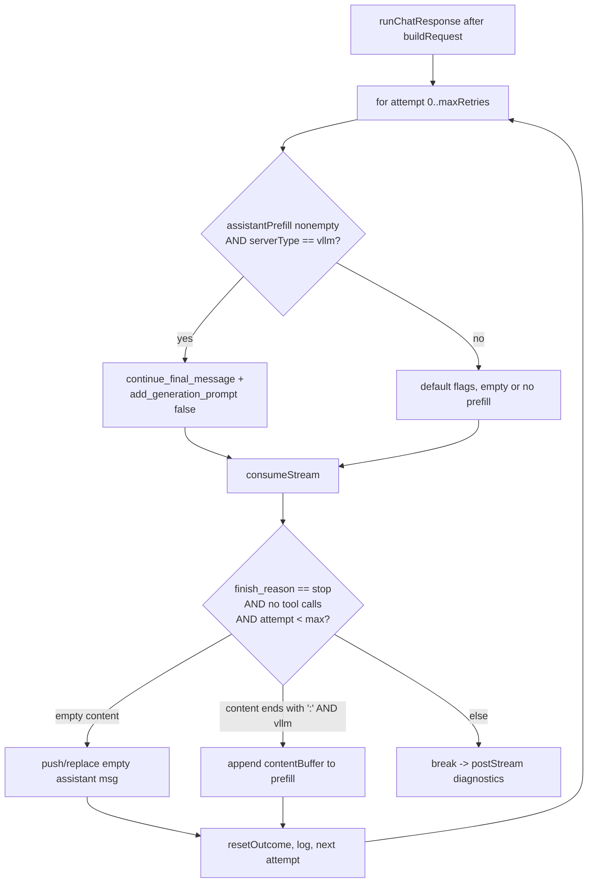

### Findings

| ID | Finding | Severity |
|----|---------|----------|
| P3-1 | **Two retry shapes in one loop, both required by the Intent.** Empty = nudge (backend-agnostic). Colon = vLLM continuation (`continue_final_message`). The `serverType === 'vllm'` gates are the Intent's "nothing more" clause made visible, not special-case rot. Splitting into two functions would duplicate the stream/consume/reset skeleton. | none |
| P3-2 | **In-place mutation of `openaiMessages`.** Prefill is pushed onto the array `buildRequest` returned; `ProviderClient` contract forbids the client from mutating it. Ugly, documented, cheaper than cloning the history every attempt. Keep. | none |

### Minimal graph

The current graph IS the minimum. Empty vs colon are two triggers, two
request shapes, one shared stream. Bounded. Matches "nothing more."

## Path 4: Tool-call accumulation + repair

**Intent**: Reassemble tool calls that arrive fragmented across SSE chunks
(name in one delta, arguments spread over dozens), and rescue malformed JSON
arguments (`jsonrepair` / best-effort parsing) so Copilot's tools actually
execute instead of dying on one missing brace from a weak model.

Status: diagrammed, findings pending verdicts

### Diagram

```mermaid
flowchart TD
    DELTA[delta.tool_calls in processSSEChunk] --> MAP[pendingToolCalls by index]
    MAP -->|id / name / args +=| MAP
    FIN[finish_reason tool_calls/stop/length<br/>OR DONE] --> FINAL[finalizePendingToolCalls]
    FINAL --> CS[consumeStream]
    CS --> PARSE[parseToolCallArgs]
    PARSE --> T1[JSON.parse]
    T1 -->|fail| T2[jsonrepair + parse]
    T2 -->|fail| T3[parsePartialJson]
    T3 -->|fail| EMPTY[null -> caller uses {}]
    PARSE --> PART[LanguageModelToolCallPart]
```

`jsonrepair` is also used by preset loading and server-auth header parsing.
Those are not Path 4.

### Findings

| ID | Finding | Severity |
|----|---------|----------|
| P4-1 | **Three-tier parse is the Intent, not ceremony.** Strict / repair-complete / recover-truncated maps onto Copilot BYOK's own stack (`best-effort-json-parser` was adopted from there). Collapsing a tier would drop truncated tool args (`finish_reason: length` mid-string). Keep. | none |
| P4-2 | **Accumulation in `sseParser`, repair in `messageConverter`.** Right split: parser is pure JSON/SSE, has no vscode; repair needs to produce Copilot `ToolCallPart` objects. Merging them would drag vscode into the parser. | none |

### Minimal graph

Current graph is the minimum: accumulate by index, finalize on terminal
reason, three-tier parse, `{}` fallback so the call does not vanish.

---

## Cluster B: self-critique before proposing (2026-09-03)

Cluster A failure mode to not repeat: naming a helper because two sites
look alike. Applied here before the user has to.

The four paths are one organism (`runChatResponse` owns 1+2+3; 4 sits
inside 2). The file split (`requestBuilder` / `consumeStream` / `postStream`
/ `outcome` / `chatProtocol` / `chatTransport`) is not pass-through
layering: each node does work the Intent names. Collapsing them would
rebuild the pre-split `provider.ts` god-file.

| ID | Original temptation | Why it fails or stands | Revised |
|----|---------------------|------------------------|---------|
| P1-1 | extract `readPickerSelection` | Two sites, already drifting (floor vs no floor). Helper is ~8 lines, kills the drift. Unlike P7-1, the duplicated *value* is the same two fields, not a coincidental RMW shape. | **keep as finding**, low-med |
| P1-2 | stop writing then stomping `max_tokens` | Real wasted write + a comment essay that exists only to explain it. Tiny. | **keep as finding**, low |
| P1-3 / P7-3 | move request math out of `config.ts` | Still not a graph change. | **defer** |
| P2-1 | split `messageConverter.ts` | File hygiene. Path 2 edges unchanged. | **defer / hygiene** |
| P2-2, P2-3, P3-*, P4-* | various collapses | Each is the Intent. | **waive now** |

**Cluster B verdict entering user review:** the pipeline graph is at the
Intent's minimum plus two small Path 1 cleanups (P1-1, P1-2). No
architecture commit required. Semantic bloat inside `resolveMaxTokensForRequest`
/ `deriveTokenBudget` is still unread at function resolution — that is
cluster C's discovery contract (advertised == wire) more than B's send path.
Flagged, not opened.

## Path 5: Activation + migrations (cluster A)

**Intent**: Get the extension from "VS Code launched" to "usable" exactly
once per install: repair or migrate anything a settings format change left
behind (registry rewrite, duplicate-id repair, output-length offer), keep
VS Code-side environment quirks patched (BYOK utility default, Agents-window
flags, remote-install warning), and register every feature surface. Hard
rules it exists to protect: never take activation down on a migration
failure, never rewrite user data twice, never rewrite it wrong.

Status: diagrammed, findings pending verdicts

### Diagram

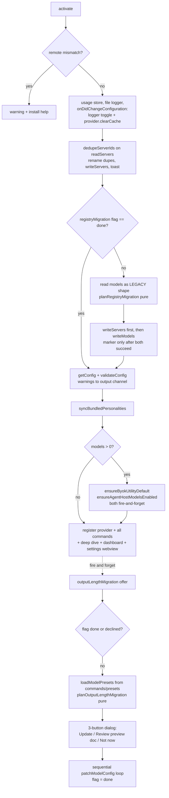

### Findings

Finding IDs: `P<path>-<n>` (P = Path; cluster labels are single letters A-F, finding IDs never collide).

| ID | Finding | Severity |
|----|---------|----------|
| P5-6 | **Inline dedupe block in `activate()`.** The duplicate-id repair is a 25-line block with its own error handling sitting inside activation, while the sibling migration (`maybeRunServerRegistryMigration`) is a module call. One asymmetric peer = one missing `maybeRepairServerIds(context, output)` module. | low |
| P5-1 | **Heaviest UI for the lightest migration.** `outputLengthMigration.ts` (236 lines) is a modal offer + JSONC preview document + nested confirm loop for a cosmetic Output-Length menu upgrade. The forced registry migration, which actually rewrites user data, got LESS ceremony than this one. Candidate: after a few releases, delete the whole module; the scalar form remains valid forever, so users lose nothing but the offer. | medium |
| P5-2 | **Layering inversion.** `outputLengthMigration` imports `commands/presets` (`loadModelPresets`, `findPresetForModel`) to reach preset vectors. Activation/state layer depends on the onboarding UI layer. Deleting P5-1 deletes this too; otherwise the preset-reader core should sit beside `config.ts`, not under `commands/`. | medium |
| P5-3 | **Triple junk-URL guard in the migration planner.** `planRegistryMigration` rejects bad URLs in three overlapping places (blank check, host-less regex, hostname + `hostSegmentOf` double-check) with three near-identical skip+report blocks. The sentinel-collision problem is genuinely load-bearing; the spread is not. One `usableServerUrl(raw): url \| reason` helper collapses it. | low-med |
| P5-4 | **Entry build logic duplicated in the planner.** Group-creation sets displayName/serverType (with the OpenRouter classification); the backfill path for later members repeats the same two fields with slightly different rules. Two code paths maintain one entry. | low-med |
| P5-5 | Noted, kept: two migration flags with different semantics (forced = `done`, offer = `done/declined/dismiss-retry`). Honest reflection of forced vs optional. No action. | none |

### Minimal graph

Activation's Intent is an ORDERED LIST of idempotent steps. The minimal
graph is that list, one node per step, zero nesting. Current graph matches
except: (1) the dedupe step is inline code, not a module (P5-6), (2) the
output-length offer drags a preset dependency from `commands/` into
activation (P5-1/P5-2), (3) the migration planner contains three
junk-URL guards and two entry-build paths where the Intent needs one of
each (P5-3/P5-4). Nothing else in Path 5 exceeds the minimum; the
ordering constraints (dedupe before migration, servers before models,
marker after writes) are load-bearing and stay.

---

## Cluster A: minimal-graph delta and execution proposal (2026-09-03)

| # | Delta current -> minimal | Findings | Net effect |
|---|--------------------------|----------|------------|
| 1 | 10 inline server-RMW sites -> `mutateServers(transform)` in `configStore` + pure per-op transforms (pattern already proven by `applyServerDisplayName`). Helpers own: read-at-write-time, changed?-then-write, error propagation. Call sites keep their selector (by-id vs URL fan-out) and side effects (cache, engines, titles). | P7-1 (scope refined), P7-7 | kills the stale-snapshot and missed-no-op bug CLASSES structurally; ~9 sites lose their plumbing comments; honest line delta is modest (-60 to -80), the invariant is the product |
| 2 | `resolveServerEntry` alias folded into `resolveServer`; dead `getConfig(_context)` param dropped | P7-2 | three names -> one lookup |
| 3 | Request math (`resolveRequestParams`, `resolveMaxTokensForRequest`, `resolveConfiguredMaxTokens`, `resolveModelSettings`, `DEFAULT_*`) moved from `config.ts` to new `requestParams.ts` | P7-3 | state layer ~500 lines, math readable by cluster B without dragging vscode imports; landing spot finalizable during B |
| 4 | deep-dive command: `firstEntryById(...).get(id)` + `resolveServer(...)` replace hand-rolled find + normalize + sanitize + type-default | P7-5, P7-6 | two documented rules become un-bypassable in their last bypass site |
| 5 | `maybeRepairServerIds(context, output)` extracted from `activate()` | P5-6 | activation = pure step list |
| 6 | Planner: one `usableServerUrl(raw)` guard + one `applyFirstDefinedFields(entry, name, type)` shared by create and backfill | P5-3, P5-4 | one junk rule, one entry-builder |
| 7 | DELETE `outputLengthMigration.ts` + its test file + activation call | P5-1, P5-2 | -236 src lines -tests; kills the layering inversion; scalar form stays valid forever, users lose only the offer. Timing: user decision (it still helps fresh-upgraders if kept) |
| 8 | `toPublicModelConfig`: keep, comment rewritten as deliberate post-migration hand-paste defense (or delete if user says no) | P7-4 | honest fossil, one line |

Out of scope, deliberately: collapsing the dual read (defended),
auto-merging redundant same-connection entries (user decision on record),
hiding the by-id/URL selector split behind one generic API (would bury a
load-bearing domain rule).

### Self-critique (2026-09-03)

Hostile re-read of every finding against the Intent, not against how many
boxes a "cleaner" graph would have. Method failure to name: the first pass
rewarded *naming things*. Several findings are file-organization TODOs
smuggled in as path complexity. Path 7's Intent is already satisfied:
two keys, one writer (`writeServers`/`writeModels`), resolve by id.
Many callers of the one writer is the design, not a missing abstraction.

| ID | Original claim | Why it fails | Revised |
|----|----------------|--------------|---------|
| P7-1 | 10 RMW sites need `mutateServers` | Count includes the migration (two-key write-order, cannot use the helper) and rename (already a pure transform + write). Remaining sites are 1-line map/filter/append. The duplicated comments are "re-read AFTER the prompt" — a command-flow fact, not a store fact. A configStore helper cannot own an await that lives in the command. False symmetry with `patchModelConfig`: models need field-level patch because the webview edits fields; servers change 1-2 fields as whole-entry replaces. | **waive** |
| P7-2 | Fold alias + drop `getConfig(_context)` | `resolveServerEntry` is a 4-line adapter (`model` -> `model.server`). 8 callers pass the dead context param; dropping it is signature churn, zero graph change. | **waive** (hygiene only if those files are open) |
| P7-3 | Split request math out of `config.ts` | Not on Path 7's graph. File-size complaint, landing spot unknown until cluster B. Moving code adds a file, changes no edges. | **defer to B** |
| P7-4 | Fossil stripper | 2 real call sites (log + webview). Hand-pasted legacy keys are a real trust-boundary. Comment rewrite is not architecture. | **keep as-is** |
| P7-5 | deep-dive must use `firstEntryById` | `firstEntryById` is documented for *iterating* the registry so shadowed entries stay invisible. Deep-dive is a single-id lookup. `.find` IS first-wins. Cargo-culting the iterate helper onto a lookup. | **waive** |
| P7-6 | hand-rolls `resolveServer` | The code already holds the entry and the comment says so. `resolveServer(id)` as the lookup (skip the find) is a 4-line cleanup, not a graph change. Collapses with P7-5. | **optional 4-line cleanup** |
| P7-7 | auth-merge sandwich ×2 | ~5 lines, twice, no third copy planned. Helper would be ~15 lines. Bug class is real (unsanitized merge doubles Authorization) but contained. | **waive** unless auth code is open |
| P5-1 | delete the offer, 438 lines of ceremony | Optional migrations NEED more UI than forced ones (consent). "Heavier than sibling" is a contract difference, not over-engineering. Recast: product question — is the 1.35 offer still earning 438 lines for remaining scalar users? | **product, not structure** |
| P5-2 | layering inversion | Contingent on P5-1. If the offer stays, `commands/presets` is the cheapest matcher. Moving the reader is cluster D. | **contingent / defer** |
| P5-3 | triple junk-URL guard | Three (four, counting `generateServerId` throw) *distinct failure classes with distinct skip reasons*. Sequential form is auditable. A tagged-union helper hides the reasons for ~10 net lines in a one-shot planner. | **waive** |
| P5-4 | create vs backfill duplication | Not the same rule. Create applies OpenRouter classification as default type; backfill is first-defined-wins and must not re-classify. A shared helper would take a flag that is the two paths leaking in. | **waive** |
| P5-6 | extract `maybeRepairServerIds` | 25-line block, one caller, ordering comment is local to `activate()` (must run before the migration). The sibling is a module because it is 132 lines of I/O+flags+two writes. Asymmetry is size. Extracting adds a file and splits the ordering comment. | **waive** |

**Cluster A verdict after critique:** the state layer's graph is already at the
minimum the Intent requires. Executing the original 8-delta plan would add
helpers and files in the name of removing them. The only live question is
P5-1 as a product call (keep or delete the output-length offer). Everything
else is waived or deferred.

What the first pass got right and should not be un-learned: (1) dual-read is
defended, (2) by-id vs URL-fan-out must stay visible at call sites, (3)
graphs find fan-out; function bodies dispose false symmetries. The miss was
treating "could be one helper" as automatically "should be."

## Path 6: Model discovery + Copilot model list

**Intent**: Make the models actually served by each registered server appear
in the Copilot model picker with truthful metadata: real context window and
output budget (clamped to what the server reports), model-mode dropdown, the
Output Length dropdown, and warning banners. Copilot advertises these values
to the user, so discovery owns the "advertised == wire" invariant.

### Diagram

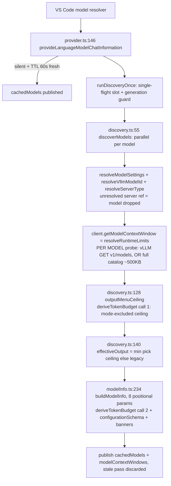

### The advertised == wire invariant

Advertised chain (per model): floor clamps inside `resolveConfiguredMaxTokens`
and `deriveTokenBudget` (output floor, window reservation, server-reported
ceiling, input floor, input room), then discovery's pick clamp
`min(pick, outputMenuCeiling)` (discovery.ts:140), then `buildModelInfo`
runs `deriveTokenBudget` a second time on the picked value.
Wire chain (`resolveMaxTokensForRequest`, config.ts:274, sole caller
requestBuilder.ts:139): picker floor, `min(requested, advertised output)`,
`min(requested, advertised window - 1)`.
They agree **by construction**: the wire clamps against the advertised number,
so it can never exceed what the picker showed. Priority order (pick > mode >
legacy) matches on both sides. Two honest asymmetries, both documented:
the server-reported output ceiling exists only in the advertised chain
(the wire inherits it transitively through possibly-stale cached metadata,
"Option A"), and the wire's window is the advertised sum while the advertised
side used the server's `max_model_len`.

### Findings

| ID | Finding | Severity |
|----|---------|----------|
| P6-1 | **Dual ownership of a RULE, not a value.** The output-budget rule is implemented twice: discovery's ceiling/pick math (`outputMenuCeiling`, `effectiveOutputTokens`) and the wire's `resolveMaxTokensForRequest`. Same contract, two formula bodies, zero shared code beyond `resolveConfiguredMaxTokens`. The picker floor `max(1, floor)` is additionally implemented three times (provider.ts:296, config.ts:277, deriveTokenBudget). No disagreement today; the invariant holds by construction. Same drift family as P1-1 (`modelConfiguration` parsed twice). Minimal shared piece: one `normalizePickerTokens()`; sharing the whole clamp chain is bigger and riskier than the drift it prevents. | low-med |
| P6-2 | **Resolver memoization missing on the discovery pass.** `discoverModels` calls `getModelContextWindow` once PER MODEL (verified discovery.ts:110). vLLM with 10 models = 10 identical `GET /v1/models` per pass; OpenRouter = one full ~500 KB catalog download per model per pass (this is P16-1, same root: `fetchOpenRouterModel` never caches the catalog, verified openRouter.ts:570-582). `testAndRefresh` groups by entry (1 probe) then calls `resolveRuntimeLimits` per matched model anyway (verified testAndRefresh.ts:229), so it pays 1+N per server. The metrics engine already has the smart pattern: one response reused for all models (vllmMetrics.ts:539). One per-pass (or short-TTL) memo keyed by (serverType, url, modelId) collapses all three storms without touching semantics. | low-med |
| (note) | `buildModelInfo` takes 8 positional params, 5 derived upstream, 3 optional scalars that silently switch budget paths. Signature hygiene, not a graph edge. Note only, no finding. | none |

### Minimal graph

Same spine: single-flight, TTL, generation guard, per-model parallel resolve,
one publish. Delta vs minimum: (1) one budget computation per model instead
of two `deriveTokenBudget` passes plus the re-derived wire copy, or at
minimum the shared picker-floor helper; (2) the per-pass resolver memo
(P6-2). No node deletions: every layer (limits resolver, ceiling, pick,
schema, banners) answers an Intent clause. The path is one finding from
lean; P6-2 is plumbing, not architecture.

## Path 7: Server registry + config storage (cluster A)

**Intent**: Own the extension's entire persistent state in two settings keys
and answer exactly two questions for every other path: "what server does this
model connect to?" and "how do I persist a change without losing anything
else?" Servers are registry entries keyed by id, models reference them. Every
server fact (URL, auth, type, label) lives on the entry, never on a model.

Status: diagrammed, findings pending verdicts

### Diagram

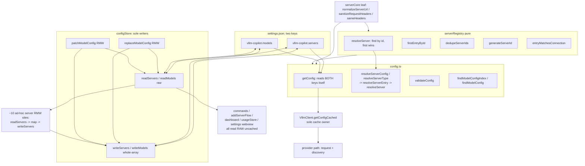

### Findings

| ID | Finding | Severity |
|----|---------|----------|
| P7-1 | **Asymmetric store API: models got `patch/replaceModelConfig`, servers got nothing.** Every server write re-implements readServers -> match by id -> mutate -> writeServers at ~10 sites (commands.ts x6, addServerFlow x4, serverSettingsView, extension dedupe). Rename fan-out, auth fan-out, entry-append are each hand-rolled. This is exactly the RMW clobber class `patchModelConfig` was built to centralize. Amputation: `updateServerEntry(id, patch)` / `addServerEntry(entry)` in `configStore.ts`, all sites route through. | med-high |
| P7-2 | **Thin resolver chain.** `resolveServerConfig` and `resolveServerType` both funnel through `resolveServerEntry`, a private pure alias for `resolveServer`. Three names, one lookup. Also `getConfig(_context)` carries an unused parameter every caller dutifully passes. Fold the alias, drop the dead param. | low |
| P7-3 | **`config.ts` mixes two layers.** State layer (identity, validation, registry reads) sits together with request-time math (`resolveRequestParams`, `resolveMaxTokensForRequest`, `resolveModelSettings`, `DEFAULT_REQUEST_PARAMS`). The math belongs to cluster B's pipeline. 742 lines, two responsibilities. Move, not delete; boundary matters for the B diagrams. | med (boundary) |
| P7-4 | **`toPublicModelConfig` strips fields the type no longer has.** `requestHeaders`/`apiKey` were removed from `ModelConfig` by the registry migration, yet the stripper casts them back in to defend against hand-edited legacy keys. Defensible (post-migration hand-paste is possible), but it is a fossil with a cast. Decide: keep as explicit defense-in-depth comment, or delete. | low |
| P7-5 | **First-wins rule implemented twice.** `firstEntryById` documents itself as THE consumer rule, yet the deep-dive command does its own `readServers().find(s => s.id === ...)`. Same semantics today; the file's own rationale says ad-hoc finds are how shadowed entries sneak back into views. Route it through `firstEntryById`. | low |
| P7-6 | **Deep-dive handler hand-rolls `resolveServer`.** It normalizes the URL, sanitizes headers, and defaults the type manually, three lines that are exactly `resolveServer(entry.id, servers)`. | low |
| P7-7 | **Auth-merge sandwich duplicated.** The sanitize-both-sides -> `mergeAuthHeaders` -> `sameHeaders`-changed trio lives in `updateServerAuth` (inside its URL fan-out loop) AND in `rotateEntryAuth` (addServerFlow), same three lines, same comment energy about spelling collisions. One pure `mergeHeadersIntoEntry(entry, incoming) -> {entry, changed}` kills both. | low-med |

### Minimal graph (what the Intent actually needs)

Read path is already minimal (dual read defended: cached for provider, raw
for write flows). The write path is where the current graph exceeds the
minimum. Deep-reading all 10 write sites downgrades the P7-1 headline: what
is duplicated is NOT the domain rule (by-id vs by-URL fan-out is a real,
documented §5 split and must stay visible at call sites) but the RMW
cycle itself: read -> transform -> changed? -> write. Plus the
stale-snapshot discipline that four sites must re-read after their prompts,
explained by near-identical comments every time. When the comment must
justify the pattern at every site, the pattern belongs in a function.

```mermaid
flowchart LR
    S[settings: servers + models] <--> ST[configStore sole writer<br/>readModels / readServers raw<br/>patch / replaceModelConfig<br/>mutateServers new<br/>writeModels / writeServers internal]
    W[all writers: commands + flows +<br/>webview + migrations] -->|pure transform fns| ST
    R[all readers] -->|cached| CA[VllmClient cache -> getConfig]
    R2[write flows] -->|raw| ST
    ST --- VR[serverRegistry pure<br/>resolveServer / firstEntryById /<br/>dedupe / generateId / matchesConnection]
    CFGC[config.ts state only:<br/>identity + validateConfig] --> VR
    MATH[requestParams.ts new:<br/>param + budget math] -.moved out.
```
| (note) | Two read APIs (`getConfig` cached vs `readModels`/`readServers` raw) look redundant but serve real needs: provider wants the cache, write flows want post-edit freshness. Defended, no action. | none |

## Path 8: Add Server / Add Model flow

**Intent**: Walk a user from "I have a server URL" to a working, correctly
configured model in the picker, with as few questions as possible. Detect the
backend, discover served models, match a bundled or remote preset, auto-fill
what the server and HuggingFace can answer, persist via the store. The
onboarding funnel: the only path where a confused user means zero revenue.

### Diagram

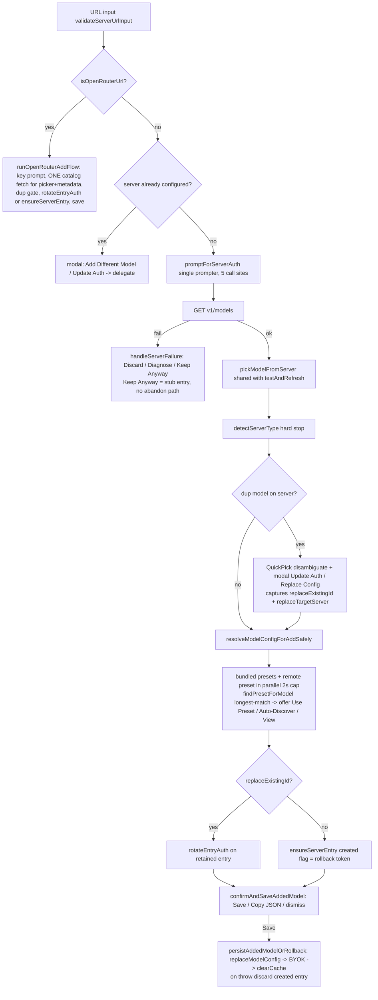

Verified rollback contract: `ensureServerEntry` returns a `created` flag, only
self-created entries are ever discarded, `discardUnreferencedServerEntry`
re-reads models before deleting (concurrency-honest), credential rotation
lands BEFORE the review modal and is deliberately non-rollbackable
(documented: rotated creds on a shared entry are a server fact). Discovery
runs before ANY registry write, so the rollback ladder guards only the
post-write window. Correct shape.

### Findings

| ID | Finding | Severity |
|----|---------|----------|
| P8-1 | **Duplicate-model gate is a copy-paste fork with amnesia** (verified). OpenRouter copy addServerFlow.ts:571-620 vs vLLM copy :933-983: identical QuickPick-disambiguate + Update Auth/Replace Config modal, ~45 lines each. Behavior drifted: the OR copy passes the just-entered headers into `updateServerAuth` (comment bragging "never re-prompt"), the vLLM copy delegates WITHOUT them (:973), re-prompting a key the user typed seconds earlier. One `handleDuplicateModelGate(...)` helper or, minimum, pass `requestHeaders` in the vLLM path. | low-med |
| P8-2 | **OpenRouter info-to-config+summary assembly exists twice** (verified by the source comment itself at openRouter.ts:800: "Mirrors runOpenRouterAddFlow's config assembly"). `runOpenRouterAddFlow` (:636-647 + buildOpenRouterSummary) vs `autoConfigureOpenRouterModel` (openRouter.ts:810-849). Sync-by-comment is sync-by-hope. Extract `projectOpenRouterInfo(info) -> {configFields, summaryLines}`. The catalog FETCH is correctly shared, only projection is forked. | low |
| P8-3 | Header-merge sandwich in `rotateEntryAuth` vs `updateServerAuth`. This is P7-7, already **waived** in cluster A. Cross-ref only, not counted twice. | waived |
| P8-4 | Two `ensureServerEntry` awaits (keep-anyway stub :703, Replace-Config fallback :1013) sit outside any try/catch; a rejected settings write escapes as VS Code's generic "command failed" with an empty output channel. Exactly the failure class `resolveModelConfigForAddSafely` was invented to prevent, one function later. ~6-line wrap. (Not independently re-verified line-by-line; verify at execution.) | low |
| (note) | `persistAddedModel` sequences BYOK bootstrap after the model write; if BYOK bootstrap ever threw, the error toast would falsely claim the model save failed. It currently cannot throw (catches its own write failure). Note only. | none |

### Minimal graph

The 12-step user journey maps one-to-one to Intent clauses, no pass-through
steps, auth prompting and model picking are single-implementation. Delta vs
minimum: fold the two dup-gate copies into one (fixes the re-prompt bug on
the way) and extract the OpenRouter projection. Expected: ~-70 lines, one
behavior fix. The rollback ladder, preset offer loop, and write ordering
stay exactly as they are.

## Path 9: Server Settings webview

**Intent**: Let a user edit any model's or server's configuration through a
form instead of raw JSON, without the webview ever becoming a second source
of truth. It renders store state, sends patches back through the store, and
triggers cache invalidation on save.

### Diagram

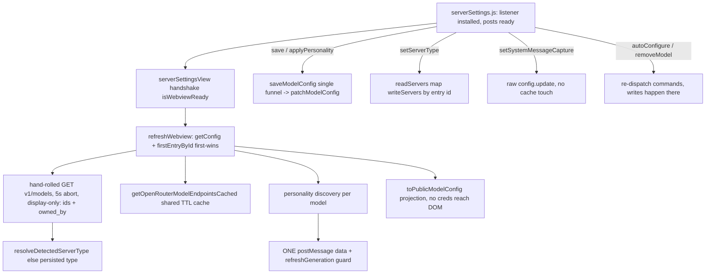

### Findings

| ID | Finding | Severity |
|----|---------|----------|
| P9-1 | **Third independent `GET /v1/models` implementation** (verified: raw fetch + 5s abort inside `refreshWebview`). Discovery probes via the resolver, `testAndRefresh` probes per group AND per model, here it is a fourth-shaped member of the seven-prober census (see P13-2). It reads only ids and `owned_by` (display-only), and LM Studio/Ollama have no `/v1/models` shape, so the "(inactive)" badge is silently blind for those backends. Delegation to the resolver is wrong (it throws per-model, the view needs a list); the honest fix is the shared `listServerModels(serverType, url, headers)` from P13-2, which also kills the backend blindness by returning entries per backend. | low-med |

### Minimal graph

Handshake, single save funnel, projection-based posting, generation guard,
view-scoped disposables: all Intent-required, all present. `setServerType`'s
raw RMW is a by-id one-liner family already waived in cluster A (P7-1).
The ONLY delta vs minimum is the hand-rolled probe (P9-1). Path is otherwise
at the Intent's minimum.

## Path 10: Server management commands

**Intent**: Lifecycle operations on registry entries and models from the
palette or dashboard context menus: update auth, rename, remove server,
remove model, test & refresh. Each command edits settings through the store
and keeps every dependent (models, engines, webview, provider cache) honest.

### Diagram

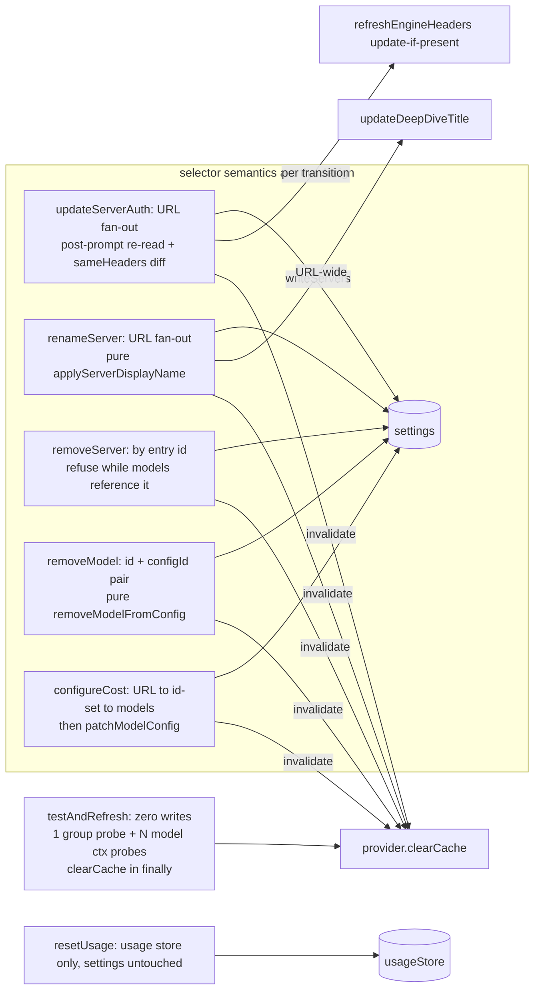

### Findings

None. The four `readServers -> map -> writeServers` sites are NOT a family:
auth/rename fan out URL-wide on purpose (§5), remove/setType address exactly
one entry id on purpose (destructive and typed writes must never sweep
siblings sharing a URL). Post-prompt re-reads are interaction state no shared
helper could own (P7-1's waiver, re-confirmed here). Side-effect wiring is
exclusive where it should be: `refreshEngineHeaders` only from auth, title
only from rename, engines never touched by rename (URL unchanged).
`testAndRefresh` writes nothing. This path is at the Intent's minimum.

## Path 11: Server dashboard

**Intent**: Live sidebar view of every registered server: online/offline,
loaded models, KV cache and throughput metrics for vLLM, OpenRouter account
and cost nodes, usage counters. Read-only projection of the registry plus
polled server metrics, polling only while visible.

### Diagram

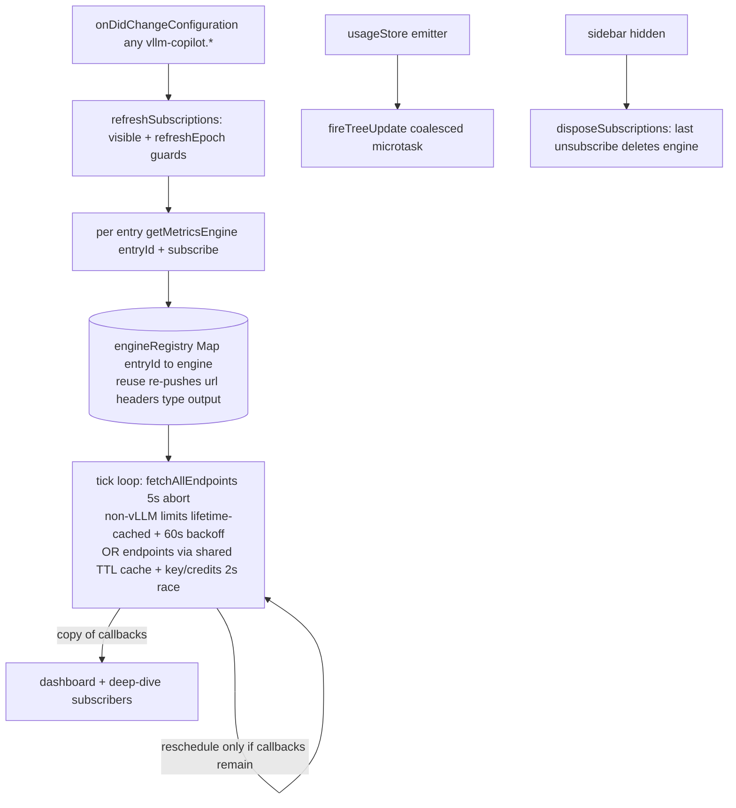

Verified engine lifecycle: creation only via `getMetricsEngine`; the
subscriber array IS the refcount; last unsubscribe disposes AND unregisters;
poll stops with the last viewer; `inFlight` flag prevents twin timer chains.
One poll cadence total (the tick); usage is push, config is event, catalog
reuse is inside the tick. This part is disciplined.

### Findings

| ID | Finding | Severity |
|----|---------|----------|
| P11-1 | Poll-interval default lives twice: `DEFAULT_POLL_MS = 15000` (vllmMetrics.ts:333) and a literal `15000` in the tree's settings read (dashboard.ts:537, verified). Drift = the badge lies about the cadence. Reviewer round R-5: `getPollSettingMs` (vllmMetrics.ts:676) already wraps read+default+catch - export THAT and have dashboard call it, killing the whole duplicated read, not just the constant. | low |
| P11-2 | Dashboard config listener (verified dashboard.ts:411) tears down and rebuilds EVERY engine subscription on any `vllm-copilot.*` change, including toggling file logging. The scoped pattern (`affectsConfiguration('vllm-copilot.servers' or '.models')`) lives one file over in serverSettingsView. One-line narrowing. | low |

### Minimal graph

Registry-keyed engines, refcount-as-subscribers, view-lifetime polling,
one cadence: this is the minimum that satisfies "live metrics only while
visible". Both findings are two-line hygiene, not graph shape. No structural
delta.

## Path 12: Deep Dive webview

**Intent**: Per-server detail page for vLLM metrics (KV cache usage,
throughput, TTFT), opened from the dashboard. A focused drill-down, nothing
editable.

### Diagram

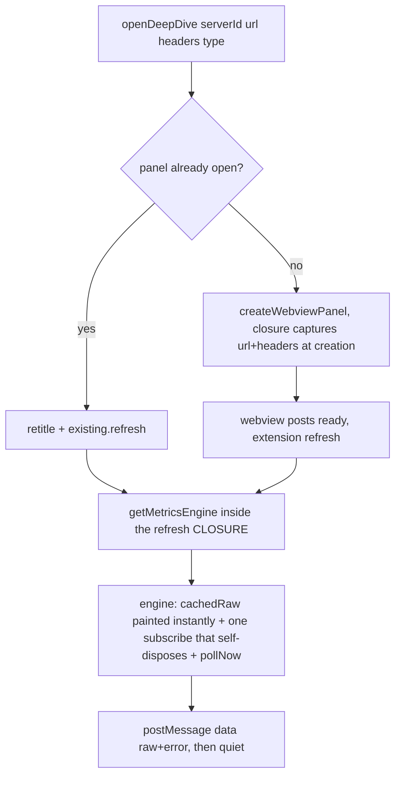

### Findings

| ID | Finding | Severity |
|----|---------|----------|
| P12-1 | **CONFIRMED BUG (verified line-by-line), found by the graph.** `refresh()` closes over `serverUrl`/`requestHeaders` captured at PANEL CREATION. The existing-panel path (deepDiveView.ts:63-70) receives fresh url/headers from the command, throws them away, and calls the stale closure, which re-enters `getMetricsEngine` with creation-time headers. `getMetricsEngine`'s reuse path re-pushes headers on every lookup (verified vllmMetrics.ts:729-733). Repro: open Deep Dive -> Update Auth rotates the key (`refreshEngineHeaders` pushes fresh ones) -> re-invoke Deep Dive -> the stale closure stomps the LIVE SHARED engine's headers back to the dead key. The dashboard shares that engine and silently degrades to offline until the next settings change. Fix: store mutable fresh args in `openPanels` and have `refresh()` read them (~5 lines). This is a bug, not structural complexity: fixable independently of any audit ruling. | med-high |
| (note) | `openPanels` keyed by entry id, retitle matched by URL: two identity schemes in one map, documented, consistent with §5. Info only. | none |

### Minimal graph

Two message types, one-shot self-disposing subscription, re-invoke-is-refresh:
leaner than most of the extension. Zero structural delta; one closure bug to
fix (P12-1).

## Path 13: Diagnose Connection

**Intent**: When a server is unreachable, tell the user why in one screen:
transport comparison, TLS chain inspection, proxy/environment collection.
Diagnostic-only; it never fixes settings, it produces a conclusion the user
acts on.

### Diagram

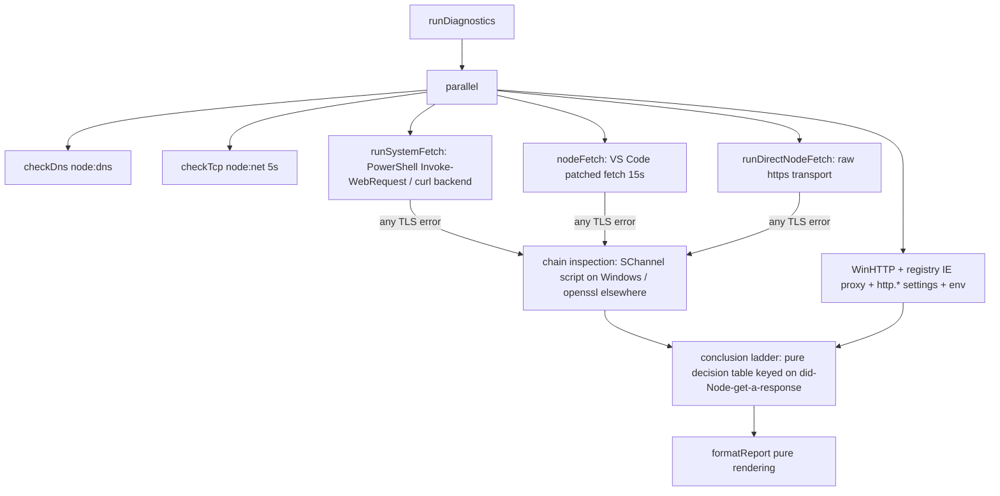

### Findings

| ID | Finding | Severity |
|----|---------|----------|
| P13-1 | All three callers hand-build the same probe URL `buildEndpoint(x, 'v1/models')` (commands.ts:84, addServerFlow.ts:684, testAndRefresh.ts:438) while `runDiagnostics` accepts any URL. Nothing pins the contract. Waive candidate (three one-liners), or comment-level contract. | low |
| P13-2 | **Cross-cluster: seven independent `GET /v1/models` fetch implementations** (census: commands.ts:84, addServerFlow.ts:890, serverSettingsView.ts:282, testAndRefresh.ts:168, hfDiscovery.ts:309, vllmMetrics.ts:803, runtimeLimits.ts:24), each with its own error handling and timeout. NOT all seven should collapse: diagnostics' transports must stay independent (comparing them IS the product), the add flow needs its failure-classification UX, and the add flow's pickModel + testAndRefresh's match already share `pickModelFromServer`. Realistic shared core: one `listServerModels(serverType, url, headers) -> entries[]` in the resolver layer for the DISPLAY/LOOKUP consumers (webview badge P9-1, testAndRefresh group probe, metrics non-vLLM path), which also kills the webview's LM Studio/Ollama blindness. The un-memoized resolver (P6-2) is the sibling fix: same layer, same commit unit if accepted. | low-med |

### Minimal graph

Parallel transports, TLS-chain-on-error only, pure conclusion table, pure
renderer: the shape matches the Intent exactly and deliberately duplicates
fetching from the serving paths (that is the comparison). Delta vs minimum:
the shared list-fetch core (P13-2), owned jointly with paths 6/9/11.

## Path 14: Usage + cost reporting

**Intent**: Track per-model token usage (and OpenRouter actual cost) across
sessions, persisted, and surface last-request/cumulative numbers plus
user-entered cost rates in the dashboard. Cost is derived at render time
from stored rates, never stored itself.

### Diagram

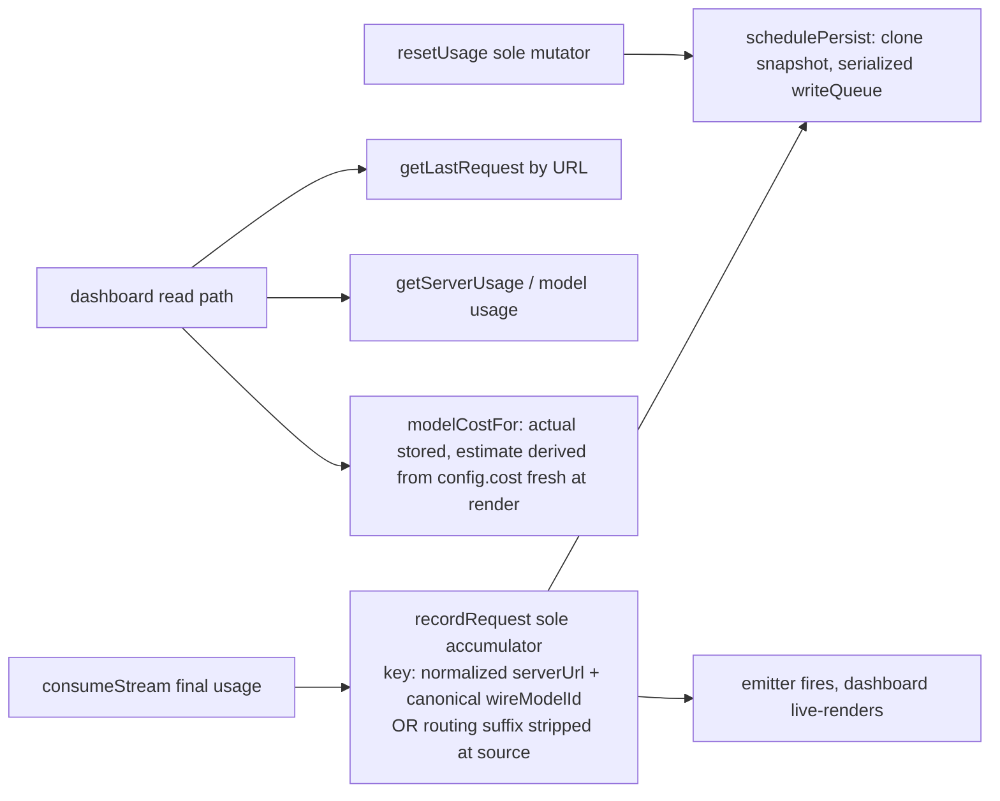

Verified: estimated cost NEVER stored (derived at render, so rate edits
re-price history for free); actual OpenRouter `usage.cost` kept in separate
planes, never summed with estimates; migration v1/v2/v3 accepted under one
key, v2 to v3 additive with no fabricated cost; writes serialized through a
promise chain. `usageReporting.ts` is a misleading filename for three pure
wire-format functions, not a second owner.

### Findings

| ID | Finding | Severity |
|----|---------|----------|
| P14-1 | **Two identities for one server** (verified store keys). Engines and dashboard nodes are keyed by registry ENTRY ID; the usage store is keyed by normalized serverUrl. Two §5 entries sharing one URL with different credentials get separate engines and labels but MERGED token counters, merged Last Request, and cost lookups that resolve one entry's model config against the other's traffic. Consistent design (usage follows the box, not the credential) and nowhere claimed otherwise. Ruling needed, not code: either document the choice in the store header or key by entry id (changes what users see as totals, so no silent fix). | med (product) |

### Minimal graph

Sole accumulator, sole mutator, push-based refresh, derive-don't-store cost:
the graph IS the minimum. Only the identity-key ruling (P14-1) is open.

## Path 15: Logging

**Intent**: Optional, user-enabled file capture of full requests/responses
for bug reports, plus an output channel for extension events. Off by
default. (Intent corrected 2026-09-03 during this audit: the previous line
claimed "credentials never written", which contradicts the code. Actual
documented policy: headers, Authorization included, are written verbatim,
consistent with the repo's standing plaintext-keys decision. Do not
re-litigate the policy; the correction is to the audit text, not the code.)

### Flow (prose, the graph is a straight line)

`init()` opens one append-mode file per activation (millisecond ISO stamp),
`pruneOldLogFiles` keeps 20 by lexicographic (= chronological) order,
skipping the active file. `logBodyLimit` (default 4000, live-adjustable from
the activation config listener without rotating). `logRequest` writes
HEADERS + body verbatim. `dispose()`/`deactivate()` close the fd idempotently
(pending-write comment documents why deactivation awaits). Grep confirmed
`logger.ts` is the only file writer in the extension; the OutputChannel is
VS Code-owned.

### Findings

None structural. Accepted-by-design notes: rotation is by COUNT only (a
`logBodyLimit = 0` session can grow one enormous file; expert toggle,
foot-gun documented); the 20-file retention is also the on-disk window for
old headers, which the plaintext-keys policy already accepts.

### Minimal graph

One writer, one file per session, one prune rule, one live-tunable limit.
No delta.

## Path 16: OpenRouter integration

**Intent**: Make the OpenRouter relay behave like a first-class backend:
catalog-based onboarding, exact wire ids, provider pinning and routing modes
(Standard/Nitro/Exacto), per-provider limits as display-only truth, actual
cost from the API. Touches discovery, requests, errors, dashboard.

### Diagram

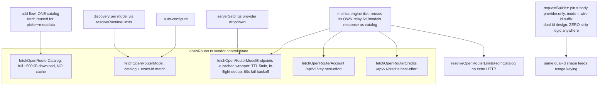

Endpoint inventory verified: catalog (no cache, onboarding + auto-config +
discovery), per-model endpoints (shared TTL cache, dashboard + webview),
key + credits (every poll, 2s race, never cached, best-effort by design).
The exact-model endpoint is deliberately unused (variant-confusion guard,
documented). Routing suffix lives only on the outbound wire id; base id is
never re-derived by splitting, so the "strip logic duplication" count is
zero. The dual-id design is genuinely clean.

### Findings

| ID | Finding | Severity |
|----|---------|----------|
| P16-1 | Discovery's per-model catalog storm: verified, same root as **P6-2** (un-memoized resolver + uncached catalog). The metrics engine proved the right pattern exists in-house (one response, all models). One row with P6-2 in the queue. | low-med |
| P16-2 | Catalog payload-validation boundary implemented twice: `fetchOpenRouterCatalog` (openRouter.ts:511-527) and the metrics parse (vllmMetrics.ts:828, comment literally: "Apply the same boundary as fetchOpenRouterCatalog()"). Sync-by-comment, one drift from a lying dashboard. Export the validation (`parseOpenRouterCatalogPayload`) and let both sides call it. ~15 lines removed. | low-med |
| P16-3 | "Is this OpenRouter" answered two ways: host predicate `isOpenRouterUrl` (9 sites, detection/migration/command guards) vs declarative `serverType` field (~20 sites, all runtime consumers). Hand-edited entry with an openrouter.ai URL and no `serverType` gets yes from `commands.ts:402`'s OR-of-both guard, no from every runtime path. The OR-guard is itself documented as deliberate (custom relays count via the field). Recommend: ACCEPT as-is with a doc comment declaring the FIELD the sole runtime truth and the host predicate a detection/migration concern. Dual-truth in name, documented division in practice. | low |
| P16-4 | `fetchOpenRouterAccount` / `fetchOpenRouterCredits` are the same 20-line best-effort dance copied once (no-retry deviation is itself documented as deliberate); catalog URL built from the hardcoded constant here but from registry `serverUrl` in the metrics probe. Two-line collapses each; bundle with P16-2 if that one is accepted. | low |
| (note) | openRouter.ts does not import vscode directly but reaches it transitively via config.ts (`buildEndpoint`). "Leaf" in spirit, impure on paper. Harmless, note only. | none |

### Minimal graph

Vendor control plane separate from the shared OpenAI data plane, exact-id
determinism, cache where polling exists, none where probes are best-effort:
all Intent-required. Delta vs minimum: catalog sharing on the discovery pass
(P6-2/P16-1), one validation function (P16-2), optionally the two best-effort
fetches (P16-4). "Is OpenRouter" (P16-3) is accepted documentation, not code.

## Path 17: Personality system

**Intent**: Rewrite parts of the system prompt Copilot injects, so the model
adopts a voice (sarcastic robot, spartan, mentor...) or strips boilerplate,
without touching the rest of the harness. Per-model file selection, global
personality library, exact-substring find/replace rules chained in
load-bearing order.

### Diagram

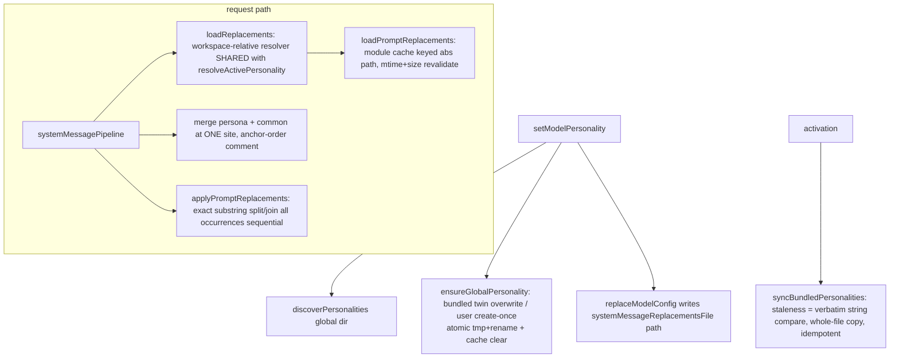

### Findings

| ID | Finding | Severity |
|----|---------|----------|
| P17-1 | "Find the bundled prompt-replacements file" logic exists at four sites with TWO resolution strategies (extensionUri-join x3 in personalityStore, module-relative x1 in promptReplacer, the latter deliberately test-safe). The bundled-twin predicate (fs.access on the extension-dir twin) is copy-pasted between `ensureGlobalPersonality` and `syncBundledPersonalities`. One `bundledPath(basename)` + predicate helper. ~10 lines. | low |

### Minimal graph

Apply path, activation sync, request path: single merge-order site (with the
load-bearing reason documented), single path resolver for config paths,
atomic writes, verbatim-compare staleness (cheap and brutal, correct).
Delta vs minimum: the bundled-path helper only.

## Path 18: Copilot session janitor

**Intent**: Purge stale Copilot chat-session state that VS Code keeps in
storage after model servers change or chats are abandoned. Maintenance
command, no model or turn state involved.

### Flow (prose)

`discoverWorkspaces` counts sessions from `chat.ChatSessionStore.index` in
each workspace's `state.vscdb` + recursive file counts; the user multi-selects
workspaces and confirms a modal; `cleanWorkspace` then deletes 10 hardcoded
`CHAT_KEYS` rows from `ItemTable` via node:sqlite and `fs.rm -rf`s three
chat directories. No VS Code API is (or publicly is) used for deletion.

### Findings

| ID | Finding | Severity |
|----|---------|----------|
| (P18-1, info) | Structural cost of the no-API bypass, accepted by design: (a) live-DB writes can be resurrected by VS Code's in-memory ItemTable on shutdown (the flow's restart warnings are the tacit admission); (b) `CHAT_KEYS` is a snapshot of undocumented internals, a VS Code rename silently turns the janitor into a placebo with zero failure signal. No action proposed beyond knowing it. | info |

### Minimal graph

There is no staleness rule to duplicate (eligibility = the user picked the
row), one module, one command, one writer. It does not duplicate VS Code's
per-window clear because no public cross-workspace API exists. At the
minimum for its (slightly criminal) Intent.

## Path 19: Presets pipeline (dev-side)

**Intent**: Ship and serve model knowledge (sampling params, mode menus,
output-length ladders, family) as JSON preset files, so users get correct
configs for known models without hand-editing settings. Bundled in the VSIX
plus a live remote index, with drift canaries keeping both honest.

### Diagram

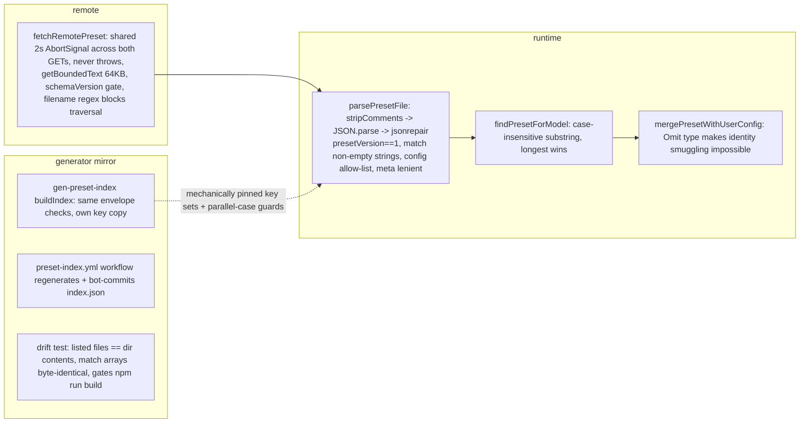

### Findings

None actionable. Duplication census, all pre-emptively judged:

| Concept | Implementations | Verdict |
|---|---|---|
| Longest substring match | `findPresetForModel` (trusted input) + `longestListMatch` (hardened for hostile input: shape guards, filename regex) | **false symmetry**, trust asymmetry, P7-1 lineage. Keep both |
| Key allow-list | `presets.ts` + `gen-preset-index.mjs` (TS/mjs import wall) | mechanically pinned by `genPresetIndex.test.ts` sorted-set compare. Nothing to do |
| Envelope guard logic | `parsePresetEnvelope` vs `buildIndex` | parallel-case pinned in two test suites. Enough for a 10-key list |
| Remote file validation | one path: downloaded presets run through the SAME `parsePresetFile` guard with a `remote:` tag | single enforcement point, audit confirmed every `return` honors never-throws |

Note (P19-1, accepted): the generator's comment-stripper is stricter than the
runtime (inline `//` loads in VS Code, throws in the Action). Fails loudly,
on our repo, at commit time. Fine.

### Minimal graph

Already there. Guard, mirror, pins, freshness chain: each element is the
reason this path can ship model knowledge without a human gate. No delta.

---

## Clusters C-F: verdicts and pre-emptive self-critique (2026-09-03)

Method applied per Cluster A's lesson: findings were drafted from subagent
recon, then every published claim was re-verified against the code before
being written here. Verification results: P12-1 confirmed line-by-line (real
bug), P16-1, P16-2, P8-1, P8-2, P11-1, P11-2, P14-1, P6-2, P16-3 all
confirmed at the cited locations; P8-4 carries a verify-at-execution flag.

Cluster verdicts:

| Cluster | Verdict |
|---|---|
| C | Paths 6/9 near-minimal with two real findings (P6-1 rule drift, P6-2 probe storm); path 10 is at the Intent's minimum, zero findings. |
| D | Path 8 is a well-ordered funnel carrying one copy-paste fork (P8-1, with a live behavior bug inside it), one comment-mirror (P8-2), one unprotected-await pair (P8-4). Path 19 is clean: its duplications are pinned or false symmetries. |
| E | Found the audit's only confirmed BUG (P12-1). Engine lifecycle and usage store are well-built; two one-line hygiene items (P11-1, P11-2); one product ruling (P14-1). |
| F | P16-1 is P6-2's OpenRouter face. One comment-synced validation twin (P16-2), one accepted dual-truth (P16-3), small hygiene (P16-4, P17-1). Path 18 is minimal for its Intent. |

Pre-emptive waivers (killed before they became findings, Cluster A doctrine):

| Candidate | Killed because |
|---|---|
| `buildModelInfo` 8-param soup | signature hygiene, not a graph edge; note only |
| Merge the two longest-match implementations (D) | trust asymmetry: one consumes hostile input, P7-1 lineage |
| Merge the three fetch helpers (D) | genuinely different contracts (deadline / size-capped / retry) |
| Server-side patch API revived in D | P7-1 waiver stands; prompt-scoped RMWs a generic helper cannot own |
| Header-merge helper revived as P8-3 | identical to waived P7-7, cross-referenced, not double-counted |
| Collapse all seven `/v1/models` fetchers | diagnostics' independent transports ARE the product; only the display/lookup subset joins P13-2 |
| P16-3 dual is-OpenRouter | documented division of labor; recommend ACCEPT with a comment, not code |
| Logger redaction | standing repo key policy, not a finding, do not surface |
| sessionManager staleness rule | none exists, nothing to deduplicate |
| Add-flow 1/4-4/4 step numbering | cosmetic, unworthy of the ledger |

Systemic theme (the audit's only architecture-scale observation): **one root,
three symptoms**. The limits resolver has no per-pass memoization, which
produces the vLLM N× probe (P6-2), the OpenRouter catalog storm (P16-1), and
testAndRefresh's 1+N waste; and model-list fetching has no shared core, which
produces seven probe implementations (P13-2) including the webview's
backend-blind badge (P9-1). If the user accepts P6-2 + P13-2 (+ P16-2), that
is one coherent commit unit at the resolver layer, roughly the entire
structural fat the whole 19-path audit found outside P12-1.

---

## Pass 2: the rent census (2026-09-03)

Pass 1 asked "does this node serve the Intent". Pass 2 asks "does this node
deserve its own name": every function/module/file must be genuinely large
(per-case, phases/branches, no line quota) or have >= 2 production callers.
Tests are not customers. Rulings recorded in Method rule 5. Scope swept:
`src/**`, `resources/*.js`, `scripts/*.mjs`, test helpers. Four census
reports, every capital claim re-verified against code before being
published here (one census verdict REJECTED: `resolveServerEntry` has 3
internal callers, pays rent, stays).

### The one doctrine collision: RESOLVED by user ruling (2026-09-03)

The law said tests do not count as callers; the test doctrine said the
wire-format tripwire crew is sacred. Ruling: **code structure wins.**
Absorption proceeds; the affected tests either (a) test the larger surviving
function from several angles, or (b) are replaced by reading-and-reasoning
code review. No structure is sacrificed for test ceremony. The [TC] tags
below mark where absorption forces test churn; all of them are now approved
to proceed on that basis.

### Tooling (wired 2026-09-03): the census is now a command

Three npm scripts, all read-only, all safe to run anytime:

- `npm run dep:check` — dependency-cruiser gates at FILE level, split in two
  cruises because one graph cannot tell two truths at once:
  `.dependency-cruiser.cjs` cruises post-compilation edges (runtime truth:
  `no-circular` must not count `import type` edges - the config.ts <->
  serverRegistry.ts cycle is a phantom that vanishes in `out/`), plus
  `types-ts-stays-pure`, `state-layer-no-ui-or-commands` (P5-2 exception
  encoded there, dies with the finding), `provider-no-ui`.
  `.dependency-cruiser.consumers.cjs` cruises pre-compilation edges:
  a type-only importer IS a consumer when the question is "does anything
  read me" (`no-orphans`). Both currently clean: 0 violations, 0 orphans,
  0 runtime cycles.
- `npm run dep:graph` — writes `temp/dependency-graph.md`, a Mermaid
  rendering of the runtime module graph (same edges the gate checks).
- `npm run rent` — `scripts/rent-census.mjs`, the pass-2 law on the
  TypeScript compiler API. For every module-level function/class/iface/type
  in src + test helpers it prints: size, distinct production caller modules,
  test files, in-file callers, and a flag:
  `DEAD`/`CONTRACT_DEAD` (zero refs), `TEST_ONLY` (exported, tests are the
  only customer - un-export or delete), `ABSORB_SMALL` (one prod call site,
  small), `INTERNAL_SINGLE` (private, one in-file caller), `CONTRACT_*`
  (interfaces/error classes are NAMED not called; single external namer is
  normal), `BIG_SINGLE` (one caller, sizeable: per-case human verdict),
  `REUSED` (pays rent). Plus: `PASS_THROUGH_FILE` (re-export facades),
  same-file collapse chains, and a naive hint pass for `resources/*.js` /
  `scripts/*.mjs`. `--tsv` for machine diff, `--max-small=N` only moves the
  ABSORB_SMALL highlight knob (not a keep-threshold), `--fail-on=dead` is
  wired into `npm run build` (gated 2026-09-03): dead named things fail
  packaging.

Workflow ruling: before executing any U-unit, run
`npm run rent -- --tsv > temp/rent-before.tsv` and mechanically confirm the
unit's caller claims against the table (the manual census already cross-checks).
The census is also the amputation tripwire: if an absorbed function had a live
organ, `npm run compile` screams.

Pre-U1 baseline (2026-09-03): 448 targets. Counts: DEAD 1, CONTRACT_DEAD 2,
TESTHELPER_DEAD 1, TEST_ONLY 38, TESTHELPER_SINGLE 2, ABSORB_SMALL 61,
INTERNAL_SINGLE 61, CONTRACT_TEST_ONLY 42, CONTRACT_SINGLE 20, BIG_SINGLE 41,
PASS_THROUGH_FILE 1, chains 59. Full table: `temp/rent-baseline.md`.
Post-U1 rescan (2026-09-03): 441 targets, zero DEAD/CONTRACT_DEAD/
TESTHELPER_DEAD/TEST_ONLY-helper/PASS_THROUGH_FILE; TEST_ONLY 39,
ABSORB_SMALL 61, INTERNAL_SINGLE 62, CONTRACT_TEST_ONLY 43, CONTRACT_SINGLE 19,
BIG_SINGLE 48, REUSED 88. Table: `temp/rent-postu1.md` (+ `.tsv`).
Dep cruises after U1: runtime 70 modules/205 deps, consumers 69/269, graph
53 nodes/147 edges. All green.

Census vs manual ledger: the machine confirmed every U1-U9 caller claim
(fmt* family, outcome pair, chatProtocol trio, fetchRetry chain, diagnostics
zoo, sessionManager delete-chain, hfDiscovery trio, presets parse chain,
factories dead, sumCounts test-only, dedupeServerIds single). New fish:
- `StructuredOutputConfig` (config.ts:14): one-line alias, zero usage
  anywhere, plus a types.ts docstring claiming it matters. -> U1.
- `PresetFile` (commands/presets.ts:81): interface with zero references. -> U1.
- `provider/contracts.ts` is NOT dead: provider.ts imports it type-only;
  the consumer cruise exists precisely so this stays invisible to no one.
- `resetOpenRouterProviderListCache` pays rent honestly (PF-1 gave it a
  production caller in extension.ts).
- JS hints reviewed, no action: the `check-prompt-drift.mjs` /
  `gen-preset-index.mjs` helpers are distinct fetch/extract stages of
  `main`, not a one-job chain; keeping them (reversible).

### Execution units (proposed commit bundles, ordered by risk)

> **U1 EXECUTED 2026-09-03** (all of R1.1-R1.7; compile + 824 tests +
> dep:check green; post-purge census has zero DEAD/TESTHELPER_DEAD/
> CONTRACT_DEAD and no PASS_THROUGH_FILE). Bonus machine wisdom from the
> rent diff: **a re-export facade pays fake rent to its own re-exports** -
> the module-scope re-export identifiers counted as production consumers,
> so `personalityApplicableTo` and friends wore REUSED-name jewelry bought
> by the facade. Kill the door, meet the true caller count. Note: the
> original R1.6 claim "commands.ts:33-34 are test traffic only" was WRONG
> (extension.ts imported the two `register*` commands through them); fixed
> by rewiring extension.ts to the real homes first. Doctrine: verify even
> the audit's own claims.

**U1 Facade purge, zero behavior risk.** Verified dead or single-door:
- R1.1 `src/autoConfig.ts` (9 lines, pure re-export, ONE importer:
  extension.ts) -> direct imports, delete file. Verified.
- R1.2 `vllmClient.ts:10` re-export line (`detectServerType` etc):
  every importer of vllmClient pulls only `VllmClient`. Dead line, delete.
  Verified.
- R1.3 `test/factories.ts` dissolves: 2 suites import 2 disjoint symbol
  sets; `makeServers`/`makeServerEntry` have zero importers anywhere.
  Verified.
- R1.4 `usageStore.sumCounts`: zero prod callers, one test. Delete export,
  delete the test's use. Verified.
- R1.5 `vllmMetrics.parseRawMetrics` de-export (no external takers at all).
- R1.6 `commands.ts` re-export lines (:33-34, :217) are test traffic only;
  point tests at real homes, delete the lines.
- R1.7 (found by `npm run rent`, verified by grep): delete
  `StructuredOutputConfig` (config.ts:14, zero-usage alias; also fix the
  types.ts:178 docstring that claims it is re-exported for a reason) and
  `PresetFile` (commands/presets.ts:81, zero references).

**U2 outcome + capture fold (pipeline, low risk).** [corrected by reviewer round - see "Reviewer-agent round"]
- R2.1 `outcome.ts`: `createOutcome`/`resetOutcome` overlap but are NOT
  equal (reviewer catch, verified): the create-literal omits
  `finishReason`/`firstTokenTime` that reset clears - `Object.assign(o,
  createOutcome())` would leak a stale finish_reason across auto-continue
  attempts. Reset stays an explicit field list (or a shared full-zero
  literal both use). File death stands: `createOutcome`/`resetOutcome`
  absorb into `streamOrchestrator` (their only value callers), and
  `StreamOutcome` the interface relocates to `provider/contracts.ts`
  (type-consumers: consumeStream + postStream -> the file had TWO consumers,
  not one; contracts.ts is the type-only seam, zero runtime edges).
  [TC-mild: outcome test churn]
- R2.2 capture chain: `processSystemMessages` absorbs `loadReplacements`;
  `captureToDisk` (12 lines) folds into the writer closure; `enqueueWrite`
  survives (75 lines, phases). ~~`isCaptureEntry` -> private~~ already
  private (reviewer catch: stale plan row, struck).

**U3 chatProtocol annihilation [TC, ruling gate].** [corrected by reviewer round]
- R3.1 `chatProtocol.ts`: `buildChatBody`/`validateMessages`/
  `checkResponseContentType`, 22-26 lines each, all single-called by
  `ChatTransport.stream` and nobody else (verified twice). File ceases to
  exist; the three RELOCATE into `chatTransport.ts` as module-private
  functions - do NOT inline into `stream()` (reviewer catch: that fuses a
  ~90-line generator into a ~170-line 4-phase monster; the law wants the
  file dead, not a god-function). Cost: `chatProtocol.test.ts`
  (wire-format crew, protected-keys canary) reroutes through `stream` with
  fetch mocks, or shrinks. Option B: KEEP by explicit tripwire exemption.

**U4 messageConverter shrink (medium churn).**
- R4.1 fold `convertAssistantMessage`/`convertUserMessage` into
  `convertMessages` (they are its two dispatch branches); inline
  `isImagePart`/`imagePartToDataUri`; `extractToolResultContent` stays
  (2 callers).
- R4.2 error-extraction chain `extractServerErrorInfo` ->
  `extractServerErrorMessage` collapses into `formatError`.
- R4.3 `isGracefulTermination`/`serializeError` move to postStream (sole
  consumer), `isTransportFailure` to streamOrchestrator. Survivors by size:
  `formatError`, `parseToolCallArgs` [TC], `describeError` (14 callers,
  the workhorse), `_classifyMessage`, TLS trio (reused).
- Net: file becomes the two things it actually is (conversion + error
  classification) with no per-message micro-organs. Supersedes pass-1
  P2-1 (split proposal): the law pulls the opposite direction and is right.

**U5 fetchRetry innards.** `parseRetryAfterMs`, `normalizeHeaders`, `sleep`
absorb into `fetchWithRetry` (private single-site); `buildRequestHeaders`
stays (3 real customers). [TC-mild: fetchRetry.test reroutes]

**U6 diagnostics de-zoo (self-contained flow, no cross-module risk).**
Verified: 18 of 24 functions are single-caller breadcrumbs of one flow.
Recommended split (per-case judgment, god-function refusal):
- DELETE outright: `getProxyInfo` (3-line platform gate around a 3-line
  call), `systemFetchLabel` (into formatReport), `runSystemFetch` +
  `runChainInspection` dispatch wrappers (runDiagnostics calls the arms).
  ~~`redactEnv`~~ STRUCK by reviewer round: INTERNAL_MULTI, 4 call sites
  inside collectEnv (folding = inlining one expression four times,
  cosmetic). ~~`getExtensionVersion`~~ STRUCK as delete: 2 callers
  (:663/:787); optional inline-read of the module variable at both,
  that is inlining not death.
- ABSORB: `detectCurlBackend` into `runCurlTest`, `formatFetchResult` into
  `formatReport` (one inner closure, 3 sites), `runChainBuildWindows` into
  the inspection switch.
- KEEP (large or flow-spine): `runDiagnostics`, `formatReport`,
  `runPowerShellTest` (44), `runCurlTest` (26), `runDirectNodeFetch` (45),
  `runChainBuildOpenSSL` (70), `detectWinHttpProxy` (31),
  `detectIeProxySettings` (38), `checkDns`/`checkTcp`/`collectSettings`/
  `collectEnv` (parallel-probe leaves: their names ARE the report rows;
  a 350-line runDiagnostics is not simpler, per-case verdict).

**U7 dashboard/vllmMetrics family relocation.**
- R7.1 `fmtPct`/`fmtMs`/`fmtN`/`fmtTokPerSec`/`shortUrl` move to
  dashboard.ts (verified: dashboard is the only consumer; presentation
  squatting in the data module). Delete `fmtThroughput` pass-through (one
  call site) - inline MUST keep the zero-guard (R-2): site renders
  `avg > 0 ? fmtTokPerSec(1000/avg) : '—'`; bare `fmtTokPerSec(1000/x)`
  prints "Infinity tok/s" at zero TPOT. Or keep the 4 lines, your call.
- R7.2 D1 twin: `emptyMetrics` (vllmMetrics) vs `emptyFallbackMetrics`
  (dashboard) same 12-field literal; dashboard imports the real one.
- R7.3 TreeItem alphabet: absorb `ModelTreeItem`, `PollIntervalTreeItem`,
  `FlagHintTreeItem`, `AddServer`/`TestRefresh` twins (inline in
  getChildren), `RequestMetricTreeItem` into `MetricTreeItem` (iconColor
  param). Routing-key classes stay. Inline `relayContextWindow`/
  `relayEffectiveOutput` (single-caller find-chains). `getPollIntervalTreeItem`
  into getChildren AND replace dashboard's settings read (dashboard.ts:537)
  with `getPollSettingMs` exported from vllmMetrics (R-5: kills the whole
  duplicated read+default+catch, not just the literal; executes P11-1).
- R7.4 `summaryLine` absorb. ~~`isoDate`~~ STRUCK by reviewer round:
  private, 2 call sites (:836/:840) - pays rent. Engine setters and
  `refreshEngineHeaders`/`updateDeepDiveTitle`: KEEP-with-note (cross-module
  accessors of private state, law cannot absorb across the module wall
  without exporting the state itself).

**U8 command-layer absorb list (low risk, wide). SPLIT: U8a EXECUTED
2026-09-03 (census 435->416, 18 targets killed, 3rd file death
`modelUtils.ts`, 814 green, both cruises green). U8b pending:
hfDiscovery collapse, openRouter small absorbs, account/credits merge
(P16-4), `registryMigration.ts` file-merge, borderline calls.**
U8a execution notes (live, some claims adjusted against the bytes):
- Absorbed as planned: `applyServerDisplayName` + `removeModelFromConfig`
  (into their commands), `personalityApplicableTo` (duplicate-append
  canary rerouted as a command-level test), `groupModelsByServer`
  (its pure test file died wholesale - structure-wins ruling),
  `applyAutoConfigUpdate` (dialog-ceremony test deleted),
  `pickModelFromServer` + lying `ServerModelChoice` docstring,
  `projectCatalog` (+ dead `PROJECTED` fixture), `catalogPricing`,
  `persistAddedModel` (turned out 5 lines, not 80 - census lines-column
  mistrust vindicated, absorbed), `toMenu` (its numeric-filter guard was
  already dead weight at the sole call site), `applyProposals`,
  `hostSegmentOf`, sessionManager clone chain (removeChatDir was a
  removeDir clone, the two 4-line wrappers died), `configureByokUtilityModel`
  (into its command), `parseJson`, `formatTokenLabel` (test import was
  already dead), `modelUtils.ts` -> `modelInfo.ts` (test import rerouted,
  zero seam loss).
- `stripModeMaxTokens` un-exported as written; its CLEAR-signal pins
  rerouted through `planOutputLengthMigration`.
- WAIVER PROPOSED (executor ruling, needs user ratification):
  `dedupeServerIds` NOT absorbed into the activation block. Reason:
  28-line pure contract, its 7 tests are settings.json destruction-crew
  tripwires (serverRegistry.test.ts was a purge survivor BY NAME), and
  extension.ts activation is the least testable place in the extension.
  Absorbing buys a name fewer and costs a real tripwire.
Single-caller
absorptions, all verified by census + spot-grep: `applyServerDisplayName`,
`removeModelFromConfig`, `personalityApplicableTo` (post-U1: TEST_ONLY, the
facade was its fake production caller -> absorb into
`registerSetModelPersonalityCommand`), `groupModelsByServer` (post-U1:
TEST_ONLY, same story -> absorb into `registerTestAndRefreshModelsCommand`),
`applyAutoConfigUpdate`, `dedupeServerIds` (into activation block),
`hostSegmentOf`, `toMenu`, `applyProposals`, `stripModeMaxTokens`
(un-export), `persistAddedModel` into its rollback wrapper, `projectCatalog`,
`catalogPricing`, `pickModelFromServer` (docstring also LIES about a
second caller that stopped importing it years ago: verified), sessionManager
delete-chain (`removeChatDir` is a `removeDir` clone with a different log
string; the two 4-line wrappers die), hfDiscovery (`fetchHuggingFaceModel`/
`fetchGenerationConfig`/`fetchVllmModelInfo` into `autoConfigureModel`;
`resolveModelConfigForAdd` + its Safely wrapper become one), byok
(`configureByokUtilityModel` into its 5-line registration wrapper),
presetRemote `parseJson` inline, `modelUtils.ts` entire file into
`modelInfo.ts` (verified: 1 prod caller; file deleted), `formatTokenLabel`,
openRouter small absorbs (`formatPerMillionUsd`,
`resolveOpenRouterLimitsFromCatalog`, `resolveOpenRouterRuntimeLimits`),
account/credits merge to one internal fetch (P16-4 executes here),
`registryMigration.ts` file-merge into `serverRegistryMigration.ts`
(one planner, one consumer file). Borderline, your call: `formatMigrationPreview`,
`mergePresetWithUserConfig` (identity-safety boundary deserves its name ->
robot rec: un-export+keep), `checkNetworkGatingSettings`, serverSettingsView
message arms, `buildHtml`/`offlineError` in deepDiveView, `runDiscoveryOnce`
(55-line cache protocol, rec: KEEP-large-lite, do not inline).

**U9 export-demotion wave (export dies, function stays).** `export` is a
reuse claim; these claims are lies.
[NOTE 2026-09-03: this section's header was destroyed by an interrupted
edit that stitched it into U8's last sentence; reconstructed from the
surviving body. Reviewer-round corrections preserved.]
Reviewer round: two rows executed themselves (already un-exported by
earlier units), two rows were STRUCK (see below). Surviving demotions:
`parseOpenRouterModelRef`, `normalizeOpenRouterModel`,
`fetchOpenRouterModel`, `fetchOpenRouterModelEndpoints`,
`buildPickerBanners`, `buildConfigurationSchema`,
`resolveOutputLengthOptions`, `isVersionAtLeast`, `longestListMatch`,
`autoConfigureModel`, `CONFIG_SCHEMA_TOOL_NAME` (accepted-with-flag: its
test moves to the literal). Post-U1 addition: `WireStructuredOutputConfig`
(already executed with U1b: alive inside types.ts as a field type).
STRUCK by reviewer round (verified): `iterateCauses`
(export must survive U4: `isGracefulTermination`/`isTransportFailure`/
`serializeError` walk it across the file boundary - R-1) and `buildIndex`
(export is the contract letting `genPresetIndex.test.ts` pin key sets
without running `main()`, which rewrites the repo - load-bearing canary).

**U1b post-rescan micro-findings (new 2026-09-03). EXECUTED 2026-09-03**
(with U11, one commit; census 441->435, zero dead, 824 green).
Live-execution addendum: `dayKey` was census-flagged TEST_ONLY - the export
earned zero rent (all 4 users live inside usageStore.ts), so it was
un-exported too; test reroutes through a local `todayKey` mirror.
(a) `usageStore.addCounts` (8L) into `accumulate` - unmasked when
`sumCounts` died; (b) `WireStructuredOutputConfig` un-export (also in U9);
(c) borderline: merge `resolveDetectedServerType` + `detectServerTypeFromV1Models`
into one private helper in serverSettingsView, un-export from runtimeLimits
(robot rec: accept; `detectServerType` itself stays - 42-line dispatcher,
pays rent by size per-case, real consumer addServerFlow).
CONFIRMED by reviewer round (2026-09-03), executing as written.
Executed as (c') : merged INTO `resolveDetectedServerType` (kept exported -
pre-existing @internal-for-testing seam the moved detection tests use;
same pattern as stripJsonComments/loadModelPresets), detectServerTypeFromV1Models
deleted from runtimeLimits, its 4 test assertions relocated to
serverSettingsView.test.ts plus a new sibling-fallback case (+1 net behavior pin).

**U11 micro-fold wave (from the improvement inventory, corrected by reviewer round). EXECUTED 2026-09-03**
(fold 4 done as written; nested-function judgment taken: the slash state
machine kept its name inside `stripJsonComments`; keep 2 kept).
All private single-callers, same-file folds, lane-free, cycle-free.
FOLD 4: `round6` (3L) into `perMillion` (openRouter.ts); `isHttp404` (3L)
into `isInvalidSignature` (runtimeLimits.ts); `pruneDays` (11L) into `load`
(usageStore.ts, `dayKey` stays - 4 users); `findFirstUnquotedSlashSlash`
(23L) into `stripJsonComments` (presets.ts; it is a state machine - per-case
it may keep its name as a nested function, judgment at execution).
KEEP 2 (reviewer, accepted): `tryRepair` - called inside
`[candidate, tryRepair(candidate)]`, inlining creates unreadable slop;
`normalizeSSE` - carries the load-bearing eventsource-parser `\n\n`
requirement comment, deserves its header not burial in a 206-line loop.

### Post-U1 rescan (2026-09-03): machine re-verification of everything

Ran the full tool trio after U1 (census md+tsv, both dep cruises, module
graph) and diffed name-by-name against the pre-U1 baseline (`temp/census-diff.mjs`).

**Clean kills (7, zero collateral):** `StructuredOutputConfig`, `PresetFile`,
`sumCounts`, `makeServers`, `makeServerEntry`, `makeModelConfig`,
`makeLegacyModelConfig`. Nothing else referenced them; suites green.

**The facade-rent gang, unmasked (9):** after U1 these lost production
rent that only the `autoConfig.ts`/`commands.ts`/`vllmClient.ts` re-export
lines had been paying: `registerAddServerCommand`,
`registerAddServerModelCommand`, `registerAutoConfigureModelCommand`,
`registerSetModelPersonalityCommand`, `registerTestAndRefreshModelsCommand`,
`ensureAgentHostModelsEnabled`, `registerConfigureUtilityModelCommand` (all
now single-caller by extension.ts), plus `detectServerType` (BIG_SINGLE,
42L) and `detectServerTypeFromV1Models` (ABSORB_SMALL, real caller:
serverSettingsView). Two more dropped to TEST_ONLY (U8 lines updated), and
`WireStructuredOutputConfig` lost its only external namer.

**Census policy note (recording, not acting):** names matching
`register*`/`ensure*` whose sole caller is the `extension.ts` activation
block are command/lifecycle WIRING - the command table IS their product.
They are ENTRY-class rent; never absorb-bait. The census prints them as
single-callers; reviewers must know the exemption.

**Claim re-verification against post-U1 census:** U2 (`createOutcome`/
`resetOutcome` -> streamOrchestrator) holds. U3 holds and is now complete
in print: `buildChatBody` (26L) joins `validateMessages`/
`checkResponseContentType` as chatTransport-only - three functions, one
consumer, file death confirmed. U4/U5/U6/U7 rows unchanged (fetchRetry
`sleep`/`normalizeHeaders` still INTERNAL_SINGLE under `fetchWithRetry`;
fmt family still dashboard-only). All 13 U9 demotions still TEST_ONLY.
`modelUtils.ts` still exports exactly one live name with one consumer.
Pass-1 queue: unaffected - no pending path finding referenced a deleted
facade, and the Path 8/13 diagrams never contained the facade nodes.

**New micro-finds from the purge (unmasked by the deaths):**
- `usageStore.addCounts` (8L): was INTERNAL_MULTI only because `sumCounts`
  was its second caller; now INTERNAL_SINGLE under `accumulate` ->
  absorb. Proposed **U1b** (with the U9 addition below).
- `WireStructuredOutputConfig` (types.ts): still alive as the
  `structured_outputs` field type INSIDE types.ts, but its export lost its
  last external namer in U1 -> un-export. Added to U9.
- serverSettingsView detection chain (borderline): `refreshWebview` ->
  `resolveDetectedServerType` (6L, TEST_ONLY) ->
  `detectServerTypeFromV1Models` (11L, now single-caller). Robot rec:
  merge the two into one private helper in serverSettingsView, un-export
  from runtimeLimits (`detectServerType` itself: 42L dispatcher with real
  branches, real consumer addServerFlow -> KEEP per-case). Your call.

### Reviewer-agent round (2026-09-03): independent hostile re-verify

The structural-review agent (`.github/agents/structural-review.agent.md`)
ran an independent pass: fresh census (byte-identical, zero drift), fresh
dep cruises (green), and a body-level re-read of every pending unit plus a
blind-spot hunt (semantic bloat, dual writers, webview message arms, dynamic
imports). Every claim it published was then re-verified against code by the
executing session before being entered here. Outcome: **all 13 pending
pass-1 rows REAL** (two citations corrected: P13-1 fetch is commands.ts:79;
P6-1's picker floor appears FOUR times, not three: provider.ts:300,
config.ts:242, config.ts:279, tokenBudget.ts:93, plus three sibling floors in
config.ts:299/modelInfo.ts:80/tokenBudget.ts:121). Negative space confirmed
clean: sole config writer holds, single config-cache owner, single engine-registry
owner, no dead webview message arms either direction, no provider->UI reach,
no dynamic-import lane escapes.

**Unit verdicts after the round (these CORRECTIONS are now binding):**

- **U2** (CORRECTED, three strikes): (a) the planned equation
  `resetOutcome(o) = Object.assign(o, createOutcome())` is FALSE -
  `createOutcome`'s literal omits `finishReason`/`firstTokenTime` which
  `resetOutcome` clears; executing it would leak a stale `finish_reason`
  across auto-continue attempts. Reset becomes an explicit field list or a
  shared full-zero helper. (b) `StreamOutcome` the INTERFACE has two
  production type-consumers (`consumeStream.ts:8`, `postStream.ts:3`) -
  file death means the interface relocates to `provider/contracts.ts`
  (the type-only seam), not inlining into streamOrchestrator (would create
  a type-only back-edge). (c) "isCaptureEntry -> private" is a no-op,
  already private (systemMessagePipeline.ts:28); row struck.
- **U3** (CORRECTED): trio death-by-file confirmed, but RELOCATE the three
  functions into `chatTransport.ts` as module-private, do NOT inline into
  `stream()` itself (would fuse a ~90-line generator into a ~170-line
  4-phase monster). Law satisfied: file dies, no god-function.
- **U6** (CORRECTED): `redactEnv` is INTERNAL_MULTI (4 call sites in
  collectEnv) - struck from the delete list; `getExtensionVersion` has 2
  callers - row becomes "read module variable", inlining not death.
- **U7** (CORRECTED + R-2 + R-5): `isoDate` is private with 2 call sites -
  PAYS RENT, struck from absorbs (`summaryLine` stays). `fmtThroughput`
  must NOT inline as bare `fmtTokPerSec(1000/x)`: the real body guards
  `<= 0 -> '—'`; inlining unguarded renders `Infinity tok/s` at zero TPOT.
  R-5 improves P11-1+R7.3: `getPollSettingMs` (vllmMetrics.ts:676) already
  wraps read+default+catch - EXPORT it and let dashboard call it, killing
  dashboard's duplicated read, not just the `15000` literal. PF-2 is 21
  positional params with nested `.metrics?.` sources; carry-the-object needs
  nesting-aware readers.
- **U9** (CORRECTED, two rows DIED): `iterateCauses` demotion is an
  execution-order landmine (R-1): `isGracefulTermination`/`isTransportFailure`/
  `serializeError` all walk it, and U4 moves exactly those across the file
  boundary; its export survives, row struck. `buildIndex` demotion killed:
  its export is the contract letting `genPresetIndex.test.ts` pin key sets
  without running `main()` (which rewrites the repo) - load-bearing CI
  canary seam, row struck. Surviving demotions: 11 (12 minus the two, and
  `CONFIG_SCHEMA_TOOL_NAME` accepted-with-flag: test moves to the literal).
- **U11** (CORRECTED): fold 4 (`round6`, `isHttp404`, `pruneDays`,
  `findFirstUnquotedSlashSlash`); KEEP `tryRepair` (called inside
  `[candidate, tryRepair(candidate)]` - inlining creates unreadable slop)
  and `normalizeSSE` (carries the load-bearing eventsource-parser `\n\n`
  comment).
- **U1b, U4, U5, U8**: CONFIRMED unchanged by hostile read.

**R-findings:** R-1 (med, folded into U9 correction above); R-2 (low, folded
into U7); R-3 census `lines`-column defect - **REJECTED**: the agent read
`91` from tab-squashed console rendering; raw TSV bytes are
`261\t9\t1\t0` (9 lines, prod:1) and the md pass always printed `9L`. The
census measures this function correctly; the reviewer tripped over its own
doctrine. Lesson recorded in instructions rule 9(e): reviewer output is a
hypothesis too - diff raw bytes, not rendered columns. R-4 (info): the
build-gate/docs edits were uncommitted while the audit described them as
done - resolved by the commit carrying this section. R-5: folded into U7/P11-1.

### Product flags (not style)

- PF-1 **CONFIRMED and FIXED 2026-09-03** (user ruling: "wire it up, it's
  a user-UI-facing feature that is not working"). The activation config
  listener now flushes the provider-list cache (values + in-flight +
  failure backoff) on any `servers`/`models` change, so auth rotation,
  server edits, and model add/remove serve a fresh provider dropdown
  instead of stale data for up to a 5-min TTL. Single choke point covers
  every write path (commands, webview, hand-edited settings.json).
  Compile + 824 tests green. Changelog candidate (user-experienceable in
  shipped versions if the dropdown predates this cycle: ruling pending).
- PF-2 `LastRequestTreeItem` photocopies `LastRequestData` through 20
  positional params: carry the object (fix with U7).
- PF-3 `pickModelFromServer` doc advertises a caller that no longer
  imports it (fixed on U8 absorption).
- PF-4 VllmClient spine: `chatCompletionStream`/`getModelContextWindow`
  are verified pass-throughs to `ChatTransport.stream`/`resolveRuntimeLimits`;
  the class's only organ is the 8-line config cache. Structural option:
  provider calls the two functions directly, VllmClient keeps the cache or
  dies. Bigger blast radius (ProviderClient interface seam); parked as
  U10 pending explicit ruling.

### Pass-2 roll-up

Files die: ~~`autoConfig.ts`~~, ~~`test/factories.ts`~~ (both executed in
U1), `modelUtils.ts`, `outcome.ts`, (conditionally) `chatProtocol.ts`,
`registryMigration.ts` (merged). ~50 function boundaries proposed; U1 banked
8 names + 2 files (commit b91cb04, net -66 lines incl. inlined test
factories), ~42 remain. No new abstractions were proposed anywhere in this
pass, per the law.
Clean bills of health: `configStore`, `serverCore`, `errorEnvelope`,
`promptReplacer`, `personalityStore`, `logger`, all five `scripts/*.mjs`.
(`usageStore` joins the pending list via U1b's `addCounts`.)

---

## Amputation queue

Nothing here yet. Findings graduate here only after their path is agreed on.

Finding IDs are `P<path>-<n>`; cluster labels are single letters A-F.

| ID | Path | Finding | Severity | Decision |
|----|------|---------|----------|----------|
| P7-1 | 7 | No server patch/replace store helpers, ~10 ad-hoc RMW sites | med-high | **waived** (self-critique: false symmetry with patchModelConfig; remaining sites are 1-line map/filter; helper cannot own the post-prompt re-read) |
| P7-2 | 7 | Resolver alias chain + dead `getConfig` param | low | **waived** (4-line adapter + signature churn) |
| P7-3 | 7 | config.ts mixes state layer with request math | med | **defer to B** (not on Path 7's graph) |
| P7-4 | 7 | `toPublicModelConfig` strips deleted legacy keys | low | **keep as-is** (2 real call sites, real trust-boundary) |
| P7-5 | 7 | deep-dive bypasses `firstEntryById` | low | **waived** (`.find` IS first-wins; helper is for iteration) |
| P7-6 | 7 | deep-dive hand-rolls `resolveServer` | low | **optional 4-line cleanup**, not a cluster A unit |
| P5-1 | 5 | Output-length offer = heaviest UI for lightest migration | med | **keep** (user 2026-09-03: offer stays; optional-migration UI is the contract) |
| P5-2 | 5 | activation imports `commands/presets` (layering inversion) | med | **keep / defer to D** (contingent deletion died with P5-1 keep; moving the preset reader is cluster D if it ever earns it) |
| P5-3 | 5 | triple junk-URL guard in migration planner | low-med | **waived** (3 distinct skip reasons, one-shot planner) |
| P5-4 | 5 | entry build + backfill duplicated in planner | low-med | **waived** (not the same rule: OpenRouter default vs first-defined-wins) |
| P5-6 | 5 | inline dedupe block in activate() vs module-call peers | low | **waived** (25 lines, one caller, ordering comment is local) |
| P7-7 | 7 | auth-merge sandwich duplicated (updateServerAuth + rotateEntryAuth) | low-med | **waived** (~5 lines ×2; helper would be larger) |
| P1-1 | 1 | `modelConfiguration` parsed twice (provider track + buildRequest) | low-med | pending |
| P1-2 | 1 | `resolveRequestParams` writes `max_tokens` then request builder stomps it | low | pending |
| P1-3 | 1 | request math in `config.ts` (was P7-3) | — | **defer** (file-size, not Path 1 edges) |
| P2-1 | 2 | `messageConverter.ts` is four modules | — | **defer / hygiene** |
| P2-2 | 2 | two inactivity timers (pre-fetch vs body) | — | **waived** (different phases) |
| P2-3 | 2 | `VllmClient.chatCompletionStream` pass-through | — | **waived** (keeps ProviderClient stable) |
| P3-1 | 3 | two retry shapes in one loop | — | **waived** (Intent: empty nudge vs vLLM colon-continue) |
| P3-2 | 3 | in-place mutation of `openaiMessages` | — | **waived** (documented, cheaper than clone) |
| P4-1 | 4 | three-tier tool-arg parse | — | **waived** (Intent) |
| P4-2 | 4 | accumulation vs repair in different files | — | **waived** (parser stays vscode-free) |
| P12-1 | 12 | deep-dive stale closure stomps live engine headers (CONFIRMED BUG) | med-high | **accepted — fixed 2026-09-03** (`deepDiveView.ts`: `openPanels` now holds live `PanelArgs`, command updates them on every invocation, `refresh()` reads the holder; compile + 824 tests green) |
| P6-2 | 6 | resolver storm: per-model probes, OR catalog N× download, testAndRefresh 1+N (includes P16-1) | low-med | pending (recommend accept, core of the resolver-layer unit) |
| P13-2 | 13 | shared `listServerModels` core for the display/lookup probes (webview badge, testAndRefresh, metrics) | low-med | pending (recommend accept with P6-2 as one unit) |
| P16-2 | 16 | OR catalog validation sync-by-comment | low-med | pending (recommend accept with the unit) |
| P6-1 | 6 | output-budget rule computed twice + picker floor x4 (reviewer round: provider.ts:300, config.ts:242, config.ts:279, tokenBudget.ts:93; extends P1-1) | low-med | pending (recommend: shared `normalizePickerTokens` only) |
| P9-1 | 9 | webview's own raw /v1/models probe, LM Studio/Ollama-blind badge | low-med | pending (dies with P13-2) |
| P8-1 | 8 | duplicate-model gate fork, vLLM path re-prompts the just-typed key | low-med | pending (behavior fix included) |
| P8-2 | 8 | OpenRouter config+summary assembly mirrored by comment | low | pending |
| P8-4 | 8 | two unprotected `ensureServerEntry` awaits -> generic error surfacing | low | pending (~6-line wrap) |
| P11-1 | 11 | poll default 15000 duplicated | low | pending (R-5: export `getPollSettingMs`, dashboard calls it - kills the duplicated read wholesale; rides U7) |
| P11-2 | 11 | dashboard rebuilds engines on any vllm-copilot.* change | low | pending (one-line scope) |
| P13-1 | 13 | diagnostics probe URL hand-built at 3 call sites | low | pending (waive candidate) |
| P14-1 | 14 | usage keyed by URL vs engines keyed by entry id (shared-URL entries merge counters) | med | pending PRODUCT RULING (document vs re-key) |
| P16-3 | 16 | is-OpenRouter answered by URL and by field | low | pending (recommend accept + doc comment) |
| P16-4 | 16 | OR account/credits twin bodies, catalog URL from two sources | low | pending (bundle with P16-2) |
| P17-1 | 17 | four bundled-path sites, duplicated twin predicate | low | pending (small helper) |

Note (2026-09-03 deep read): P7-1's scope was first refined to "RMW cycle
only", then the self-critique waived it entirely. See "Self-critique"
under Cluster A. Cluster A graph is at the Intent's minimum; no
architecture commit from this cluster.
