# Structural Complexity Audit

Goal: walk every main functional path of the extension, draw it as a mermaid
graph, and judge it by graph shape. Complexity that only forwards data,
duplicates ownership, or fans out without paying for it gets named and
amputated.

This document is the product of a full re-review: every path was
re-diagrammed against the current source after the `src/` folder
reorganization, all caller counts and citations re-verified against bytes,
all carried findings re-audited (confirmed, corrected, or struck), and every
standing ruling re-checked. Where a blueprint and the ledger disagree, the
ledger wins.

Citation policy: module names are canonical; `file:line` numbers are hints
and drift with every edit. Tests are never customers in any rent argument.

## Method

0. Every path section starts with **Intent**: what this flow is trying to
   do, in big-picture terms. Over-engineering can only be judged against a
   stated purpose, so no diagram without one.
1. One mermaid flow diagram per path (call flow, not file inventory).
2. Verdict from graph shape:
   - **Fan-out**: a node with many outgoing edges that could be one dispatch.
   - **Pass-through layers**: nodes that only forward data to the next node.
   - **Back-edges / loops**: state read from downstream and written back upstream.
   - **Dual ownership**: two nodes mutating the same state.
   - **Special-case branches**: one-off if-branches inside generic pipelines.
3. Each finding gets a severity and a named amputation candidate
   (file + function + what deleting/merging it would cost).
4. Nothing gets edited during diagramming. Fixes happen only after the
   user rules on each finding.
5. **Reuse-or-absorb law (pass 2).** Every named thing (function, module,
   file) pays rent to exist: it must be genuinely large or called from at
   least 2 independent production sites. A site is a call site: distinct
   caller functions inside the home file count too (functions exist to
   prevent doubled code and keep one place to fix; files separate concepts
   logically, they do not gate rent). Unit tests do NOT count as a caller;
   "large" is judged per case (phases and branches, no line quota); scope
   covers `src/**`, `resources/*.js`, `scripts/*.mjs`, and test helpers.
   A small helper with a single caller gets absorbed into that caller. A
   sequential chain of small single-caller functions that performs one job
   collapses into ONE function; sub-steps become separate functions again
   only where something else reuses them. LOC is a signal, not the metric:
   structural simplicity is the goal, immense LOC growth is an anti-goal.

### Execution model: cluster-analyze, cluster-fix

Fixing per-path immediately deposits archaeology layers (shared organs get
half-fixed); analyzing all 19 before fixing anything makes early findings
stale in memory. So paths are grouped into coupling clusters. Within a
cluster: diagram all paths, merge findings, user rules on each, execute
amputations as one coherent change, tests, one commit unit. Cross-cluster
findings go to the queue and wait for the cluster that owns the organ.

| Cluster | Paths | Rationale |
|---|---|---|
| A. State layer | 7, 5 | Registry/config/migrations. Everyone reads it, settle it first |
| B. Core pipeline | 1, 2, 3, 4 | One organism; `streamOrchestrator` straddles all four |
| C. Discovery/UI surface | 6, 9, 10 | Model list + settings webview + management commands share config shape |
| D. Onboarding | 8, 19 | Preset/pick/add-server chain |
| E. Observability | 11, 12, 13, 14, 15 | Read-only consumers, low blast radius, batched late |
| F. Cross-cutting | 16, 17, 18 | Standalone, mostly independent |

Order: **A -> B -> C -> D -> E -> F**: path 1's shape is partly dictated by
path 7's resolution API, so the state layer settles first.

## Path inventory

| # | Path | Cluster | Main files |
|---|------|---------|-----------|
| 1 | Prompt processing / outbound request | B | `provider/provider.ts`, `provider/streamOrchestrator`, `provider/systemMessagePipeline`, `provider/requestBuilder`, `shared/tokenBudget`, `provider/chatTransport` |
| 2 | Response receiving / inbound stream | B | `provider/streamReader`, `provider/sseParser`, `provider/consumeStream`, `provider/postStream` |
| 3 | Auto-continue | B | `provider/streamOrchestrator` |
| 4 | Tool-call accumulation + repair | B | `provider/sseParser`, `jsonrepair` call sites |
| 5 | Activation + migrations | A | `extension.ts`, `migrations/registryMigration`, `migrations/serverRegistryMigration`, `migrations/outputLengthMigration`, `commands/byok` |
| 6 | Model discovery + Copilot model list | C | `provider/discovery`, `provider/modelInfo`, modes, output-length menu, banners |
| 7 | Server registry + config storage | A | `state/serverRegistry`, `state/configStore`, `state/config`, `state/serverCore` |
| 8 | Add Server / Add Model flow | D | `commands/addServerFlow`, `commands/presets`, `commands/presetRemote`, `commands/hfDiscovery`, `commands/autoConfigureFlow` |
| 9 | Server Settings webview | C | `ui/serverSettingsView`, `resources/serverSettings.js` |
| 10 | Server management commands | C | `commands/commands`, `commands/serverAuth`, `commands/testAndRefresh` |
| 11 | Server dashboard | E | `ui/vllmMetrics`, `ui/dashboard` |
| 12 | Deep Dive webview | E | `ui/deepDiveView`, `resources/deepDive.js` |
| 13 | Diagnose Connection | E | `ui/diagnostics` |
| 14 | Usage + cost reporting | E | `usage/usageReporting`, `usage/usageStore` |
| 15 | Logging | E | `shared/logger` |
| 16 | OpenRouter integration (cross-cutting) | F | `backends/openRouter`, touch points in 1/2/6/8/11 |
| 17 | Personality system | F | `persona/personalityStore`, `persona/promptReplacer`, persona/common merge |
| 18 | Copilot session janitor | F | `shared/sessionManager` |
| 19 | Presets pipeline (dev-side) | D | `model-configs/`, `gen-preset-index`, drift canaries |

---

## Path 1: Prompt processing / outbound request

**Intent**: Take a Copilot Chat request (message history + Copilot's own
options) and turn it into a valid OpenAI-compatible chat completion POST to
the model's registered server: find the model's config and server entry,
apply the selected model mode, run personality/prompt replacements over
system messages, compute the token budget for the context window, resolve
the output budget (mode/defaultParams/picker pick), hand a finished request
to the transport. User-visible contract: what Copilot shows in the picker
must match what goes on the wire.

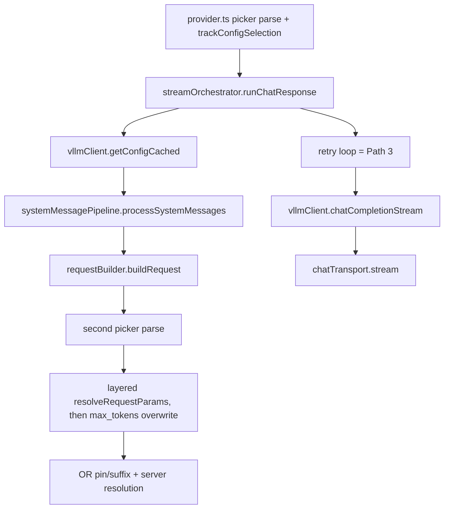

### Findings

| ID | Finding | Severity |
|----|---------|----------|

### Minimal graph

Current graph is the minimal chain; the deltas are exactly P1-1 (duplicate
parse) and P1-2 (dead layer). No node deletions.

## Path 2: Response receiving / inbound stream

**Intent**: Turn SSE bytes from the server into live Copilot parts (text,
reasoning, tool calls, usage) and produce an honest error on any early end.

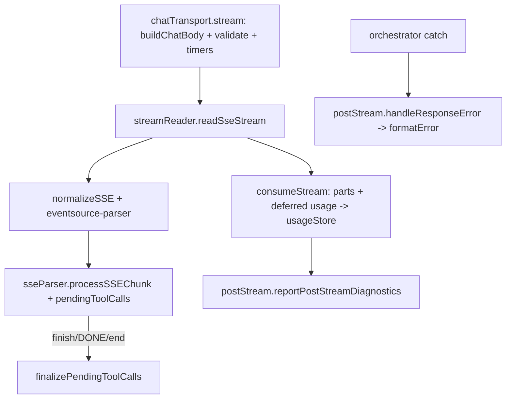

### Findings

| ID | Finding | Severity |
|----|---------|----------|

Timing note (not a finding): the transport/reader pair actually runs THREE
timer phases, initial-response timeout, post-headers content-type sniff
window, and body inactivity; each is load-bearing and separately budgeted
(the old "two timers" phrasing undersold it).

### Minimal graph

At minimum except P2-4. `messageConverter.ts` is 477 lines holding three
concerns (conversion, tool-arg repair, error copy): the file-size split
stays deferred/hygiene, no graph edge.

## Path 3: Auto-continue

**Intent**: When a reasoning model ends with content but no usable
continuation (empty answer, or the vLLM colon-continue signature), grow or
replace an assistant prefill and retry the request within a bounded loop, so
truncated agent turns complete without user nudging.

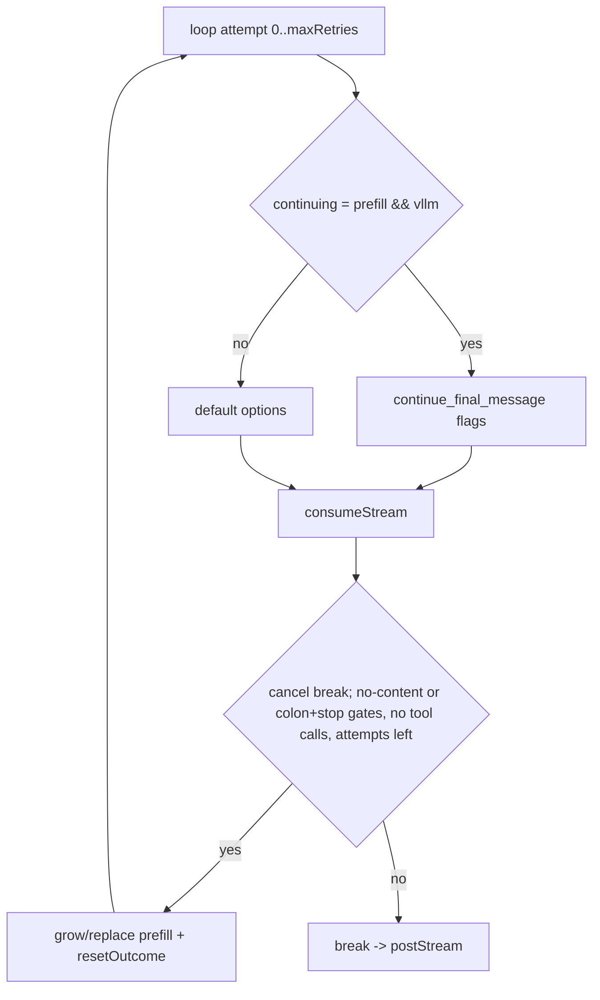

### Findings

None open (two-retry-shape and in-place message mutation waived on Intent,
see ledger; both re-verified honest against current bytes).

### Minimal graph

None. Blueprint matches code; the only former gap was the cancel-break
edge, cosmetic, fixed here.

## Path 4: Tool-call accumulation + repair

**Intent**: Reassemble streamed `tool_calls` deltas (split across chunks,
often with malformed JSON arguments) into complete, parseable tool calls
before Copilot sees them.

```mermaid
flowchart LR
  D[delta.tool_calls sseParser] --> M[pendingToolCalls by index]
  M --> F[finalize: called from finish_reason, DONE, and stream end]
  F --> CS[consumeStream] --> PA[parseToolCallArgs: JSON.parse -> jsonrepair -> parsePartialJson -> null->{}]
```

### Findings

None open. Three-tier arg parse and the accumulate-vs-repair file split are
ruled by Intent (parser stays vscode-free: `sseParser.ts` has zero runtime
vscode imports; `streamReader.ts` imports it type-only, elided at emit).

### Minimal graph

None.

## Path 5: Activation + migrations

**Intent**: Boot the extension as an ORDERED LIST of idempotent steps where
no migration can kill activation: env patches (BYOK/Agents), settings
repair (dedupe, forced registry migration, output-length offer), then
feature-surface registration.

Verified activation order:

1. output channel
2. remote-mismatch warning (non-blocking)
3. setExtensionVersion + setSessionManagerOutput
4. initUsageStore
5. FileLogger + enableFileLogging
6. onDidChangeConfiguration wiring (logger toggle, logBodyLimit,
   `provider.clearCache` on any `vllm-copilot.*`, `resetOpenRouterCaches`
   on `.servers`/`.models`)
7. inline dedupeServerIds repair
8. `await maybeRunServerRegistryMigration` (servers before models, marker after writes)
9. `getConfig` + `validateConfig` -> Output
10. syncBundledPersonalities (non-fatal)
11. models > 0 -> ensure* fire-and-forget
12. provider register
13. `maybeOfferOutputLengthMigration` fire-and-forget
14. schema tool
15. commands + inline deep-dive handler
16. dashboard, server-settings webview, setPollInterval

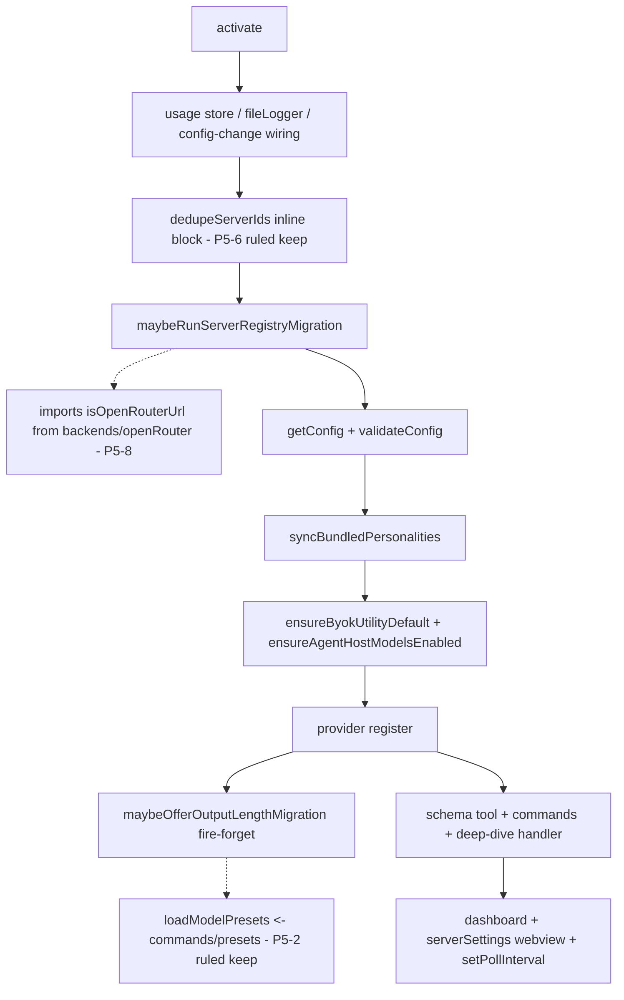

### Findings

| ID | Finding | Severity |
|----|---------|----------|

### Minimal graph

The ordered list above, one node per step, zero nesting. Deltas vs minimum:
the inline dedupe (ruled keep) and the presets edge (ruled keep); the P5-8
edge is closed (host predicate relocated to `state/serverCore.ts`).

## Path 6: Model discovery + Copilot model list

**Intent**: Make the models actually served by each registered server appear
in the Copilot model picker with truthful metadata: real context window and
output budget (clamped to what the server reports), model-mode dropdown, the
Output Length dropdown, and warning banners. Discovery owns the
"advertised == wire" invariant.

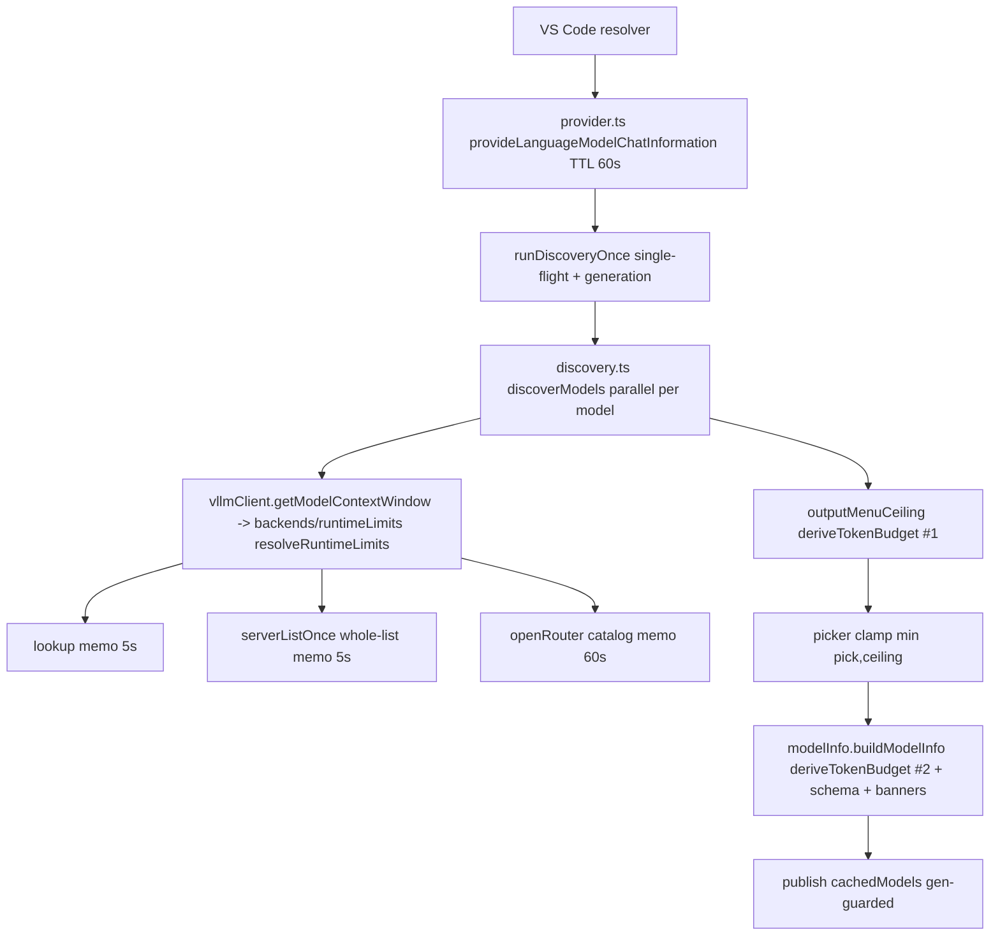

Probe cost is at the Intent's minimum: one list fetch per server per pass
(via `serverListOnce` for vLLM/LM Studio/Ollama; llama.cpp is per-model by
endpoint design; OpenRouter resolves through its own catalog memo). Both
memo layers are success-only, in-flight shared, 5 s TTL, flushed by
`vllmClient.invalidateConfigCache`; the OR catalog memo is deliberately NOT
on that hook (transport failures must not flush a 500 KB global catalog),
it clears on `.servers`/`.models` edits and Test & Refresh.

### Findings

| ID | Finding | Severity |
|----|---------|----------|

### Minimal graph

Already at minimum except the P6-1 duplicated body. Every memo/probe node
answers an Intent clause.

## Path 7: Server registry + config storage

**Intent**: Own the two settings keys (`servers`, `models`); answer "which
server does this model reach?" (registry find, first-wins) and "how do I
persist without clobbering?" (store whole-array writes + model RMW helpers).
Read is intentionally dual: `getConfig` (raw read, cached by `VllmClient`)
for the provider path, raw `readServers`/`readModels` for write flows.

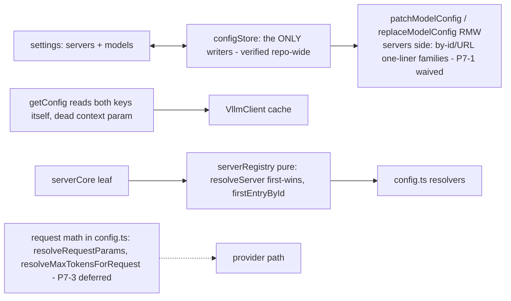

### Findings

| ID | Finding | Severity |
|----|---------|----------|

### Minimal graph

Read path is minimal (dual read defended, see doctrine). Write path: the
P7-1 "missing patch-store API" headline was overruled by the cluster A
self-critique and re-confirmed byte-for-byte this pass; the graph above IS
the minimum. Sole-writer claim re-verified: `workspace.update` on the two
keys exists only in `configStore.ts`. All P7-1..P7-7 rulings hold;
`resolveServerEntry`'s census rent (3 internal callers) is byte-true.
`config.ts` is 784 lines and the deferred request-math (P7-3) has exactly
one customer each (`requestBuilder`); `tokenBudget`'s `shared/` home is
justified solely by `config.ts` importing its scalar math.

## Path 8: Add Server / Add Model flow

**Intent**: The guided journey URL -> entry -> model pick -> backend detect
-> preset/HF/relay metadata -> confirm -> save, with the rollback ladder
guarding only the post-write window.

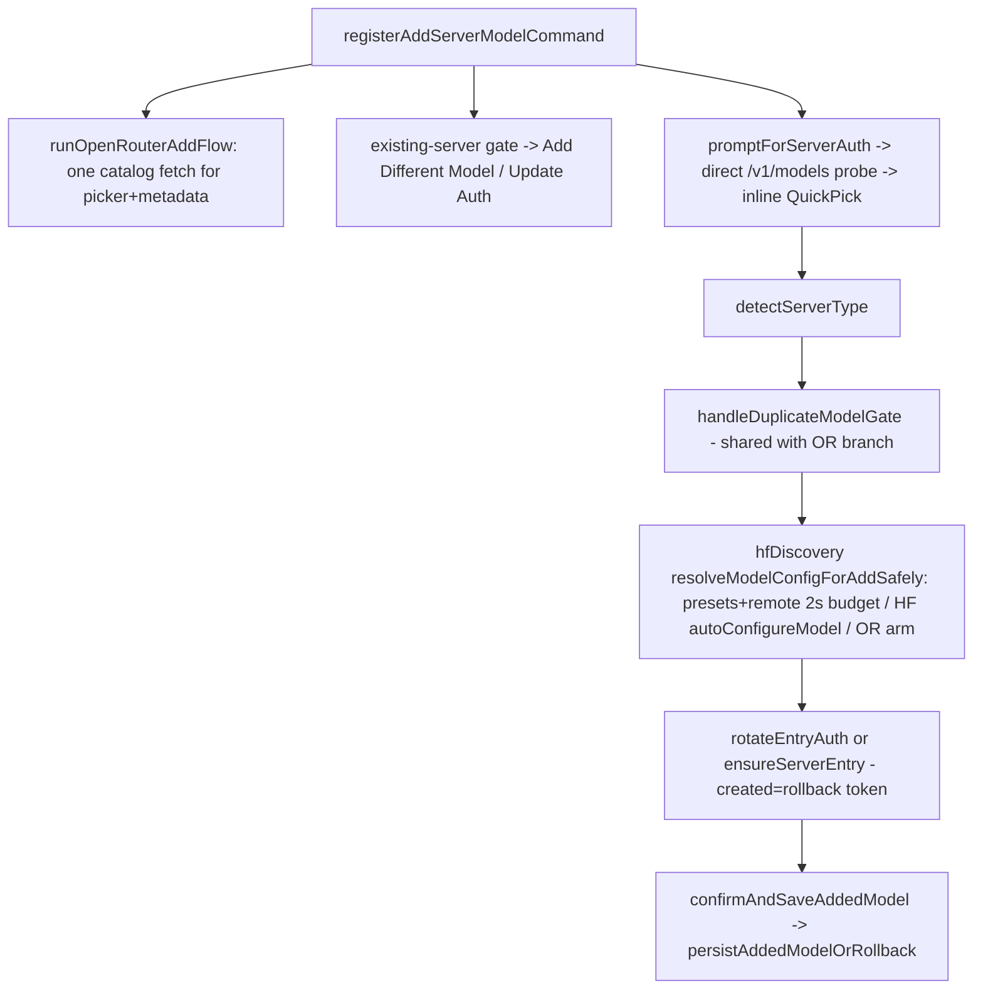

### Findings

| ID | Finding | Severity |
|----|---------|----------|

### Minimal graph

Same spine minus the dead branches and the redundant fetch. The rollback
ladder, dup gate, and write ordering stay exactly as they are.

## Path 9: Server Settings webview

**Intent**: Let a user edit any model's or server's configuration through a
form instead of raw JSON, without the webview ever becoming a second source
of truth. It renders store state, sends patches back through the store.

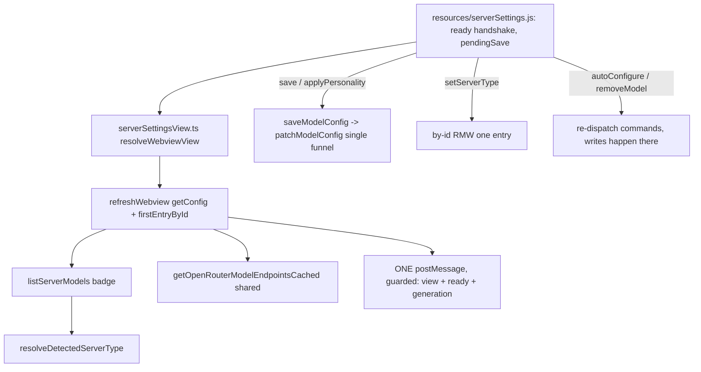

### Findings

None open. Blueprint claims re-verified byte-for-byte: single save funnel,
generation guard, badge through the shared `listServerModels`, by-id
`setServerType` RMW, capture toggle deliberately raw-update with no cache.

### Minimal graph

IS the minimum.

## Path 10: Server management commands

**Intent**: Lifecycle operations on registry entries and models from the
palette or dashboard context menus: update auth, rename, remove server,
remove model, configure cost, test & refresh. The by-id vs URL-fan-out
selector split IS the design.

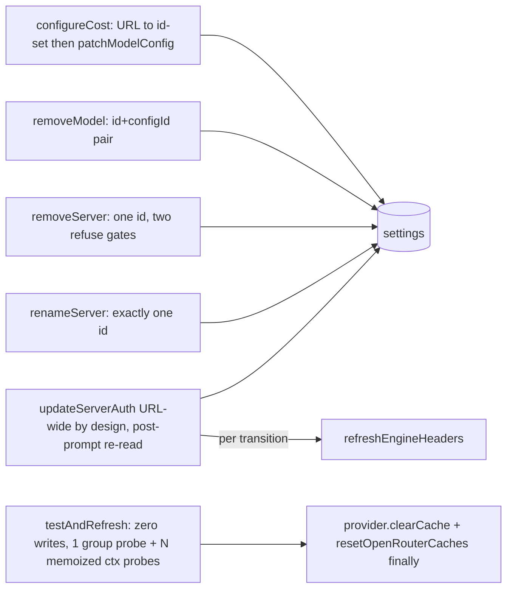

### Findings

None open. Zero-writes verified (no store-writer import in
`testAndRefresh.ts`). The two borderline smalls from this path (error-result
shape x3, refuse-block x2) carry recommendations in the open queue.

### Minimal graph

Current graph; every node maps to a lifecycle verb in the Intent.

## Path 11: Server dashboard

**Intent**: Live read-only tree of registered engines: connection state,
metrics while visible, usage counters, poll cadence. Polling follows
visibility, never runs when nobody looks.

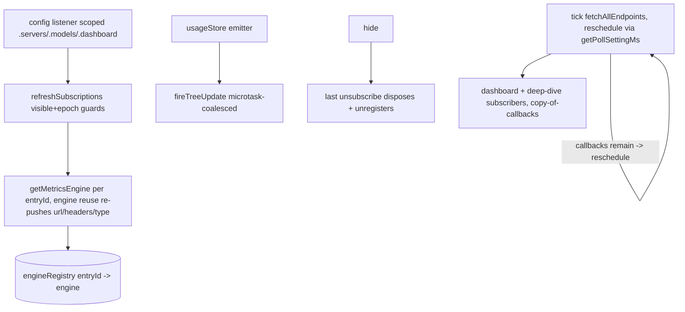

### Findings

None open. Poll default reads through the single `getPollSettingMs`
(the remaining `15000` literals elsewhere are unrelated transport
timeouts); listener scope guard, engine repoint cache-clears, and the
per-model limit clearing all re-verified in bytes.

### Minimal graph

Entry-id engines, refcount-as-subscribers, one cadence. Zero delta.

## Path 12: Deep Dive webview

**Intent**: Per-server detail page for vLLM metrics, opened from the
dashboard. A focused drill-down, nothing editable.

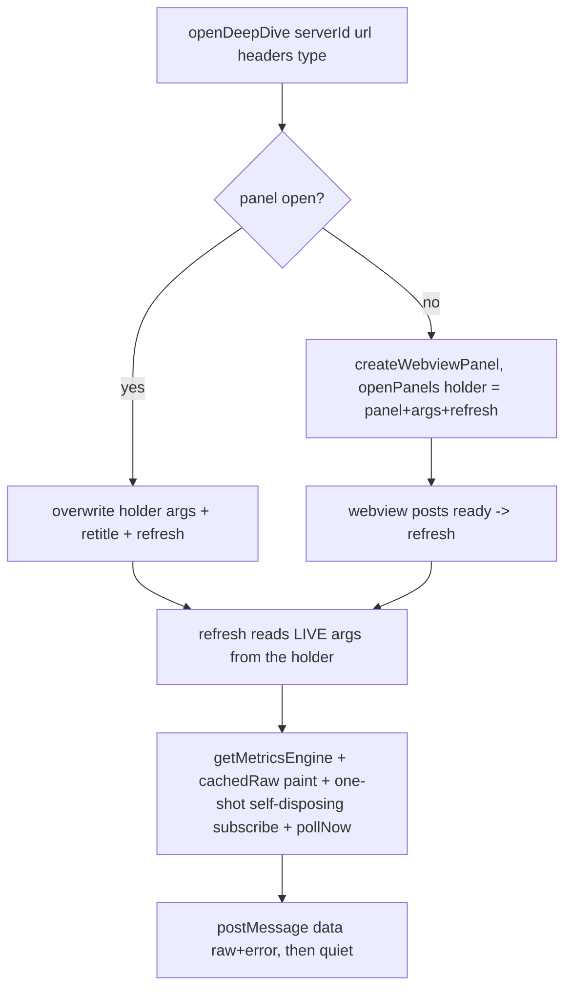

### Findings

None open. The stale-closure bug this path produced was fixed with the
mutable holder visible in the diagram (command overwrites all fields every
invocation; refresh reads the holder), re-verified dead this pass.

### Minimal graph

One message type, one-shot subscription, re-invoke-is-refresh. Zero delta.

## Path 13: Diagnose Connection

**Intent**: When a server is unreachable, tell the user why in one screen:
transport comparison, TLS chain inspection, proxy/environment collection.
Diagnostic-only; it produces a conclusion, never fixes settings.

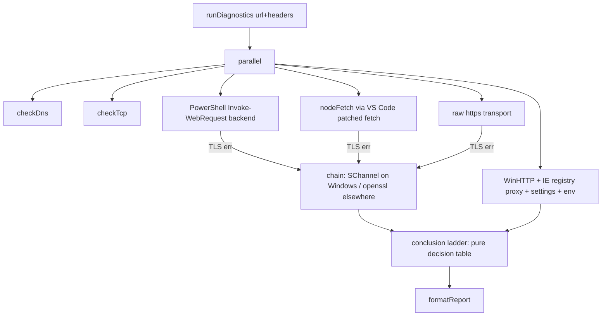

### Findings

| ID | Finding | Severity |
|----|---------|----------|
| P13-1 | Three callers hand-build the probe URL `buildEndpoint(x, 'v1/models')` before calling `runDiagnostics` (recount verified: `commands.ts`, `addServerFlow.ts`, `testAndRefresh.ts`). Review recommendation this pass: **WAIVE**. The shared part is already one call to the shared composer (the pre-emptive waiver "buildEndpoint IS the composer" covers exactly this shape); pushing composition into `runDiagnostics` would pin the probe to `/v1/models` and kill its any-endpoint honesty, which IS the product. The contract is already documented on `runDiagnostics`. | low |

### Minimal graph

Parallel transports, chain-on-error only, pure ladder, pure renderer.
Deliberately duplicates fetching from the serving paths (that is the
comparison). Zero delta.

## Path 14: Usage + cost reporting

**Intent**: Track per-model token usage (and OpenRouter actual cost) across
sessions, persisted, and surface last-request/cumulative numbers plus
derived estimates.

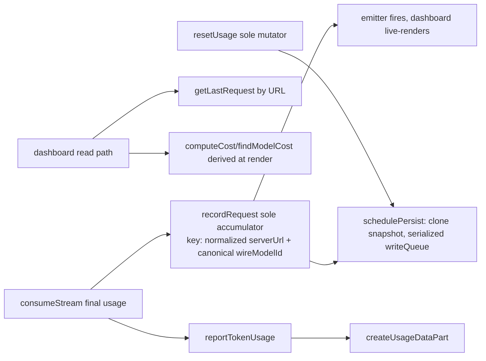

### Findings

| ID | Finding | Severity |
|----|---------|----------|

### Minimal graph

Sole accumulator, sole mutator, serialized writes, derive-don't-store cost
(estimated cost is NEVER stored; rate edits re-price history for free;
actual OpenRouter cost stays in a separate plane, never summed). Only delta
is P14-2. The identity ruling (usage keyed by normalized URL, counters
follow the box not the credential) is documented verbatim in the
`usageStore.ts` header as ruled.

## Path 15: Logging

**Intent**: Optional, user-enabled file capture of full requests/responses
for bug reports, plus an output channel for extension events. Off by
default. Documented policy: headers, Authorization included, are written
verbatim, consistent with the repo's standing plaintext-keys decision.
Do not re-litigate.

### Flow (prose, the graph is a straight line)

`init()` opens one append-mode file per activation (millisecond ISO stamp);
prune keeps 20 by lexicographic (= chronological) order, skipping the active
file; `logBodyLimit` (default 4000) is applied live from the activation
config listener without rotation; `logRequest` writes HEADERS + body
verbatim; close is idempotent via a shared closing promise and
`deactivate()` awaits it. Verified: `logger.ts` is the only writer of
request/response log files (other modules write user data elsewhere; the
previous sentence in this doc overclaimed "only file writer", corrected).

### Findings

None open. Code delta: none.

### Minimal graph

One writer, one file per session, one prune, one live limit.

## Path 16: OpenRouter integration (cross-cutting)

**Intent**: Treat the relay as a first-class backend: catalog-exact
metadata, provider pin + routing suffix on the outbound wire id only,
display-only provider limits, best-effort account probes, cost from the API.

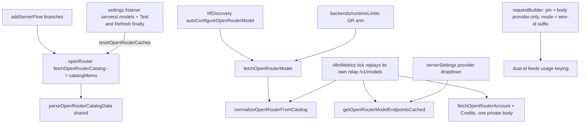

Routing suffix lives ONLY on the outbound wire id; base ids are never
re-derived by splitting (verified: zero `split(':')` sites on model ids), so
the "strip logic duplication" count is zero. The exact-model endpoint is
deliberately unused (variant-confusion guard, documented and tripwired).

### Findings

| ID | Finding | Severity |
|----|---------|----------|

### Cache inventory

Five caches touch OpenRouter-adjacent data; every one has an owner and a
clear hook, all five re-verified:

| Cache | Owner | TTL / lifetime | Cleared by |
|---|---|---|---|
| `catalogMemo` (in-flight shared, failures never cached) | `openRouter.ts` | 60 s | `resetOpenRouterCaches` <- settings listener (.servers/.models) AND Test & Refresh finally |
| provider list cache + in-flight + failure backoff | `openRouter.ts` | 5 min / 60 s backoff | same hook, same triggers |
| `limitsMemo` + `listMemo` | `runtimeLimits.ts` | 5 s | `clearRuntimeLimitsCache` <- `invalidateConfigCache` (every settings change, model CRUD, Test & Refresh) |
| engine per-model resolved limits | `vllmMetrics.ts` | engine lifetime | `setModelIds` prune; cleared on url/type repoint; dies with last subscriber |
| `provider.cachedModels` | `provider.ts` | 60 s + generation guard | `clearCache` (all triggers) + transport failure |

### Minimal graph

The current graph IS the minimum: vendor plane separate from the shared
OpenAI data plane, cache where polling exists, none where probes are
best-effort. P16-3 is documentation, not structure.

## Path 17: Personality system

**Intent**: Rewrite parts of the system prompt Copilot injects, so the model
adopts a voice or strips boilerplate, without touching the rest of the
harness. Per-model file selection, global personality library, exact-
substring rules chained in load-bearing order.

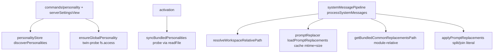

### Findings

| ID | Finding | Severity |
|----|---------|----------|
| P17-1 | **Half survives.** The four bundled-path resolution sites are confirmed (`personalityStore.ts` x3 + `promptReplacer.ts` x1), but the twin-predicate sub-claim is REFUTED in bytes: the two ensure/sync probes use different primitives (`fs.access` vs readFile-as-probe), not copy-paste. Remaining amputation: a 3-line bundled-dir getter inside `personalityStore.ts` over its three joins; the module-relative twin in `promptReplacer` must stay separate (vscode-free + test-safe). Recommendation: close as file hygiene. | low |

### Minimal graph

Delta vs minimum is one getter inside one file. Chain order (persona rules
before common rules) sits at ONE site with a load-bearing comment - that is
correct, not duplication.

## Path 18: Copilot session janitor

**Intent**: One maintenance command: count then purge Copilot session state
from the live `state.vscdb` and three session directories, for sessions VS
Code itself will not delete.

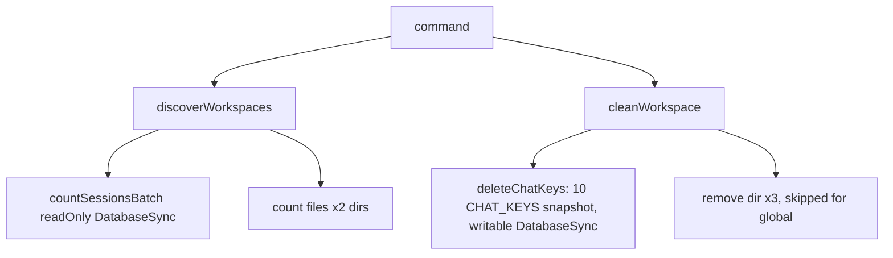

### Findings

| ID | Finding | Severity |
|----|---------|----------|
| P18-1 (info) | Structural cost of the no-API bypass, accepted by design: live-DB writes can be resurrected by VS Code's in-memory ItemTable on shutdown (the flow's restart warnings are the tacit admission); `CHAT_KEYS` is a snapshot of undocumented internals, a VS Code rename silently turns the janitor into a placebo with zero failure signal. No action proposed beyond knowing it. | info |

### Minimal graph

One module, one writer, eligibility = the user picked the row. Nothing to cut.

## Path 19: Presets pipeline (dev-side)

**Intent**: Ship model knowledge as JSON presets (bundled VSIX + live remote
index), guard every load through one strict v2 envelope parser, and pin
freshness/mirroring with canaries so no human gate is needed.

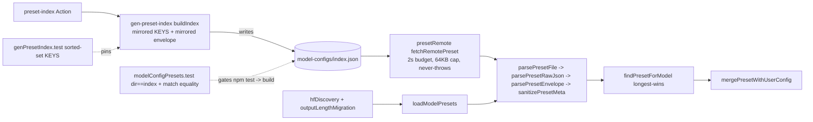

Canary verdicts (all re-verified live): index freshness = vitest
file-list-equality, runs in `npm test` which `npm run build` runs (semantic
JSON comparison, hence EOL-immune); preset-match equality pinned in the same
suite; gen-prompt-drift = manual-only by design (needs GitHub fetch + blob
SHA baseline, whitespace-collapsed); cli-rules = static half in `npm test`
(EOL-normalized read of the anchor file), live half manual vs capture.

### Findings

| ID | Finding | Severity |
|----|---------|----------|

### Minimal graph

The chain `parsePresetFile` (2 real customers) -> two per-case-large phases
(forgive-parse vs strict-reject: the dual-strictness spine, not
pass-throughs) is the minimum. Post-amputation: minus one named node and
one exported symbol.

## Standing doctrine from the cluster reviews

Rulings live in the ledger; this is the doctrine those rulings established,
so the same shapes do not get re-proposed:

- **Dual read is defended.** `getConfig` (cached, provider path) vs
  `readModels`/`readServers` (raw, write flows) serve different freshness
  needs; one shared cache would make one of them wrong.
- **The by-id vs URL-fan-out selector split is load-bearing** and must stay
  visible at call sites: Update Auth rotates URL-wide on purpose,
  destructive and typed writes address exactly one entry id.
- **Graphs find fan-out; function bodies kill false symmetries.** Several
  first-pass findings ("N sites look alike") died on hostile re-read:
  "could be one helper" is not "should be one helper".
- **A re-export facade pays fake rent to its own re-exports.** After killing
  a facade, re-check the true caller counts.
- **A census TEST_ONLY flag is un-export hygiene, not a structure finding.**
  A function with four in-file production callers pays rent; only its
  export keyword is test-bought.
- **A grep proves the words are gone, not the behavior.** Dead branches
  hide in copies that carry none of the grepped words; verify by reading.
- **Out of scope by ruling:** auto-merging same-connection registry entries
  (user data decision), collapsing the dual read, hiding the selector split.

## Pre-emptively waived (do not re-propose)

Candidates killed before they became findings, per the standing doctrine and
the reverse-law census (measured code doubles judged NOT worth a function):

| Candidate | Killed because |
|---|---|
| `buildModelInfo` 8-param soup | signature hygiene, not a graph edge; note only |
| Merge the two longest-match implementations | trust asymmetry: `longestListMatch` consumes hostile input, `findPresetForModel` trusted |
| Merge the three preset fetch helpers | genuinely different contracts (deadline / size-capped / retry) |
| Server-side patch store API for servers | P7-1 waiver; prompt-scoped RMWs a generic helper cannot own |
| Header-merge helper | identical to waived P7-7, not double-counted |
| Collapse all `/v1/models` fetchers | diagnostics' independent transports ARE the product; only the display/lookup subset shares `listServerModels` |
| Logger redaction | standing repo key policy, not a finding, do not surface |
| sessionManager staleness rule | none exists, nothing to deduplicate |
| `fetchJsonRaw` vs the probe closure in `listServerModels` | documented retry-vs-fast-fail asymmetry; `ServerProbeError` carries the numeric status the auth classifier needs, `fetchWithRetry` cannot |
| Arg-extraction preamble in commands (x4 sites) | 1-2 lines of idiom sitting on the by-id/URL selector split; a union-typed helper would be larger than what it kills |
| Four context-window error throws in the resolver | backend-specific user advice; templating them flattens the diagnostic |
| OpenRouter URL composer | `buildEndpoint` already IS the composer, every endpoint join goes through it |
| 401/403 classification prose | single classifier (testAndRefresh); the webview badge only logs and hides |
| Webview escaper duplicated per webview | cross-webview self-containment, 2 lines |
| `err instanceof Error ? ... : String(err)` (~45 sites) | one-line idiom; `describeError` adoption is selective hygiene for user-visible copy, not a reverse-law unit |
| Dual KEYS list + envelope mirror in gen-preset-index | the mjs import wall; both mirrored halves are pinned by tests that check the mirror itself |
| `gen-preset-index.d.mts` | type seam for its single typed importer, pays its rent |
| `consumeStream` 11-positional call site | same precedent as the waived 8-param note above: signature hygiene, not a graph edge |
| `checkDns`/`checkTcp` absorbs | parallel-branch fan-in with a uniform envelope, not a chain |
| `parseOpenRouterBranchInput` absorb | absorbing it would export a 54-line private parser across the module wall: net loss |

## Pass 2: the rent census

Pass 1 asks "does this node serve the Intent". Pass 2 asks "does this node
deserve its own name": every function/module/file must be genuinely large
(per-case, phases/branches, no line quota) or have >= 2 production callers.
Tests are not customers. Method rule 5 carries the law. Every capital claim
gets re-verified against code before being published here (a census verdict
REJECTION was upheld this pass: `resolveServerEntry` has 3 internal callers,
pays rent, stays).

### Doctrine collision: tests vs structure (resolved)

The law said tests do not count as callers; the test doctrine said the
wire-format tripwire crew is sacred. Ruling: **code structure wins.**
Absorption proceeds; the affected tests either (a) test the larger surviving
function from several angles, or (b) are replaced by reading-and-reasoning
code review. No structure is sacrificed for test ceremony.

### Tooling: the census is a command

Four npm scripts, all read-only, all safe to run anytime:

- `npm run dep:check` - dependency-cruiser gates at FILE level, split in two
  cruises because one graph cannot tell two truths at once:
  `.dependency-cruiser.cjs` cruises post-compilation edges (runtime truth:
  `no-circular` must not count `import type` edges - the config.ts <->
  serverRegistry.ts cycle is a phantom that vanishes in `out/`), plus
  `types-ts-stays-pure`, `state-layer-no-ui-or-commands` (P5-2 exception
  encoded there, dies with the finding; P5-8 proposes closing the
  `backends/` hole), `provider-no-ui`.
  `.dependency-cruiser.consumers.cjs` cruises pre-compilation edges:
  a type-only importer IS a consumer when the question is "does anything
  read me" (`no-orphans`). Both currently clean.
- `npm run dep:graph` - writes `temp/dependency-graph.md`, a Mermaid
  rendering of the runtime module graph (same edges the gate checks).
- `npm run rent` - `scripts/rent-census.mjs`, the pass-2 law on the
  TypeScript compiler API. For every module-level function/class/iface/type
  in src + test helpers it prints: size, distinct production caller modules,
  test files, in-file callers, and a flag:
  `DEAD`/`CONTRACT_DEAD` (zero refs), `TEST_ONLY` (exported, tests are the
  only customer - un-export or delete), `ABSORB_SMALL` (one prod call site,
  small), `INTERNAL_SINGLE` (private, one in-file caller), `CONTRACT_*`
  (interfaces/error classes are NAMED not called; single external namer is
  normal), `BIG_SINGLE` (one caller, sizeable: per-case human verdict),
  `REUSED` (pays rent). Plus: `PASS_THROUGH_FILE` (re-export facades),
  same-file collapse chains, and a naive hint pass for `resources/*.js` /
  `scripts/*.mjs`. `--tsv` for machine diff, `--max-small=N` only moves the
  ABSORB_SMALL highlight knob (not a keep-threshold), `--fail-on=dead` is
  wired into `npm run build`: dead named things fail packaging.
- `npm run cluster` - `scripts/cluster-census.mjs`, **pass 3: does each
  function live in the right file?** rent asks "should this function exist",
  dep:check asks "may this file import that"; nothing asked placement until
  now. Builds the function call graph (TypeScript compiler API, production
  `src/**` only - tests are not customers, doctrine), attributes nodes to
  files, patches the two blind spots the call graph cannot see (webview
  message-type pairs to `resources/*.js` pseudo-nodes, weight 0.5; shared
  import symbols, weight 0.25, hub symbols above `--hub=15` skipped so
  wire-types cannot fake a merge-everything attractor), then prints:
  `MOVE_GAIN` (a function whose call weight points mostly at ONE other file,
  `--min-share=0.6`/`--min-weight=2`, gated on >= 1 real call edge toward the
  target so patches alone cannot nominate trivia; `extFiles=1` + `home 0` is
  the strong move signal, `extFiles>=2` with no home use is usually an honest
  module API), `SCC_CROSS` (function-level cycles spanning files - the
  ping-pong a clean file DAG hides), `MODULARITY` (Q of the current file
  partition vs a deterministic greedy reference - diagnostic smoke alarm,
  never a refactoring plan), `CONDUCTANCE` (cut/volume per file; a
  conversation-starter - leaf/registry/library files are cut-heavy BY
  DESIGN). Determinism: sorted traversals, alphabetical tie-breaks, same
  bytes in equals same report out (`--tsv` diffs, run twice to prove it).
  The graph is evidence, not law: every candidate gets the pass-1 Intent
  test and the pass-2 rent test before it earns a move, and class members
  nominated by their callers are read as API-surface notes, not move orders.
  **TOOLS exception (user ruling 2026-09-04):** a common-helpers file is a
  legitimate shape - helpers consumed everywhere and rarely calling each
  other are a TOOLBOX, not a misplaced cluster. The exemption is earned
  mechanically, never claimed: `src/shared/` only (the declared toolbox
  directory), stateless (no top-level `let`/`var`), loosely self-coupled
  (internal call edges <= function count), and >= 4 distinct consumer
  files. Qualified files print `[TOOLS]`, their conductance is annotated
  not nagged, and a MOVE_GAIN on one of their helpers with >= 2 consumers
  is skipped (generality proven, helper stays). A single-consumer helper
  in a toolbox stays NOMINATED: a machine can disprove laziness but can
  never prove a helper is general, so that ruling stays human. Shared
  files that FAIL the shape test (module state, dense internals) are
  printed as `[not yet]` - they are domain modules in toolbox clothing,
  and the profile refuses to launder them (sessionManager, live example:
  state + 40 internal edges + 3 consumers = proper cohesive module, not
  a toolbox, and it needs no exemption because its conductance is already
  low).

Census policy: names matching `register*`/`ensure*` whose sole production
caller is the `extension.ts` activation block are command/lifecycle WIRING -
the command table IS their product. ENTRY-class rent, never absorb-bait;
the census prints them as single-callers, reviewers must know the exemption.

Workflow ruling: before executing any amputation unit, regenerate the
census (`--tsv`) and mechanically confirm the unit's caller claims against
the table instead of trusting memory or this document, and diff the census
afterward. The census is also the amputation tripwire: if an absorbed
function had a live organ, `npm run compile` screams.

## Pass 3 findings: placement (cluster lens, 2026-09-04)

The lens nominated 19 candidates; every one was checked against bytes before
any ruling. Executed:

- **C-1** `usageStore` display family: `fmtCount` (18 dashboard call sites,
  zero in-store) and `computeCost` (pure render-time money math, dashboard
  only) moved into `dashboard.ts`'s formatting section as private functions
  (same precedent as the U7 move). Test reroute: `usageStore.test.ts` carried
  dead imports of both - deleted, no pin lost. WAIVED siblings with reasons:
  `emptyCounts` (3 in-store call sites, moving it would force the
  usageStore -> dashboard import cycle), `getModelStartedAt` /
  `getServerUsage` / `resetUsage` (store accessors: the graph reads a single
  consumer as homelessness, the store IS their job), `formatCost` (live
  internal caller `formatCostSummary`).
- **C-2** `config.buildAuthHeaders` -> `commands/serverAuth.ts`, its only
  caller; the config docstring had been apologizing for exactly this for
  months. Bearer-shape tripwire pin rerouted, export kept as tripwire crew.

Ruled KEEP / noted (no action): **C-3** `config.normalizeModelEntry`
(ModelConfig invariant guardian, belongs with the type; the graph is evidence
not law); **C-4** `promptReplacer.loadPersonalityMeta` weak 3-edge signal;
`register*` candidates are ENTRY wiring (standing rule); class members
nominated by external callers (`FileLogger#isActive`,
`OpenRouterAccountTreeItem#ctor`, `VllmClient#chatCompletionStream`) are
API-surface notes; `buildModelId`, `formatUsdRate`, `finalizePendingToolCalls`
are honest module APIs (multi-file consumers).

Post-move baseline: candidates 19 -> 16, Q 0.704 -> 0.736, SCCs still 0.
Remaining 16 are the waived/noise set above plus new same-family echoes.

## Round 7: full re-review via the portable agent (2026-09-04, executed same session)

Clean-slate review under the language-agnostic `Structural Review` agent; all
prior IDs stay dead, standing rulings (rules 7/8/9) were loaded as law.
Native tooling won per Step 0 (`dep:check` / `rent` / `cluster`, evidence
snapshots in `temp/`, double-run determinism verified). dep:check clean,
SCCs 0, Q held baseline: no regression, the ratchet holds. Survivors: 3,
verified against bytes before execution, all executed same session.

- **R7-P5-1** (placement): the 30-line anonymous `openDeepDive` command
  closure in `extension.ts` (domain logic: entry lookup by id, vLLM guard,
  URL/header normalization, sole reason two config helpers were imported)
  absorbed into `registerOpenDeepDiveCommand` in `ui/deepDiveView.ts`, the
  domain home. The census now sees it: `BIG_SINGLE`, caller
  `extension.ts::(module scope)` = ENTRY wiring, ruled keep.
- **R7-P5-2** (placement): the anonymous `setPollInterval` closure moved to
  `registerSetPollIntervalCommand` in `ui/vllmMetrics.ts`, directly under
  `getPollSettingMs` - the key's writer and reader now share one file.
  Census row as expected. One forced adjustment: the closure's
  `validateInput` returned `null` (accepted only by old dts); now returns
  `undefined`. Falsy-contract unchanged.
- **R7-P14-1** (existence): `usageStore.resetUsageStoreForTests` deleted
  (prod:0, test:1, no escape applies). `usageStore.test.ts` rerouted per
  structure-beats-seams: `vi.resetModules()` + dynamic namespace per test
  (30 call sites; the mid-test "window reload" case literally re-imports),
  plus 8 dead names swept from its import block. TEST_ONLY 13 -> 12.

Both closures were invisible to every census while anonymous - the ENTRY-
class blind spot made flesh; grepping `vscode.commands.registerCommand` in
`extension.ts` now returns 0 and belongs in the next round's checks.

Notable waivers (full graveyard in the review report): the `usageStore`
collapse-chain nominations are a false chain (`mergePersisted` is a
5-plane merge fan-out with per-plane clamp/reset semantics);
`isVersionAtLeast` not absorbed (would inline a documented gate invariant
into the path's largest builder); the webview's local `clearCache?.()` is
multi-trigger fan-in onto one owner, not dual ownership; TEST_ONLY names
whose bodies are internally REUSED stay un-export-hygiene, not structure.

Post-round baseline: candidates 16 unchanged (moves don't touch the call
graph's shape), Q 0.736 -> 0.753 (placement improved: two blocks now sit
where their weight points), SCCs 0, tests 826 pass / 3 skip.

**Census caveat, permanent**: rent's `prod:N` counts distinct caller
MODULES, not call sites. `normalizeModelEntry` prints `prod:1` while
having four call sites (`configStore.ts:129,134,203,209`). C-3's KEEP is
strengthened, and any ABSORB_SMALL execution must recount sites by hand
first. Also this round caught the search index hallucinating a ledger
section that did not exist on disk: rule 9e now covers your own grep tool.

## Open queue (pending user rulings)

No open queue. The three standing items were ruled at fix-pass 6 (2026-09-03):

- **P20-1**: KEEP `autoConfigureOpenRouterModel` as a named function. Its
  @throws contract (`OpenRouterCatalogUnavailable` → caller falls back to the
  byok draft + background refetch) is the concept; absorbing it into
  `autoConfigureModel`'s branch would hide a cross-process failure mode inside
  a linear flow. Rent law respected: the name guards a documented contract, it
  is not a pass-through.
- **U8b**: EXECUTED in full. The two HF fetchers folded into
  `autoConfigureModel` (gloss + generation config stay live on two call sites
  and remain functions); `resolveModelConfigForAdd` collapsed into its Safely
  wrapper; `formatPerMillionUsd` deleted; `resolveOpenRouterRuntimeLimits`
  ruled KEEP (its three-line body encodes the no-merge load-order rule where
  the invariant lives); `fetchVllmModelInfo` KEEP as ruled.
- **Un-export hygiene**: EXECUTED where it was junk (`ResolvedModelSettings`
  type un-exported, internalized in `config.ts`; `ConfigExports` facade
  deleted). The remaining test-only exports are the **auth tripwire crew**
  (`isModelNotInRuntimeError`, `isRetriableFetchError`, `isAuthError`) and the
  flow entry points (`promptAddServer`, `runAutoConfigureFlow`,
  `discoverAndAddHfModels`, `ensureServerEntry`, `pickOpenRouterModel`,
  `buildOpenRouterSummary`, `runOpenRouterAddFlow`,
  `userDataRootFromGlobalStorage`) - all ruled KEEP under the tests-vs-structure
  doctrine: they pin the silent-failure classes (un-authed 401, no-catalog
  price lie) that a wrong refactor would ship silently. The doctrine already
  accepted structure concessions to test seams (2026-09-03).

### Executed units (gauntlet-green, census-diffed)

- **Fix pass 6** (round-1 re-review execution, 2026-09-03): the per-path
  amputations this ledger recorded as executed had their rows pruned here
  (P1-1, P1-2, P2-4, P5-8, P6-1, P7-8, P8-2, P8-6, P8-7, P14-2, P16-3, P19-2,
  P19-3); git history carries the diffs. The round-1 survivor fixes
  (CR-19/20/22/25/26/27/29/31/74/81/87/94) shipped with it; CR-94's validator
  documented as a deliberate tripwire, not a bug.

- **P1-1 + P6-1**: one `readPickerSelection` reader and one
  `normalizePickerTokens` rule in `state/config.ts`; provider tracking and the
  request builder read the same parse, tracked values are normalized exactly
  like the wire value.
- **P1-2**: `max_tokens` is no longer seeded into the params layering at all;
  the output budget is decided once, after the spread, by
  `resolveMaxTokensForRequest`.
- **P2-4**: `isTransportFailureText` exported from `messageConverter.ts`;
  `formatError` and the orchestrator's cache-invalidation decision share it.
- **P5-8**: host predicate relocated to `state/serverCore.ts`, lane closes the
  `backends/` hole.
- **P7-8**: both lying caller comments in `config.ts` corrected to the true
  single customers (`serverAuth.ts`; the `configStore.ts` write paths).
- **P8-2**: `openRouterCatalogConfigFields` + `openRouterInfoDetailLines` in
  `backends/openRouter.ts` - Add flow and Auto-Configure consume the same
  projection; flow-specific head/trailer lines stay at the call sites.
- **P8-6**: `Promise.allSettled` replaced with `Promise.all` in
  `autoConfigureModel`; the fetchers swallow to `null`, the rejection branches
  were unreachable.
- **P8-7**: `serverRoot` threads into `autoConfigureModel`; a caller that
  already probed `/v1/models` skips the second identical probe.
- **P14-2**: `createUsageDataPart` absorbed into `reportTokenUsage`; the
  wire-shape tests drive the progress sink (fake progress collecting parts).
- **P17-1**: `getBundledPersonalitiesDir` getter - three hand-rolled joins
  collapsed to one named fact.
- **P19-2**: `sanitizePresetMeta` folded into `parsePresetEnvelope` (lenient
  meta rule kept verbatim).
- **P19-3**: `stripJsonComments` private; `parsePresetRawJson` is the
  test-facing parse boundary (canary tests rerouted).
- **testAndRefresh x3**: one per-task `errorResult(errorMessage)` closure
  replaces three byte-identical all-parked skeletons.
- **PF-2**: `LastRequestTreeItem` carries the `LastRequestData` record plus
  the tree-context `serverType` - 21 positional params to 2; the derived
  server timings are fields on the item.
- **P16-3**: runtime-truth doc comment on `serverCore`'s `isOpenRouterUrl`:
  the declarative `serverType` field is the sole runtime truth, the host
  predicate is a detection/migration concern and must never gate behavior.

## Settled rulings (single source of truth for standing decisions)

Finding IDs are `P<path>-<n>`; cluster labels are single letters A-F. These
rulings were each re-verified against current bytes this pass.

| ID | Finding | Decision |
|----|---------|----------|
| P7-1 | No server patch/replace store helpers, ~10 ad-hoc RMW sites | **waived** (false symmetry with patchModelConfig; 1-line map/filter/append families; a helper cannot own the post-prompt re-read) |
| P7-2 | Resolver alias chain + dead `getConfig` context param | **waived** (4-line adapter, 7 dutiful callers, signature churn for nothing) |
| P7-3 / P1-3 | config.ts mixes state with request math (784 lines) | **defer** (file-size, not graph complexity; each math export has 1 customer) |
| P7-4 | `toPublicModelConfig` casts back deleted legacy keys | **keep as-is** (2 real call sites, trust boundary against hand-edited settings.json) |
| P7-5 | deep-dive bypasses `firstEntryById` | **waived** (`.find` IS first-wins; the helper is for iteration) |
| P7-6 | deep-dive hand-rolls `resolveServer` | optional 4-line cleanup, not a unit |
| P7-7 / P8-3 | auth-merge sandwich duplicated x2 | **waived** (~5 lines; the helper would be larger) |
| P5-1 | Output-length offer UI (244 lines) heavier than the forced migration | **keep** (user ruling: the optional-migration offer IS the contract) |
| P5-2 | activation reads `commands/presets` | **keep / defer** (contingent deletion died with the P5-1 keep; dep-cruiser exception encoded) |
| P5-3 | triple junk-URL guard in migration planner | **waived** (3 distinct skip reasons, one-shot planner) |
| P5-4 | entry build + backfill duplicated in planner | **waived** (not the same rule: OR default vs first-defined-wins) |
| P5-6 | dedupe block inline in activate() | **waived** (~19 code lines, one caller, ordering comment is local) |
| P2-1 | `messageConverter.ts` holds three concerns (477 lines) | **defer / hygiene** (no graph edge; correction: three, not four - the image handling is inline in the converter and the transport predicate lives in the orchestrator) |
| P2-2 | multiple inactivity timers on the stream path | **waived** (three distinct phases: initial response, headers/body sniff window, body idle; one budget each) |
| P2-3 | `VllmClient.chatCompletionStream` pass-through | **waived** (keeps ProviderClient stable; the bigger spine question is parked as U10) |
| P3-1 | two retry shapes in one loop | **waived** (Intent: empty nudge vs vLLM colon-continue) |
| P3-2 | in-place mutation of `openaiMessages` | **waived** (documented, cheaper than clone) |
| P4-1 | three-tier tool-arg parse | **waived** (Intent) |
| P4-2 | accumulation vs repair in different files | **waived** (parser stays vscode-free, verified) |
| P14-1 | usage keyed by URL vs engines keyed by entry id | **RULED: document** (usage follows the box, not the credential; verbatim in the `usageStore.ts` header) |
| P16-5 | claim that `formatPerMillionUsd`'s comment lies | **REJECTED** (comment misattribution: the quoted sentence belongs to `formatUsdRate`, which the dashboard does call; the missing /1M suffix is deliberate, the row label carries "(1M)") |
| P18-1 | live-DB write + CHAT_KEYS snapshot fragility | **info, accepted by design** |
| P19-1 | remote vs bundled stripper strictness delta | **waived** (remote input is the hostile side; asymmetry is the point) |
| P13-1 | OpenRouter pin/suffix copy sites | **waived** (recount: 3 sites, not 4; the composer is already shared and pinning kills any-endpoint honesty) |
| removeServer refuse x2 | pre- vs post-confirm refuse copy | **waived** (deliberately different messages: "still used... Remove those models first" vs "now used... Removal cancelled" - unifying them would erase which race was caught) |
| U10 / PF-4 | VllmClient spine wrappers | **closed as keep** (the wrappers are one-liners, and the provider-level DI seam `dependencies?.client` already carries the tests; killing the class would strand the config-cache pair for zero graph gain) |
| Style | em dash in user-visible strings | **ruled and executed in full** (2026-09-04 completion): no `—` anywhere a human reads - UI toasts, error copy, diagnostics, quick-picks, validation warnings, tooltips, webviews, settings.json writes, dashboard placeholder glyphs (the earlier typography exemption is revoked), AND the shipped text corpus: README, CHANGELOG, `docs/**`, `package.json` descriptions, `model-configs/` README and `notes` (they render in the add consent dialog), and personality `description` fields (they render in the quick pick). The `messageConverter` status-text parse cuts on ` - ` in lockstep with `fetchRetry`'s status line; exemptions: source comments, en dashes in numeric ranges (`0.0-2.0` family), the `configSchemaTool` LLM prompt, and personality `replace` bodies (model-facing prompt text, same family, ruled 2026-09-04) |
| (struck) | "modelLabel x3" dedup candidate | **struck** - no such function or variable exists anywhere; all hits were a reused parameter name in `dashboard.ts`. Ledger phantoms die here |
| (struck) | P17-1 twin-predicate sub-claim | **struck this pass** - the two probes use different primitives; only the 3-join getter survives |

## src layout

The folders mirror this doc's layer clusters: `provider/` (request
pipeline), `state/` (config + registry), `migrations/`, `backends/`
(per-backend probing, OpenRouter), `commands/`, `ui/` (dashboard, deep-dive,
server settings webview, diagnostics, metrics engine), `usage/`,
`persona/`, `shared/` (logger, error envelope, fetch retry, session janitor,
schema tool, token math). `extension.ts` (entry point) and `types.ts`
(wire-type seam) stay at root. The dependency-cruiser lanes are folder
rules; `tokenBudget` lives in `shared/` because `state/config.ts` imports
its math, and `promptReplacer` resolves the bundled `prompt-replacements/`
dir module-relative, so moving it changes the depth.
