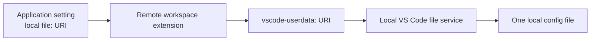

# Config File Plan: Optional Local Config File

Status: BRIDGE PROVEN 2026-09-25. No production file backend yet; the optional backend is now unblocked to be built.
Date: 2026-09-25. v5, updated after the local-write to WSL-read/write to automatic-local-observation round trip was verified on a real local Windows host with WSL.

## 0. Ruling ledger (owner decisions, 2026-09-25)

| # | Topic | Decision |
|---|---|---|
| 1 | Default backend | Keep `vllm-copilot.servers` and `vllm-copilot.models` in settings.json. No automatic migration; the file backend is opt-in. |
| 2 | Migration cleanup | An explicit settings-to-file migration may offer cleanup after the file and pointer are verified. "Keep as backup" remains available, plus a later cleanup command. |
| 3 | Pointer | One optional application-scoped, non-synchronized setting stores an absolute local `file:` URI. Empty means settings mode. |
| 4 | Local file access | The workspace-hosted extension converts the local `file:` URI to VS Code's internal `vscode-userdata:` scheme for `workspace.fs` operations. No URL, mount, network path, or second extension. |
| 5 | Extension topology | **Workspace-only is an invariant.** Remote requests must execute beside the remote server. UI or mixed placement is not a fallback. |
| 6 | Migration depth | Two arrays only. Diagnostics and dashboard settings stay in settings permanently. |
| 7 | File format | Strict JSON. Human annotations use `//` or `_comment` string keys. |
| 8 | Reload semantics | File mode requires a `FileSystemWatcher` on the local config URI. Internal writes update immediately; cross-host writes are reloaded after a debounced event. `Reload config file` remains the recovery command. |
| 9 | Schema + LM tool | Reuse `configSchemaTool` plumbing; return the active backend and local path. |
| 10 | Failure handling | A missing, unreadable, invalid, or unwritable file reports a clear error. The extension stays alive with no models. |

## 1. The problem

`vllm-copilot.servers` and `vllm-copilot.models` are arrays in VS Code settings that the extension itself writes. Model entries run 40 to 80 lines once modes, params, and costs fill in, so settings.json becomes a database wearing a trenchcoat. Verified in code:

- `configStore.ts` is the sole writer, always whole-array. Human hand-edits racing extension writes lose silently, and comments inside the arrays are destroyed by today's writes anyway.
- Both settings are `scope: "window"`, so their current values can be tied to an editor window or remote settings layer. The planned pointer must not repeat that topology mistake. Portability today is manual settings.json surgery.
- Cross-entry integrity (every `model.server` must name a registry id) cannot be expressed in the settings schema. It is runtime code with warnings.
- Several hundred lines of package.json exist only to validate these arrays, and the LM tool plus `schemas/vllm-copilot-models.schema.json` both instruct humans and AIs to edit "in VS Code settings".

The repo already points at the exit (`systemMessageReplacementsFile` is a pointer-to-data setting), and so does VS Code itself. See BYOK, section 3.

## 2. The design

Settings mode remains the default. An optional config file holds the same two arrays when the user explicitly selects one.

```json
{
  "$schema": "https://github.com/fuzzifikation/vLLM-Copilot/blob/main/schemas/vllm-copilot-config.schema.json",
  "version": 1,
  "//": "my notes survive here, this is a real key with real string values",
  "servers": [ { "id": "home", "serverUrl": "http://localhost:8000/v1" } ],
  "models": [ { "id": "qwen", "server": "home", "maxOutputTokens": 4096 } ]
}
```

- `vllm-copilot.configFile` is the only new setting. Empty means settings mode. A value is an absolute local `file:` URI selected through a native local file dialog.
- The setting is `scope: "application"` and `ignoreSync: true`, so the remote workspace extension receives the pointer while another client does not inherit a machine-specific path.
- `configStore` becomes the sole reader and writer for both backends. Every direct settings read is inventoried and re-pointed before the file backend lands.
- Backend selection happens once during activation. Existing consumers read one initialized in-memory snapshot.
- A file newer than the extension understands is refused without changing the current runtime configuration.

## 3. BYOK is the route precedent

VS Code's Bring Your Own Key feature keeps model definitions in `chatLanguageModels.json`, a local user-data file opened by the workbench. Its shape is close to ours, and it proves that a large model array can live outside settings.json.

The relevant transport is VS Code's built-in `vscode-userdata:` filesystem provider. That provider lives in the local workbench and delegates to the local disk provider. A remote workspace extension does not install a remote shortcut for that scheme, so `workspace.fs` requests cross VS Code's extension-host RPC and reach the local client. [remote-local-file-bridge.md](./remote-local-file-bridge.md) records the verified mechanism, the VS Code source facts behind it, and the acceptance evidence.

We reuse that local-file route while keeping vLLM-Copilot workspace-hosted. BYOK's UI-side extension placement is not the model for vLLM-Copilot.

## 4. Local file topology

**Workspace-only placement is an architecture invariant.** Remote request code must execute beside the remote vLLM or OpenRouter endpoint so `localhost:8000` and similar addresses keep their intended meaning.

The configuration route is:



- Node `fs`, `os.homedir()`, and `globalStorageUri` resolve on the workspace host. They never locate the local config file.
- Plain `file:` requests through `workspace.fs` are also intercepted by the remote extension host's disk provider. The production adapter must convert the saved local `file:` URI to `vscode-userdata:` before every file operation.
- The file picker must receive a local `file:` default URI so VS Code uses its native local dialog. The returned URI is saved unchanged as the application-scoped pointer.
- `~` and relative paths are rejected. A remote extension cannot expand local home directories correctly, and the workspace must never choose a file that receives authentication headers.
- One local client has one canonical file. Its local and remote windows read and write the same physical file through the local workbench provider. Proven on 2026-09-25 with a local-write to WSL-read/write to automatic-local-observation round trip, not merely the same file being read by two WSL windows. See [remote-local-file-bridge.md](./remote-local-file-bridge.md).
- Separate client computers have separate local files and pointers. Synchronizing one config between computers remains a user choice.
- No second extension, mount, network path, or path translation is part of the design.

The round trip required for acceptance has been run and passed: local wrote token A and left the file open, WSL read A and wrote token B, and the local window observed B automatically with no local command, confirmed in the already-open editor. The evidence and the two API traps it exposed are recorded in [remote-local-file-bridge.md](./remote-local-file-bridge.md). The disposable probe was deleted after the run; that document explains how to rebuild it.

## 5. Writability and failure handling

- Missing, unparsable, or version-too-new files produce a loud error with the exact local path. Activation continues, the provider registers with zero models, and a configured settings backup remains available only when the user explicitly switches back.
- A readable file remains active if later writes fail. The in-memory snapshot changes only after a successful atomic replacement.
- The file adapter checks the `vscode-userdata:` provider and performs a local capability probe before enabling file mode. Failure leaves the pointer empty and settings mode active.
- Migration writes through the same adapter and verifies readback before changing the pointer or settings arrays.
- A last-known-good copy is kept beside the local file or in a second explicitly selected local path. It is never silently restored over the user's file.
- Atomic writes use a sibling temp file and rename. Two windows writing the same file remain last-writer-wins without partial JSON.

## 6. The LM tool (`vllm-copilot_model_schema`) reuse and changes

Inspected `src/shared/configSchemaTool.ts`. It is a clean fetch-the-schema tool: registration via `contributes.languageModelTools` + `vscode.lm.registerTool`, a `section` input (`all` | `schema` | `guide`), cancellation discipline, never-fail fallback to the guide alone.

| Part | Fate |
|---|---|
| Registration, section handling, cancellation, never-fail shape | Survives untouched. |
| `SCHEMA_PATH` (bundled per-entry schema) | Swapped to the new envelope schema. |
| The embedded GUIDE string | Full rewrite. Today it opens with "You are editing the `vllm-copilot.models` array in the user's VS Code `settings.json`" and its example is settings.json syntax. Post-flip it teaches the file format and tells the agent to edit the file. |
| New `section: 'where'` | Returns the active resolved config path (and settings-vs-file backend state). Cheap and load-bearing: the whole point is that the AI must know *where* to edit; a path the model can ask for beats guessing. |
| package.json `modelDescription` / `userDescription` | Rewritten in the same commit; both currently say "in VS Code settings". |

After the flip the tool gets *more* useful, not stale: file edits are Copilot's home turf, and the tool becomes the signpost.

## 7. Migration and switching

There is no automatic migration at activation. Settings mode remains active until the user explicitly runs **Migrate Settings to Config File**.

Migration order:

1. Read the effective settings arrays and validate them as one configuration.
2. Ask for a local destination through the native file dialog.
3. Refuse an existing target unless the user explicitly confirms replacement after backup.
4. Write a sibling temp file through `vscode-userdata:`, read it back, then rename it over the target.
5. Set `vllm-copilot.configFile` only after the target readback succeeds.
6. Reload the new file backend and confirm the model count matches.
7. Offer to remove the old settings arrays. "Keep as backup" leaves them untouched.

The reverse flow writes the active file contents back to settings, verifies both settings readbacks, then clears the pointer. The file remains untouched as a backup.

Workspace or folder overrides are never migrated silently. The command reports them and asks whether to migrate the effective arrays or cancel.

## 8. File format: strict JSON, measured, not believed

You said most parsers forgive comments, and asked to test. Tested (Node 24, the repo's installed deps):

| Input | `JSON.parse` | `jsonrepair` (existing dependency) |
|---|---|---|
| trailing `// note` | throws | strips it, valid JSON |
| `// note` between keys | throws | strips it |
| `/* note */` | throws | strips it |
| trailing commas | throws | removes them |
| `{"//": "note", ...}` | **parses, key kept** | kept |
| `{"_comment": "note", ...}` | **parses, key kept** | kept |

So: `JSON.parse` forgives nothing, ever. Comments are a JSONC-parser feature, and `jsonc-parser` is a new dependency we are not adding for a nicety (ruling 7 confirmed strict JSON anyway).

The humane middle, all zero-dependency:

- Real annotations live in `"//"` (and `_comment`) string keys. Legal JSON, schema-allowed at every level, round-trips through our own whole-file writes as plain data, and the config file itself demonstrates the convention in the migration-written initial file. BYOK's `"__comment"` proves the trick.
- Parse failure (user typed a real comment or a trailing comma): error names the path and position, with a **Repair file** button that runs the already-bundled `jsonrepair` and reloads. Explicit repair, never silent, because quietly rewriting a file full of server URLs and tokens is how trust dies.
- Unknown keys still rejected in the envelope and `servers` items, matching the registry's `additionalProperties: false`. `models` items stay as lenient as the runtime is today, on purpose: the migration copies entries verbatim, and inventing stricter-than-runtime validation in the new format would reject the extension's own migrated output. Lenient models, strict envelope, documented, orphan-entry keep-and-warn philosophy inherited.

## 9. Reload semantics

- Every local write updates the in-process snapshot immediately after the atomic replacement and invalidates the existing provider caches.
- File mode registers a `FileSystemWatcher` for the same `vscode-userdata:` URI. This watcher is required: a WSL write must become visible in a local window without a manual local read.
- Watcher events are debounced and de-duplicated. The handler re-reads, parses, and validates the complete file before replacing the snapshot. A malformed external write leaves the last valid runtime configuration active and reports the error.
- `Reload config file` remains available when a watcher event is missed or when the user wants immediate recovery.
- The same watcher seam covers edits made outside the extension, including edits from another VS Code window.

## 10. Current gate

- Workspace-only placement is closed. Remote requests must execute beside the remote server; UI or mixed placement is rejected.
- Settings.json remains the default backend. Automatic migration and automatic backend switching are rejected.
- **Satisfied 2026-09-25:** the one-extension local-file bridge is proven. A local Windows host and a WSL host, one workspace-only VSIX, produced a matching token chain across local write, remote read and write, and automatic local observation in the open editor. See [remote-local-file-bridge.md](./remote-local-file-bridge.md).
- The internal `vscode-userdata:` scheme is accepted only with feature detection and clear failure reporting. A removed provider leaves settings mode working.
- Non-writable file behavior remains loud-continue: existing readable configuration stays active, writes fail with an actionable message.
- `//` and `_comment` remain the supported annotation keys.
- `${env:VAR}` expansion is deferred until the file backend itself is proven.

## 11. Implementation units

Each production unit ends with `npm run compile`, `npm test`, `npm run rent -- --tsv`, and `npm run dep:check`, with the census diff reviewed before proceeding.

1. ~~**CONFIG-1 disposable bridge probe.**~~ **Done 2026-09-25**, result in [remote-local-file-bridge.md](./remote-local-file-bridge.md). Rebuild procedure in section 8 of that document.
2. **Read-site inventory.** Find every direct read of `models` or `servers` outside `configStore`, then define one synchronous read API backed by an initialized snapshot.
3. **Local URI adapter.** Isolate the non-public `vscode-userdata:` conversion and file operations in one state module. Reject non-`file:` pointers and feature-detect the local provider.
4. **Envelope schema.** Add the versioned envelope with strict JSON, annotation keys, server-registry validation, and model-entry compatibility.
5. **ConfigStore routing.** Settings backend when the pointer is empty, local file backend when set. Initialize before provider registration and invalidate existing consumers after successful writes.
6. **Explicit migration and reverse migration.** Follow section 7, including backup, readback verification, workspace-override warning, and rollback-safe pointer order.
7. **UI, LM tool, and documentation.** Show the active backend and local path, add reload/open commands, and make every description agree with the active source.
8. **Tripwire tests only.** Cover migration data preservation, failed pointer updates, corrupted files, version refusal, failed writes leaving memory unchanged, and reverse migration without data loss.

## 12. Risks and mitigations

| Risk | Mitigation |
|---|---|
| VS Code removes or changes the internal `vscode-userdata:` provider | Keep all internal-scheme access in one adapter, feature-detect it, fail clearly, and leave settings mode untouched. The mechanism is now verified in [remote-local-file-bridge.md](./remote-local-file-bridge.md), and that document's rebuild procedure is the regression check. |
| The native dialog returns a remote or non-`file:` URI | Reject it before writing anything and show the local/remote host context. |
| Two windows write the same local file | Atomic temp-file rename prevents partial files; last writer wins and the watcher reloads the winner. A warning is optional for concurrent-write diagnostics. |
| A user edits inactive settings arrays after opting into file mode | Dashboard and LM tool identify the active source; explicit cleanup can remove the stale arrays after verified migration. |
| Local file is missing, malformed, or unwritable | Loud error with the exact path; readable content remains active; failed writes leave memory unchanged. |
| A repository attempts to choose the config file | The pointer is application-scoped and `ignoreSync`; workspace-relative paths are rejected. |
| Separate computers need the same config | Users synchronize the file themselves. No transparent cross-machine transport is invented. |
| Extension is older than the file | Refuse the newer version, preserve the file, and ask for an upgrade. |
| Migration loses data | Write, read back, activate, and verify model count before changing the pointer or settings arrays. |

## 13. Pros and cons

For:

- Small installations keep the familiar settings.json workflow.
- Larger installations gain a portable, diffable config file without leaving workspace-hosted requests.
- WSL, SSH, and container windows from one local client can share the same local file.
- The file schema becomes the real configuration contract for agents and humans.
- One adapter contains the non-public VS Code dependency, so compatibility work stays bounded.

Against:

- The extension gains a second backend, migration flows, and a local-storage failure surface.
- The file route uses an internal VS Code provider, so it needs explicit compatibility checks and a clear settings-mode fallback.
- Cross-host visibility requires watcher behavior and debounce handling in addition to atomic writes.
- The implementation is a real feature unit rather than a small storage swap.

## 14. Release shape

Feature release once the file backend lands. Version bump requires explicit owner blessing. The changelog says users can optionally keep model and server configuration in settings.json or move it to a shared local file. Documentation ships with the same release.

## 15. Deferred or rejected

- Automatic migration: rejected. Settings mode remains the default.
- UI or mixed extension placement: rejected. Workspace-only placement is required for remote request semantics.
- A second local-bridge extension: rejected.
- URL, network-path, or mount-based pointers: rejected.
- Workspace-relative pointers: rejected.
- Two simultaneously active configuration backends: rejected; the pointer selects exactly one source.
- Real JSON comments: rejected; annotation string keys are the supported strict-JSON form.
- `FileSystemWatcher`: required for file mode, with debounce, validation, disposal, and reload-command recovery.
- `${env:VAR}` expansion: deferred until the core file backend is proven.
