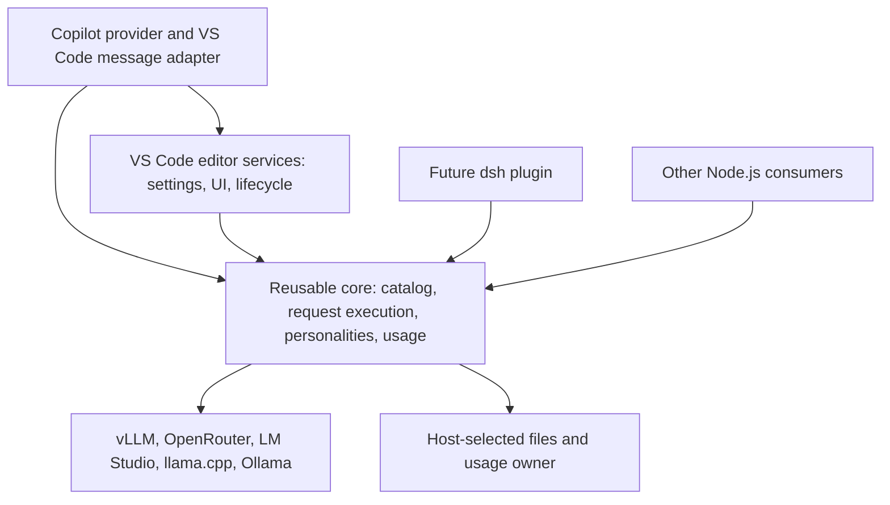

# Reusable Core Restructuring Plan

**Status:** Executed through Phase 8 (2026-10-04). The host-neutral core, public entry, Node-only declaration gate and isolated packed-consumer proof are in the build; behavior is preserved. Phase 9 editor acceptance (live VS Code + Copilot, real backend) is owner-performed and NOT yet claimed complete — an automated pass is not acceptance. The [Folder Proposal](#folder-proposal) relocation was executed as its own mechanical step (2026-10-04): host code now lives under `src/vscode/`, core persona under `src/core/personality/`. The owner's priority is a reusable core without deterioration of the existing VS Code + Copilot extension. The [dsh bridge](./dsh-bridge-plan.md) is a later consumer, not the driver of the core's contracts.

## Intent

Make the extension's model-request machinery usable from ordinary Node.js: the existing Copilot provider, a future dsh plugin, and other editor or harness adapters must use the same model resolution, request policy, transport, personalities, and accounting. Copilot remains the production consumer throughout the work; moving code must not remove a feature or change its defaults.

Reuse means one implementation of the product's behavior, not an SDK containing disconnected utilities that each consumer must assemble differently. Extract host-independent work as far as its purpose supports; retain real editor and conversation ownership at the boundary. This is a Node.js core, not a browser-portability project or a new agent harness.

## Executor Protocol

Read this section before editing. Read the repository instructions, then only the source and tests named by the active phase. Default first execution is phase 1 only; subsequent execution starts from the last verified phase reported by the owner. An instruction to execute the whole plan permits sequential phases, not a single cross-cutting rewrite.

1. Check `git status --short` and the diff of every file you will touch. Preserve pre-existing edits. Record the starting revision with `git rev-parse HEAD`; a revision alone is not a baseline for a dirty tree.
2. State the active phase, affected production symbols, expected unchanged behavior, and focused command before the first edit. Read its named tests and the direct callers. Use actual imports and function bodies, not this document's filenames alone.
3. Move implementation first, adapt its current production caller, and immediately run the focused checks. Update test imports/mocks to the new ownership when needed; preserve behavior assertions. A forwarding module is transitional, not the finished architecture.
4. Run `npm run build` after the phase's focused checks pass. It includes dependency/rent gates and test type-checking, not merely source compilation and Vitest. Do not weaken those gates or expand unrelated fixes to obtain green.
5. Audit the phase diff against the preservation table. Account for every moved export and every changed production caller; distinguish relocation, necessary boundary adaptation, and behavior changes. Unapproved behavior changes block completion.
6. Stop on a failing gate, unresolved interface/ownership choice, required version/license approval, or unavailable manual acceptance check. Report the blocker; do not call a partial phase DONE or continue into its dependents.
7. Report a handoff: starting/current revision and dirty files, completed phase, exact checks/results, remaining manual checks, and the next phase. Tests remembered from another session are not results for this tree. Do not commit/push, publish, change versions, or create the companion repo as part of this plan.

### Focused Test Entry Points

Run `npx vitest run` followed by the relevant paths below; these are existing tripwires, not permission to add a second test suite. A phase must read their assertions before changing its implementation. After changing compiler/package settings, test type-checking and the full build remain mandatory.

| Phase surface | Existing tests to start with |
| --- | --- |
| Config and request policy | [configFunctions](../test/configFunctions.test.ts), [resolveOverrideForModel](../test/resolveOverrideForModel.test.ts), [configStore](../test/configStore.test.ts), [requestBuilder](../test/requestBuilder.test.ts), [serverCore](../test/serverCore.test.ts), [serverRegistry](../test/serverRegistry.test.ts) |
| Transport and protocol | [fetchRetry](../test/fetchRetry.test.ts), [chatTransport](../test/chatTransport.test.ts), [sseParser](../test/sseParser.test.ts), [vllmStream](../test/vllmStream.test.ts), [vllmClient](../test/vllmClient.test.ts) |
| Discovery and budget | [runtimeLimits](../test/runtimeLimits.test.ts), [openRouter](../test/openRouter.test.ts), [tokenBudget](../test/tokenBudget.test.ts), [discovery](../test/discovery.test.ts), [modelInfo](../test/modelInfo.test.ts), [providerDiscovery](../test/providerDiscovery.test.ts) |
| Personality and capture | [promptReplacer](../test/promptReplacer.test.ts), [personalityStore](../test/personalityStore.test.ts), [promptReplacementsPresets](../test/promptReplacementsPresets.test.ts), [providerSystemMessages](../test/providerSystemMessages.test.ts) |
| Execution and response | [providerAutoContinue](../test/providerAutoContinue.test.ts), [consumeStream](../test/consumeStream.test.ts), [consumeStreamThinkingGating](../test/consumeStreamThinkingGating.test.ts), [postStream](../test/postStream.test.ts), [messageConverter](../test/messageConverter.test.ts), [usageReporting](../test/usageReporting.test.ts) |
| Ledger and editor surfaces | [usageStore](../test/usageStore.test.ts), [serverSettingsView](../test/serverSettingsView.test.ts), [testAndRefresh](../test/testAndRefresh.test.ts), [webviewContract](../test/webviewContract.test.ts) |
| Build and distribution | [packageStaging](../test/packageStaging.test.ts), [test compiler config](../test/tsconfig.json), [VSIX staging script](../scripts/package-vsix.mjs) |

## Why A Separate Plan

The original bridge extraction recipe mixed reusable-core work with dsh supervision, overlays and publication; it left retry, catalog and usage ownership incomplete. The bridge document now points here rather than carrying a competing extraction recipe.

This document owns restructuring scope, dependency direction, behavior preservation, and completion gates. The bridge document owns dsh integration and its standing product rulings. Adapter-specific protocol decisions do not belong in the core.

## Architecture



All core imports, including public type declarations and transitive imports, stay within the core, Node.js, or its declared runtime dependencies. No `vscode`, Copilot storage, dsh, Cordis, extension context, or imports back into extension modules. Existing pure modules move only once their consumers can follow this direction.

Two boundaries are distinct: the Node.js core is editor-free; the remaining editor integration is Copilot-optional. VSCodium can reuse the registry, dashboard, personalities, and accounting through that editor integration without pretending to implement Copilot's conversation APIs.

## Ownership

| Concern | Core owns | Host or consumer owns |
| --- | --- | --- |
| Configuration | Types, normalization, validation of supplied data, registry identity and resolution, parameter precedence | Reading/writing settings, effective settings layer, migrations, change notifications |
| Configuration cache | No second implicit config cache | Existing `VllmClient` remains the extension's sole config-cache owner; other consumers supply their own snapshot source |
| Catalog | Backend metadata probes, runtime limits, token budgets, neutral model descriptions, model/mode identity | Picker rendering, tracked picker choices, refresh events and consumer presentation |
| Request | Server/header resolution, sampling/mode layering, routing suffixes, output clamp, empty-tool schema fix, backend body rules | Conversation/messages, tool definitions, requested mode/output selection, consumer-specific auxiliary-call policy |
| Streaming | HTTP/SSE, accumulated tool calls, usage normalization, timing, stream observations, bounded request retries/continuation | Displaying parts, tool execution, turn scheduling, response visibility and replay constraints |
| Personality | Rule loading/includes, preset/path resolution from explicit directories, text replacement, capture data and file merge | Selecting paths/root, providing system text, editor messages, capture enablement and warnings |
| Usage | Canonical accounting types, aggregation, actual/estimated cost semantics, file serialization and delta merge | Canonical storage location, ingestion ownership, change delivery to UI and process coordination |
| Errors/logging | Transport/protocol facts, causes, timeout markers, structural logging hooks | Copilot error parts, dsh error taxonomy, output channels, editor notifications and file-logger lifecycle |
| Lifecycle | Cleanup of resources allocated by a core operation or instance | Activation, subscriptions, process supervision, extension commands and UI disposal |

Settings writes stay in the existing single writer. Do not invent `readServersFromConfig`/`writeServersToConfig` wrappers merely to neutralize an import: pass servers or headers to the neutral caller instead. Retain meaningful pure model-update operations only when an actual consumer needs them.

### Source Checkpoints

These are checked against the current source, not a claim that extraction is already complete. Re-read the named functions in the active phase; stop if the code has changed enough to invalidate its recipe.

| Current owner | Required handling |
| --- | --- |
| [config](../src/vscode/state/config.ts): `getConfig`, `rawShapeWarnings`, `resolveWorkspaceRelativePath`, `validateConfig` | Keep settings reads/raw-shape inspection outside; extract supplied-data policy. Pass the root explicitly to neutral path resolution. Preserve the ordering of raw-shape and supplied-data warnings and non-blocking validation. |
| [messageConverter](../src/vscode/copilot/messageConverter.ts): error helpers and `parseToolCallArgs` | Move `describeError`, `iterateCauses`, `isTransportFailureText`, `isTlsCertificateError` and the timeout marker to neutral error support. Keep `formatError`, `_classifyMessage` and `TLS_CERT_SUGGESTION` with editor-facing diagnostics: their copy names editor commands/settings. Move tool-argument repair with neutral stream processing, not into a new single-purpose tiny file. |
| [VllmClient](../src/vscode/copilot/vllmClient.ts): `getConfigCached`, `invalidateConfigCache` | Keep the config promise and its rejection reset in the extension facade. Metadata-cache invalidation still accompanies config invalidation. The core never calls `getConfig`. |
| [provider](../src/vscode/copilot/provider.ts): selection tracking, discovery generation/join, watchdog, `provideTokenCount` | Keep lifecycle/cache/event machinery in the adapter; move only neutral discovery. Retain tracked picks across `clearCache`, stale-generation rejection, recovery event behavior, and the fast local token-count path. |
| [modelInfo](../src/vscode/copilot/modelInfo.ts): `buildModelInfo` and its helpers | Separate model facts from `ThemeIcon`, `vscode.version`, picker groups/banners and price presentation. `formatCostRate` currently comes from the editor-backed usage module; do not let that import reach the neutral descriptor. |
| [OpenRouter](../src/backends/openRouter.ts): `openRouterStatsHeaders` | Retain the first configured OpenRouter entry's authenticated-statistics rule; pass its headers from the host rather than read settings inside the core. Preserve endpoint memo/in-flight/backoff behavior and its reset paths. |
| [presets](../src/vscode/commands/presets.ts): `loadModelPresets`, `parsePresetFile`, `findPresetForModel`, `mergePresetWithUserConfig` | Model presets (`model-configs/`) are add-flow and migration tooling only: [hfDiscovery](../src/vscode/commands/hfDiscovery.ts), [presetRemote](../src/vscode/commands/presetRemote.ts) and [outputLengthMigration](../src/vscode/migrations/outputLengthMigration.ts) merge a matched preset into the stored model config when the model is added or migrated. The runtime request path never consults presets. Keep preset loading/parsing/matching host-side despite its pure-looking signatures; do not move it into the core or give the core a bundled-directory reader. |
| [usageStore](../src/vscode/state/usageStore.ts): `findModelCost`, `schedulePersist`, `initUsageStore`, `resetUsage` | Cost lookup also reads `readServers`; pass servers to neutral lookup and retain the host signature as an adapter. File success advances the delta baseline even if the memento mirror fails. Reset retains Last Request. Preserve fallback/load and notification timing. |
| [Vitest configuration](../vitest.config.ts) and [compiler configuration](../tsconfig.json) | Unit tests alias `vscode`; root compilation includes its ambient types. Neither proves isolation. The Node-only type/package gate must override ambient types and run outside the repository without the Vitest alias. |
| [VSIX staging](../scripts/package-vsix.mjs), [payload rules](../.vscodeignore), [license policy](../licenses/README.md) | Keep staged packaging and source/VSIX licenses unchanged. VSIX MIT metadata does not authorize an MIT-licensed standalone core. A new proof artifact must not overwrite the tracked license. |

## Core Contract

These are required capabilities, not an instruction to create one file or interface per row. Use existing types and collaborators; each new named abstraction must remove real mixed ownership or serve an actual production use.

### Explicit Inputs

Each operation receives a configuration snapshot or already resolved request, model identity, plain messages/tools, selections, and its required host values. Paths use explicit workspace root, preset directory, bundled directory, and storage path. There is no ambient editor workspace or environment-based fallback to an unrelated server.

Keep the current OpenAI-compatible message/tool vocabulary as the initial wire boundary. Do not introduce a second universal conversation model. Copilot and dsh perform their own lossless projection into it; add a missing wire field only after verifying a real backend/consumer requirement. Never mutate consumer-owned histories or tool definitions.

`assembleRequest` is the starting point, not the finished core. Its input is already plain data, but [its module](../src/vscode/copilot/requestBuilder.ts) still imports VS Code and mixed config/message modules. Keep `buildRequest` and picker parsing in the Copilot adapter and make the assembly import graph genuinely host-free.

### Catalog And Budget

Extract the neutral work from [discovery](../src/vscode/copilot/discovery.ts) and [model metadata](../src/vscode/copilot/modelInfo.ts), not just the backend probes. A consumer must be able to obtain model id/name, modalities, context window, output ceiling/budget, available modes and default mode without constructing a VS Code model object.

Use the existing budget derivation and parameter precedence. The Copilot adapter continues to produce its configuration schema and advertised input/output budgets from those results. An offline server or missing authoritative window keeps the current discovery behavior; no fabricated windows and no new global probing. Discovery metadata and request clamps must agree for the same config and selections. A standalone consumer must not need a Copilot-advertised number to discover its valid request budget.

The neutral descriptor must carry the configured id, wire id, name/family/capabilities, server type, actual context window, derived input/output budget, server-reported output ceiling, static output-menu ceiling, mode names/default, and surviving output-length values. It contains facts and raw configured cost rates, not editor objects or formatted picker copy. Keep the raw vector-form override available for schema construction; substituting the advertised scalar would delete the length menu.

Preserve these distinctions: a length pick outranks mode `max_tokens`; the static length-menu ceiling is independent of the current mode/pick; and the menu remains able to offer longer values than the current pick. Advertising a default mode in a picker is not permission to apply its parameters to an otherwise mode-less Copilot request. Preserve the existing selected-mode behavior; other adapters materialize their own selection explicitly.

### Request Execution And Stream State

Provide a usable execution path, rather than requiring each adapter to reconstruct assemble -> transport -> observe -> retry -> account. Share the existing phases and state where neutral; keep consumer output conversion and user-facing diagnostics outside. The current Copilot entry point delegates to this path before another adapter is considered ready.

Extract bounded empty-response nudges, early mid-stream error replay, and vLLM-only colon continuation from [orchestration](../src/vscode/copilot/streamOrchestrator.ts). Preserve their current defaults and retry budget. Retry eligibility depends on what the consumer has actually displayed, not just what the server emitted: the adapter supplies the minimal visibility/replay policy, including whether reasoning became ordinary text. No second agent loop and no automatic stacking with a harness's own retry budget.

The current [parser](../src/vscode/copilot/sseParser.ts) returns finalized tool calls; [the consumer](../src/vscode/copilot/consumeStream.ts) does not own incremental argument accumulation. Keep that contract initially. Exposing genuine tool argument deltas is a separate change, not a fictitious `toolCallDelta` extraction. Copilot tool-argument repair and final-call deduplication remain intact; other adapters may need raw arguments instead of Copilot's repaired objects.

Keep per-attempt observations available after a throw: emitted content/tool calls, reasoning visibility, raw thinking tags, finish reason, timing, cumulative usage, and sticky request-wide output. Copilot still distinguishes discardable thinking from visible text. Account usage with the same completion/cancellation/error boundaries as today; changing partial-failure accounting is a separate behavior change.

Use a pull-based async iterable for shared execution, preserving transport backpressure. Its input is the assembled request, plain accounting/model limits, retry budget, signal, neutral transport/logging collaborators and a caller-owned mutable execution state. The state carries the existing `StreamOutcome`, request start time, active attempt start time and actual attempt count. Keep `StreamOutcome` with request contracts, not in the wire-only types module.

The iterable exposes two kinds of event: content/reasoning/finalized-tool output in the existing `StreamEvent` vocabulary, and attempt completion with the final sanitized `WireUsage`, optional complete `LastRequestData`, and measured elapsed time. It does not emit a terminal harness finish for every retriable backend finish. Final request status remains in the execution state. This is execution metadata, not a second conversation format.

Core processing owns split think-tag detection, per-attempt tool-id deduplication, observation/timing updates, pending cumulative usage/metrics and completed-record construction. The Copilot consumer owns part construction and tool-argument repair presentation. On each attempt-completion event it preserves the current order: report usage, log stream finish/tokens, then record the supplied request data through the existing usage wrapper. Other consumers use the same completed record; they do not reconstruct accounting from displayed parts.

Normal stream exit, including a quiet cancellation after usage was seen, can complete an attempt record as today. A stream throw skips that completion record as today. Do not add persistence in an error `finally`. Core retry catches transport/stream failures, not exceptions thrown by the consumer's rendering. Do not add a detached producer or unbounded queue to adapt the iterable.

### Cancellation And Timeouts

The core accepts an optional `AbortSignal`. The Copilot boundary converts its token once per operation, handles an already-cancelled token, and disposes its subscription in `finally`. User cancellation remains a quiet stop.

Transport retains its operation-local timeout controller and the existing initial-response and stream-inactivity mechanisms. Forward caller aborts without trying to abort a caller-owned signal; preserve cancellation of a pending stream read, abort reasons, timer cleanup, and listener cleanup. Merely moving the controller out of [transport](../src/vscode/copilot/chatTransport.ts) would discard ownership it still needs.

### Configuration And Metadata Dependencies

Split pure config policy from settings access. `resolveWorkspaceRelativePath` must receive a root or remain host-side; it currently reads VS Code workspace folders. Data validation can be neutral, while raw settings-shape inspection stays at the settings source.

Keep [VllmClient](../src/vscode/copilot/vllmClient.ts) as the extension facade if that remains the simplest way to preserve its cache ownership. Its `getConfigCached()` calls editor-backed `getConfig()` and cannot move into the core unchanged. The core receives config; changing token/channel types is not enough.

Remove the live `readServers()` dependency from [OpenRouter](../src/backends/openRouter.ts) by supplying the resolved registry/auth input to metadata consumers. Preserve existing authenticated statistics, shared endpoint-cache semantics, provider tags, and cache invalidation. Do not pull settings persistence into the core to solve a metadata read.

### Personalities And Logging

Share rule discovery/resolution, includes/cache behavior, replacements, and capture merge logic using explicit directories and plain system text. Preserve shipped-name precedence, portable basename fallback, custom-file rules, non-mutating transformations, and fail-open behavior when replacement files or includes are broken. The Copilot adapter retains the same system-message capture setting and location.

Use a structural log sink and the small logging hooks actually used by transport/streaming; do not leak the extension's `FileLogger` type through package declarations. Preserve request/header redaction, optional body limits, request/stream/error logging, and the current host's logger disposal. A new logging framework is unnecessary.

The structural tracing surface covers the existing `logRequest`, `logStreamChunk`, `logStreamFinish` and `logError` calls with their current argument shapes. A host `FileLogger` satisfies it; it is not imported even with `import type`. The core does not choose the log directory or read logging settings.

### Usage And Cross-Process Ownership

Extract the ledger as an instance with explicit storage and notification ownership, not a new package-global singleton. The extension wrapper continues to expose its existing API/events to the dashboard and status bar. Preserve normalized server URL + canonical wire model identity, persistence format, retention, delta replay, reset behavior, actual cost, BYOK flag, timings, and the downgrade memento mirror.

For this restructuring, the extension remains the sole ingestion point for requests in its host, with its existing canonical usage file. A standalone Node.js consumer can own a ledger at an explicitly selected path. Those are separate installations, not a promise of one global ledger across machines.

For future supervised dsh requests, choose one ingestion owner before integration: return completed request records to the extension's ledger, with a durable transfer/idempotency design if the supervisor can disconnect. Do not silently create a second dashboard-invisible ledger under `DSH_HOME`. A shared-file alternative must specify read refresh, notifications, resets, and concurrent writers before it can replace this proposal. The existing accepted cross-window merge race is not a license to promise stronger multi-process guarantees.

Core token counts retain existing aggregate prompt semantics (`cached` is a subset of `prompt`). Consumer adapters convert other taxonomies explicitly: dsh's `inputTokens` excludes cache reads/writes. Tests must prove that cached usage is neither lost nor counted twice and that actual cost survives normalization.

The ledger's required host inputs are a storage path, optional downgrade-mirror read/write functions, log sink and synchronous change callback. Core state is instance-owned: last requests, count/cost/day planes, first-record timestamps, last-successful-write baseline and serialized write queue. Preserve the existing synchronous `recordRequest`/`resetUsage` wrapper contracts. Expose an awaitable flush for standalone shutdown/proof checks without claiming that current editor disposal already awaits persistence. Money formatting is neutral; registry-dependent cost lookup receives the supplied registry.

## Copilot Preservation Contract

The unchanged Copilot path is the reference consumer for every phase. No intentional behavior improvement is bundled with a move unless separately approved and checked against the previous behavior.

| Surface | Required parity |
| --- | --- |
| Configuration | Same keys/defaults, registry resolution, settings write targets, migrations and immediate invalidation; one config cache |
| Discovery/picker | Same live/offline policy, model identities, capabilities, mode/default selection, output-length menu, schema and input/output budgets |
| Token counting | Same local `max(1, ceil(text.length / charsPerToken))` estimate, model-specific settings and fallback logging; no network or new blocking work |
| Request wire | Same system-message placement, history/images/tool results, raw params, protected keys, headers, routing suffixes, prompt caching and backend quirks |
| Response | Same text/thinking/tool parts, argument repair, ordering, final-call deduplication and finish diagnostics |
| Retry | Same empty/colon/early-error eligibility, output visibility gates, shared budget, prefill shape and per-attempt timing |
| Cancellation/errors | Same quiet cancellation, timeout distinctions, partial-output behavior, error classification and stale-picker invalidation |
| Personality/logging | Same preset resolution, replacements/includes, capture file, fail-open behavior, redaction and optional request logging |
| Accounting/UI | Same per-HTTP-request totals, cache/reasoning subsets, actual cost/BYOK, last request, resets, persistence and dashboard/status-bar events |
| Hosting/lifecycle | Workspace-only placement, remote endpoint meaning, resources disposed, dashboard/commands functional and activation clean |

Existing documented asymmetries and owner rulings remain in force. Do not revise them to simplify an extraction. No version changes, release entries, settings migrations, dsh runtime dependency, or companion repo are needed for restructuring alone.

### Required Discriminating Cases

Find each case in the named tests and retain its assertion; add a missing case in the existing suitable test before moving the owner. Cases are not satisfied by a grep or a total passing-test count.

- Request: mode/default/runtime precedence; length pick above an advertised clamp; configured id versus canonical and suffixed wire ids; caller tools overriding configured tools; zero-argument tool schema injection; Anthropic cache on/off/TTL; Ollama tool-choice stripping; system messages first; protected body keys; headers without value leakage.
- Discovery: unavailable/unloaded models skipped — ruled law by the owner 2026-10-03, not an implementation accident to "fix"; recovery republishes them; invalidation during an in-flight pass cannot publish stale metadata; concurrent resolves join; picks survive cache clearing; vector/default/smaller-pick/menu-ceiling distinctions; truthful backend context/output caps. Any future policy disagreement is a stop-and-ask condition, never a reason to change offline behavior inside this refactor.
- Execution: normal response; empty stop -> empty assistant nudge; vLLM colon stop -> accumulating assistant prefill and continuation flags; non-vLLM colon -> no retry; valid tool-only stop -> no retry; reasoning-as-text -> no replay; genuine thinking -> existing retry eligibility; early mid-stream error -> identical-request retry; visible text/tool output -> no replay; exhausted budget -> accurate actual attempts and sticky-output diagnostics.
- Stream: split raw think tags; split tool name/arguments and fallback ids; duplicate final tool ids; malformed/truncated arguments; `length`, `content_filter`, missing finish and usage-only chunks; cumulative usage emitted many times -> one final report/record per normally completed attempt; stream throw -> no newly invented completion record.
- Cancellation/error: pre-aborted input; abort before headers and during a pending body read; initial-response versus inactivity timeout; consumer closing the iterator -> transport cleanup; all subscriptions/timers/readers released; quiet user cancellation; bare graceful `TypeError: terminated` versus a socket-kill cause; transport failure -> picker invalidation, HTTP rejection -> not transport invalidation.
- Persistence/personality: file success + mirror failure cannot double-count on retry; file failure retains the delta; corrupt/missing file can load the mirror; scoped/all reset retains Last Request; actual versus estimated cost; zero reported cost and BYOK; seeded name versus custom-path/basename fallback; missing/cyclic include remains fail-open; capture opt-in and deduplicating merge keep their current file location.

## Implementation Gates

Execute the phases in order. Every implementation phase ends with its focused test group, `npm run build`, a diff audit and the executor handoff. No phase may depend on an unimplemented later phase; retain a host adapter until its neutral dependency exists. Existing internal test seams can change, but behavior assertions and contributed extension contracts must survive. A phase that moves a file updates the pre-existing rules in both dependency-cruiser configurations to the new paths in the same step and records that each updated rule still matches a non-empty module set; a boundary rule silently matching zero relocated files is not a passing check.

### Phase 1: Baseline

Record revision/dirty diff, Node/npm versions, and `npm run build` result. Read the source checkpoints and map the required cases to actual tests or missing fixtures. Read the boundary rules in [.dependency-cruiser.cjs](../.dependency-cruiser.cjs) and [.dependency-cruiser.consumers.cjs](../.dependency-cruiser.consumers.cjs). Do not start moving code in this phase.

DONE: the handoff identifies each missing required case, pre-existing failures, relevant manual checks, and the exact phase-2 test command, and confirms both standing rulings are recorded: the Folder Proposal approval (2026-10-03, which phase 2's `src/core` creation depends on) and the picker offline policy (skip, not OFFLINE rows; 2026-10-03). Owner confirmation is required for any conflict between current behavior and a standing instruction.

### Phase 2: Configuration, Assembly And Error Boundary

Move the already neutral wire types, token budget, server primitives/registry and error-envelope/JSONC support into the core before importing them from extracted policy. Split config into neutral types/resolution/supplied-data validation and the host reader/raw validation/picker/path-root adapter. Extract `assembleRequest`, `RequestTool`, `RequestLog`, `ServerConfig` and its result type; keep the VS Code `buildRequest` entry outside. Move only the neutral error facts identified above; leave editor-specific error copy outside.

Preserve current exports through necessary host adapters while updating production imports. Add a core dependency rule in both runtime and pre-compilation cruises: core may not reach any non-core source module or editor/harness package, even as a type. Wire each extracted module to its real production caller in the same phase; do not disable orphan/rent checks.

CHECK: config/request test group plus message/error assertions. DONE: the assembler and config/error primitives are host-free, existing request bytes/warnings/defaults remain the same, and all extracted modules have their current callers rewired.

### Phase 3: Transport And Backend Metadata

Move `fetchWithRetry`, `ChatTransport`, `readSseStream`, SSE parsing, runtime-limit probes and OpenRouter's neutral catalog/endpoint operations. Supply authenticated statistics headers explicitly from the host; keep the old host-facing endpoint signatures only as adapters where needed. Extract structural tracing types instead of importing `FileLogger`. Change the internal stream collaborator to `AbortSignal`; keep the facade's config cache and existing invalidation responsibility. The Copilot boundary owns its token subscription, while the transport owns local timeout controllers/read cleanup.

CHECK: transport/protocol group plus runtimeLimits/OpenRouter tests. DONE: request/body/header/SSE/error/cancellation cases pass; backend operations no longer read settings transitively; metadata memo layers and Test & Refresh invalidation are unchanged. No catalog/picker lifecycle rewrite.

### Phase 4: Catalog And Budget

Extract per-model discovery and neutral descriptors; project them into VS Code metadata without recomputing policy independently. Retain icon/version gates, price/banners and `navigation`/`tokens` picker groups in the host projection. Keep price formatting host-side until the neutral usage module exists; do not make the core import the old usage singleton to satisfy it.

Leave `lastSelectedMode`, `lastSelectedLength`, model-cache generation/TTL/join, watchdog and change events in the provider. Preserve token counting's local estimate/config fallback. Adapt the existing `buildModelInfo`/discovery tests to the neutral facts plus unchanged host projection, rather than maintaining two metadata builders.

CHECK: discovery/budget group and configuration/schema assertions. DONE: every required discovery/budget case passes and a direct Node caller can obtain descriptors without an editor model object or picker cache.

### Phase 5: Personality And Capture

Move rule/include/meta loading and neutral preset-index/discovery/seeding/path-resolution work with explicit directories/root. Keep settings mutation and machine-path migration outside. Extract plain-system-text transformation and capture-file merge/write queues; the host provides the current capture flag/path and wraps the same transformed text back into editor message objects. Preserve the resolver's existing headless path-only behavior when no preset directories are supplied.

CHECK: personality/capture group. DONE: every preset/custom-file/include/capture case passes; transformed messages do not mutate caller data; packaged-core logic requires no bundled extension path or editor context.

### Phase 6: Execution And Response

Move retry loop/state and neutral stream observations/accounting-record construction into the pull-based execution contract above. Move usage sanitization and tool-argument repair out of the VS Code-coupled converter/consumer while retaining the Copilot fallback-to-`{}` warning/presentation. Copy retry predicates and prefill mutation logic before refactoring their form; clone caller-owned history once, then retain the current per-attempt mutation semantics internally.

Keep host `runChatResponse` as config/personality/framework-input adaptation plus core delegation, post-stream diagnostics, error presentation and transport-failure cache invalidation. The host output consumer reports core events and records supplied attempt-completion data exactly once. Do not leave a second active retry loop or duplicate observation implementation in that consumer. Determine reasoning visibility once per request from the host's thinking-part capability.

CHECK: execution/response group plus transport tests. DONE: all required execution/stream/error cases pass, attempt state survives throws, and the existing provider runs through the one shared executor. UI-oriented graceful termination and diagnostic copy remain host behavior.

### Phase 7: Ledger

Move usage state, aggregation, persistence/delta merge, money functions and registry-explicit cost lookup into an instance. The existing wrapper binds the same global-storage path, memento mirror and `EventEmitter` and keeps the same callers/signatures. Its change callback fires after synchronous mutation/scheduling as today. Standalone consumers instantiate the ledger with explicit paths and can await its write queue.

CHECK: ledger/editor group plus modelInfo price and usageReporting assertions. DONE: persistence/reset/mirror/cost cases pass, Copilot records at the same boundaries, dashboard/status-bar events still arrive, and core usage has no settings or editor imports. Do not implement dsh IPC, storage migrations, locks or stronger cross-window guarantees here.

### Phase 8: Isolated Package Proof

Use the fixed proof procedure below. Add its Node-only compiler/build check to the real build pipeline after source compilation. Add the actual public core entry point and consume it from appropriate production host adapters so an exports barrel is not an orphan invented for tests. Export operations/types needed by adapters, not every internal helper.

CHECK: Node-only declaration type-check, isolated packed-consumer smoke, existing packageStaging checks, then full build. DONE: the public package performs discovery, assembly/execution, personality transform and persisted accounting without editor/harness code or aliases; its runtime dependencies and declarations resolve; the existing VSIX still ships all runtime resources and correct licenses.

### Phase 9: Editor Acceptance

Use the rebuilt VSIX in VS Code + Copilot for text/thinking/tools, modes/output length, retries, cancellation, personality/capture, usage/reset, settings refresh and remote placement. Check registry/dashboard/accounting activation in a no-Copilot editor separately; if optional chat APIs are absent, isolate registration without dropping unrelated features. Record any such activation adaptation as a separate tested change, not part of a file move.

DONE: each preservation row has an actual test/manual result and isolated proof has passed. If editor/backend access is unavailable, report automated extraction complete but acceptance pending; stop short of claiming the whole plan complete.

A local mock is the deterministic regression rail, not proof of real backend compatibility. Release acceptance also requires representative configured backend/editor smoke checks, including a real vLLM tool turn and the applicable OpenRouter request/accounting behavior. Record checks actually run; do not label planned gates as passed.

## Packaging Decision

Use the existing single source build: core source under the designated `src/core` tree compiles with the extension into `out/core`. Keep `src/extension.ts` and the extension manifest entry unchanged. No workspace-package migration, bundler, separate copied implementation or new core runtime dependency is required. Group core code by ownership; the folder-layout proposal is separate from this behavior contract.

For phase 8, add a dedicated compiler config extending the root with `include` limited to core source, `rootDir` set to that tree, `types: ["node"]`, `skipLibCheck: false`, and declaration-only output under ignored scratch. Retain inherited strictness. This must resolve no non-core source or editor/harness type. Root source compilation remains the producer of the executable JS used by both artifacts.

Add one Node proof runner under the existing scripts directory, following the staged-copy pattern without touching tracked manifests/licenses. It must:

1. Take fresh compiled core JS and independently checked declarations and stage them as an ESM package with its public `index` export. Use only the root's existing runtime dependencies; verify each actual bare import is declared and resolves. Host assets are supplied by fixture paths, not copied from the extension accidentally.
2. Generate an explicitly private local-proof manifest: derive its proof name from the extension name and copy the existing version verbatim. Use `SEE LICENSE IN LICENSE` with the unmodified source license for this private local proof; include dependency notices. The VSIX's MIT declaration remains unchanged. Standalone distribution identity/license/publication requires a separate owner decision.
3. Run `npm pack` on the stage, then install that tarball in a fresh OS-temp consumer outside the repo. Give the consumer its own TypeScript/Node development types for declaration checking, matching the project's toolchain; no `vscode`, dsh, repo aliases, path mappings, `NODE_PATH` workaround or imports into repo source. Do not put the consumer beneath the repo, where Node could resolve undeclared ancestor dependencies.
4. Type-check imports using only the package's public entry, then run with plain Node. Use an ephemeral loopback mock backend to prove catalog limits and wire-body layering, one tool turn, reasoning/text output, retry/cancellation, personality fixtures, one completed usage record per eligible attempt, and persisted reload/cost. Include a stream-error case proving no invented completion record. Assert request/event/ledger values, not merely import success.
5. Inspect the packed file list: core runtime/declarations, manifest/license/notices only; no editor/harness modules or leaked host files. Clean scratch in `finally`. Keep this proof in `npm run build`, alongside unchanged VSIX staging/package tests and dependency/rent gates. Compiler-config additions also require test type-checking/full build.

These are local proof artifacts, not a new published version. Do not infer standalone MIT licensing from the extension manifest. Reuse the [license policy](../licenses/README.md) and [staging implementation](../scripts/package-vsix.mjs); changing either license text or the distribution policy is outside restructuring.

## Folder Proposal

Ownership layout, approved by the owner 2026-10-03; **relocation executed 2026-10-04** as the separately verified mechanical step, full build green and boundary rules re-verified to fire on the new paths. The source checkpoints above refer to the pre-relocation paths where phases 2-7 landed; the tree below is now the live layout. Keep existing basenames where they still describe the implementation, and create a directory only when extracted files actually need it.

```text
src/
    extension.ts                 activation entry; manifest path stays unchanged
    core/
        index.ts                   public Node.js package entry
        types.ts                   wire types only
        config/                    config data/policy, server identity and registry
        catalog/                   discovery, neutral model descriptors and limits
        backends/                  backend-specific catalog/protocol knowledge
        request/                   assembly, transport, SSE, execution and observations
        personality/               rules, preset/path resolution, transform and capture
        usage/                     ledger, persistence and money/cost semantics
        shared/                    cross-domain leaf support: budgets, errors, JSONC, HTTP retry
    vscode/
        copilot/                   provider, picker projection, message/part conversion,
                                                             diagnostics, session/tool integration and client facade
        state/                     settings reader/writer, host paths, personality/usage wrappers
        ui/                        dashboard, settings/deep-dive webview controllers
        commands/                  user-facing editor workflows
        migrations/                activation/settings migrations
        logging/                   editor-owned file/output logging
resources/                     existing webview JS/CSS/assets; keep paths stable
test/                          existing tests/mocks; no test-tree migration required
scripts/                       existing build tooling plus the isolated core proof runner
```

`shared` is for genuine cross-domain leaves, not an escape from assigning ownership. The editor folders call core operations; core never imports them. A host adapter exists because it converts framework values or owns settings/events/lifecycle, not solely to forward another function.

Use `vscode/copilot` rather than an extra `vscode/adapters/copilot` level while there is one chat adapter. Other editor/harness adapters belong to their consuming products; the core should not acquire one folder per consumer. The public index is an API boundary, not a barrel that every internal core module imports back through.

The dsh companion remains a separate repository and imports the built core package. Its eventual layout can be:

```text
src/
    extension.ts
    vscode/
        commands/                  launch/configure/open commands
        ui/                        our editor client/status/approval UI
    dsh/
        plugin/                    Cordis registration, LlmAdapter and protocol projection
        runtime/                   Node/npx detection, launch, health and process cleanup
        config/                    snapshot validation and upstream overlay generation
```

dsh's upstream web UI stays upstream. Our VS Code UI belongs under the companion's `vscode/ui`, not under a supposedly editor-free plugin. Runtime/config code takes paths and callbacks rather than extension context; the extension binds editor services. No `src/dsh` is created in this repository.

Implement ownership splits first in phases 2-7. Once their behavior is stable, move the remaining host files into `vscode` as one separately verified mechanical step before phase-9 editor acceptance. Keep the activation entry and resource locations stable. In that same step update imports, test mocks, path-sensitive scripts/docs and both dependency-cruiser configurations so their existing state/provider layering rules still cover the relocated host modules. Update the project architecture instructions after moves, not the vendored working principles. Re-run affected focused tests and the full build; a graph rule silently matching no relocated files is not a passing boundary check.

## Completion And Handoff

Restructuring is complete only when Copilot uses the extracted core, its behavior matrix passes, and the packed core runs without an editor. The dashboard/registry remain editor services; the core does not claim to replace them or to execute harness tools.

Then resume the [dsh bridge plan](./dsh-bridge-plan.md). Its adapter must prove immutable message projection (including one-shot system prompts and tool results), mode/budget mapping, reasoning replay, cache-aware usage conversion, error/retry ownership, and delivery into the chosen usage owner. dsh supervision, privacy overlays, companion naming/publication and client UI remain separate work. No future adapter is allowed to require reimplementing the extracted request machinery to preserve its behavior.