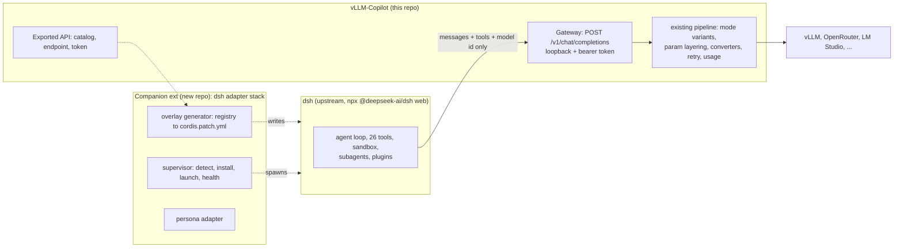

# dsh Bridge Plan: Local DeepSeek Harness on the vLLM-Copilot Registry

**Status:** Ruled plan (owner decisions below are standing law for this feature). Architecture fully spike-verified 2026-10-01 against dsh `0.2.0-rc.2`; field facts in "Verified on the wire".
**Supersedes:** the free-form bridge entry that lived in [feature-ideas.md](./feature-ideas.md).

## Intent

Local-model users want a real agent harness (sandboxed tools, subagents, sessions) without a single vendor login. DeepSeek Harness (dsh) is the strongest open harness and it already serves local models natively, so the missing piece is not another harness: it is a zero-config bridge from our model registry into theirs, with our request pipeline sitting in the middle. Users keep their vLLM/OpenRouter servers, their model modes, their personalities, their usage ledger, and get the full dsh plugin ecosystem for free because we never fork dsh.

## Owner rulings (standing, do not re-propose around them)

1. **We sit in the middle** between the dsh agent loop and the real model servers. Nothing unaccounted-for may sit in that path: our gateway terminates the harness wire and speaks to the backends through the existing pipeline.
2. **dsh stays 100% upstream.** We contribute config overlays and supervision only, never a fork. Full compatibility with other dsh plugins is a consequence of not touching them.
3. **Separate extension** for the adapter stack, in its own repo. Marketing law: people search "dsh running locally for vLLM"; "vLLM-Copilot" must not be the only thing they find. Cross-promotion both directions, possibly a collection.
4. **No dependency on Jager's extension** (`NEXTINDIE/DeepSeek-Harness-for-VS-Code`, MIT, verified). Our client stands on its own feet; MIT code may be copied where they did good work, with attribution kept in `THIRD-PARTY-NOTICES.txt`.
5. **Runtime delivery via npx is acceptable.** DeepSeek's own documented entry is `npx @deepseek-ai/dsh web`; our users are pros and may wait for an install. We only make adapters.
6. **The harness owns the conversation, we own the request.** dsh gets no say in how a model is addressed or parameterised. Its client contributes the message array, its own tool definitions, and a model id; our model configs (modes, sampling params, `chat_template_kwargs`, output budget, backend quirks, routing suffixes, headers) are applied by us on the way out. Their model intelligence in `compat` (`chatTemplateKwargs`, `chatTemplateArgs`, `vllmPriority`, `thinkingFormat`, reasoning switches) stays unset in the route profile, so no model behaviour is decided inside their process.

## Architecture



Two repos because the gateway and pipeline ARE this extension (one pipeline, one usage ledger, "only what I take responsibility for"), while supervisor/generator/persona-adapter want their own manifest, version line, changelog, and marketplace keywords. The two communicate through the exported API and the OpenAI wire, both explicit contracts, so almost zero shared code.

## Verified on the wire (2026-10-01 spike, artifacts in `temp/dsh-spike/`, do not re-verify)

- **Overlay config:** `npx @deepseek-ai/dsh@latest web --patch <file>` composes without touching permanent profiles; `--dump-config` dry-runs the composed tree and names unknown rows. A patch entry replaces the WHOLE `config` of the targeted row, so generators must restate keys they keep.
- **Model route:** row `llm-pi-ai`, `config.providers.<route> = { api: openai-completions, baseURL, apiKeyEnv, compat: { supportsUsageInStreaming, maxTokensField, ... }, models: [{ id, name, contextWindow, maxTokens }] }`. Our catalog values land on the wire verbatim (`max_tokens: 8192` came from our entry). `apiKeyEnv` resolves a launch-environment variable into the Bearer header.
- **Agent loop:** standard OpenAI wire carries the whole loop, including the error-result path (bad tool args come back as a `role: tool` message and the loop continues). 26 core tools mounted in "Standard mode".
- **Zero login:** disable rows `deepseek-account`, `session-log-deepseek`, `session-telemetry-otel`, `plugin-package-inventory-deepseek`, `desktop-product-telemetry`. The leftover account-controller idles ("pending, waiting for service") harmlessly. UI onboarding gate is skippable ("Configure later").
- **Usage accounting:** dsh consumes streamed `usage` faithfully (badges, tok/s, context ring all rendered from fabricated numbers). A gateway that emits honest usage powers their UI and our cost ledger simultaneously.
- **Persona control:** `system-prompt` row `{ includeHarnessIdentity: false, personaPrefix, personaSuffix, includeRuntimeContext: false }` removes the DeepSeek identity line and runtime-context messages, BUT the prefix is shadowed by scoped `persona` rows nested inside the agent preset rows (`preset-standard` default; also ptc/minimal/cordis). Full replacement patches the preset row itself, restating its plugin list from `--dump-config` and rewriting only the nested persona config. `{{model}}` interpolates OUR catalog name, so personality templates get the active model for free. `complete: true` additionally suppresses all tool-prose sections (nuclear mode, available).
- **Hidden traffic:** every new session fires one extra small persona-free completion at our endpoint for title generation (`max_tokens: 64`); compaction is configurable to a cheap route. Gateway meters everything automatically, and the generator aims those auxiliary calls at the cheap model too.
- **Wire shape:** `stream_options.include_usage`, `store: false`, Bearer auth, UA `deepseek-harness/0.2.0-rc.2`. Client is `openai` JS SDK via Node, so no CORS surface.
- **Request body inventory (measured, `temp/dsh-spike/key-inventory.mjs`):** the harness sends `model`, `messages`, `tools`, `stream`, `stream_options`, `store`, `max_tokens`, and nothing else. Absent: `temperature`, `top_p`, `top_k`, `frequency_penalty`, `presence_penalty`, `repetition_penalty`, `seed`, `stop`, `n`, `response_format`, `reasoning`, `thinking`, `chat_template_kwargs`, `vllm_priority`. The outbound body is a blank canvas, which makes ruling 6 cost nothing.
- **Thinking preservation (measured, `temp/dsh-spike/reason-check.mjs`):** the harness round-trips reasoning across turns. A stream carrying `delta.reasoning_content` is stored as a thinking block, and the NEXT request's history carries it back on the assistant message as `reasoning_content`, verified byte-for-byte on the wiretap. Mechanism in pi-ai: the parser records the reasoning field name it saw (`reasoning_content`, `reasoning`, or `reasoning_text`) as the block's signature, and history conversion replays the block under that exact field name. So a vLLM server behind `--reasoning-parser` gets its own reasoning back, which is precisely what `preserve_thinking` templates need. This is the capability Copilot Chat denies us (`docs/copilot-integration.md`, Historical Thinking Preservation: Copilot flattens assistant history to visible text before the provider sees it). Gateway duty: stream `reasoning_content` deltas out, and pass `reasoning_content` through on inbound assistant messages untouched instead of stripping unknown keys.
- **Certified against:** dsh `0.2.0-rc.2`, Node 24. Preview-era warning applies: `--dump-config` diffing is the regression rail per version bump.

## Unit 2 (this repo): gateway + exported API

### Gateway (`src/gateway/`, new, default OFF)

- Settings: `vllm-copilot.gateway.enabled` (default false). One knob, no port setting: the OS assigns a loopback port and `status()` reports the URL, because the only consumer learns it programmatically and a manual port is a support ticket for a value that must match nothing.
- Surface: `POST /v1/chat/completions` and nothing else; 404 elsewhere. `GET /v1/models` stays unbuilt until a real consumer exists: dsh's catalog is written by the generator from `listCatalog()` in-process, and the spike confirmed the harness never probes the endpoint.
- Auth: random bearer token minted per activation, loopback bind only (`127.0.0.1`), no CORS, no persisted secret. The token rides the `apiKeyEnv` channel for free and keeps drive-by localhost requests off the registry.
- Model variants: every registry model serves as base id plus one id per model mode, `<id>--<mode>` (example `GLM-5.3--think`). Mode selection is the model id, replacing Copilot's hidden-options smuggling. Picker output-length has no harness equivalent; the configured budget per model applies.
- Request path: parse variant → resolve model + mode → neutral core (param layering, `chat_template_kwargs`, OpenRouter suffix, server headers) → existing transport/retry/SSE → re-emit SSE with usage → `usageStore` record tagged source `harness`. Title-generation and compaction calls are ordinary traffic through the same metering.
- Cancellation: client disconnect aborts the upstream request (AbortSignal, per repo law). Errors map to OpenAI-shaped error envelopes using the shared error envelope.
- The Copilot provider path keeps its exact behavior; the gateway is a second entry adapter, not a rewrite.

### Request assembly ownership (ruling 6 in code form)

| Decided by | Contents |
| --- | --- |
| dsh | Conversation history, tool definitions and results, title/compaction prompts, streaming flag |
| Gateway | Model and variant-mode resolution, sampling params from `defaultParams`/mode, `chat_template_kwargs`, output budget (our configured value replaces their echoed `max_tokens`), reasoning dispatch, `reasoning_content` pass-through both directions, backend headers and routing suffixes, retries, error envelope, usage accounting |

Mechanics: the outbound body is built from our config, then the harness's `messages` and `tools` are grafted onto it. Nothing is merged param-wise, because they send no params; if a future version starts sending them, ours still win. Only `tools` and `tool_choice` are honored from their side, since those are the agent's own tools. Personality needs no per-request work: it already lives in the system message via the preset persona splice, so `systemMessagePipeline` (capture and replace) stays a Copilot-path-only mechanism. Changing a personality means re-emitting the overlay and restarting the host, which is the supervisor's job, not the request path's.

The route profile therefore declares the minimum: `api`, `baseURL`, `apiKeyEnv`, `models`, `defaultContextWindow`, `defaultMaxTokens`, plus two compat flags that describe the transport rather than the model (`supportsUsageInStreaming`, `maxTokensField`). Even those get re-tested in gate 2; the target is an empty `compat` object.

### Neutral core extraction (prerequisite refactor)

- `buildRequest` keeps its logic, sheds its vscode-typed signature: input becomes `{ modelId, mode, openaiMessages, params, tools, toolChoice }` resolved by thin per-entry adapters. `CancellationToken`/`OutputChannel` usage inside the core narrows to `AbortSignal` + logger.
- Tripwires: existing wire-format suites (`requestBuilder`, `chatProtocol`, `vllmStream`, `consumeStream`) must stay green without semantic edits.

### Exported API (`extension.exports`, v1)

```ts
interface VllmCopilotApiV1 {
  gateway: {
    status(): { enabled: boolean; running: boolean; url?: string; token?: string };
    readonly onDidChange: vscode.Event<void>;
  };
  harness: {
    listCatalog(): GatewayCatalogEntry[]; // id, name, contextWindow, maxTokens, modes, compat hints
  };
}
```

Consumed by the companion via `extensions.getExtension('System-Sciences.vllm-copilot').exports`. Keep it tiny; extend only when the companion actually knocks. `listPersonalities()` is deliberately absent: the Unit 3 generator starts with the default personality, and the method lands with the persona picker that would feed it.

### Verification gates

1. Core extraction: full suite green, `npm run build` gauntlet.
2. Gateway: point the spike's dsh boot at it with a REAL local server, complete an agent turn with a tool call; check the usage dashboard shows the spend.
3. API: the spike's generator script consumes `listCatalog()` output to write the overlay (script stands in for the companion until that repo exists).
4. VSCodium: fresh VSCodium install of this extension from Open VSX, gateway enabled, agent turn through the gateway with no Copilot anywhere in the box; dashboard and usage ledger must work, activation must be clean (see "VSCodium, no-Copilot editors").

## Competitive snapshot (verified 2026-10-01 against marketplace listings)

- `Jager.dsh-vscode` (3.7k, 5★): complete login-free client for `dsh web` (participant, sidebar, approvals, pills, model discovery, turn-level git rollback). MIT. Copyable material for Unit 4+ client work; never a dependency (owner ruling).
- `lixxx1.dsh-sidebar` (1.4k, 5★): debugger integration is unique; onboarding demands `DEEPSEEK_API_KEY`.
- `baobaolaodie.dsh-tui-vscode` (1.3k, 5★): dsh-TUI in the integrated terminal; Quick Start demands `DEEPSEEK_API_KEY`.
- `WentaoJIang.deepseek-harness` (385): bundled runtime, wants a DeepSeek API key or import from `~/.dsh`.
- `shengsuan-cloud.cline-shengsuan` "DSH Cline" (101k, 3.4★): DSH kernel with Cline-style UX behind an SSYCloud reseller account. Commercial funnel, and mass-demand proof despite login walls.

The gap: all five end onboarding at "configure model credentials yourself". None offers a vLLM-first, zero-credential first run. Our registry translated into a ready dsh deployment is the unclaimed entry point; the client window itself is commoditized, which is why the client is Unit 4 and the bridge is Units 2-3.

## VSCodium, no-Copilot editors (researched 2026-10-03)

The harness path has zero Copilot dependencies by construction, so a no-Copilot editor runs the full stack: dsh (own Node process, own web UI), companion (supervisor + generator, plain core APIs), gateway (loopback HTTP). In VSCodium the harness is not an add-on to Copilot, it replaces the entire agent story there.

- **Gallery law:** VSCodium ships pointed at Open VSX; the Microsoft Marketplace ToS forbids use by non-VS-Code products. This extension is already published on Open VSX (as `System-Sciences.vllm-copilot`), which means VSCodium users already run it, currently on a stale version. Durable duty: every release of this extension AND the companion publishes to Open VSX too (`ovsx publish`, or CI trusted publishing so no token is hoarded), and the `System-Sciences` namespace gets verified to clear the unverified-publisher warning.
- **No-Copilot inventory (grepped 2026-10-03):** the extension's entire Copilot surface is `vscode.lm.registerLanguageModelChatProvider` and `vscode.lm.registerTool`, both core APIs that register harmlessly when no chat consumer exists, plus session-cleanup paths pointing at `GitHub.copilot-chat/*` storage dirs that report empty when absent. Dashboard, Model Settings, registry, usage, and the gateway are pure core API and fully functional without Copilot. What stays MS-only: the Copilot chat picker, the Agents window, the Copilot CLI.
- **Optional chat picker for VSCodium users:** Copilot Chat is now open source (`microsoft/vscode` `extensions/copilot`, MIT) and VSCodium documents a manual sideload via a custom `product.json` (`trustedExtensionAuthAccess`, `defaultChatAgent`, see VSCodium `docs/ext-github-copilot.md`). Our registered provider should surface in that picker because the `chatProvider` contract is core, but this is unverified and is not a support duty: document the link, add nothing.
- **Positioning:** the five marketplace competitors all assume VS Code and die at "configure your API key". "Agent harness for editors without Copilot" is an unserved search shape that only this stack can fill.

## Unit 3 (new repo): companion extension

Supervisor (detect Node/dsh, install offer, spawn with dedicated `DSH_HOME` and the gateway token as a launch-environment variable, health, logs, dispose), overlay generator (registry → `cordis.patch.yml`, privacy rows disabled, preset persona splice from `--dump-config`), persona adapter, status bar, "Open harness" command. No credentials file on disk: `apiKeyEnv` resolves the launch env, proven in the spike, so spawning with the variable set is strictly simpler and leaves nothing behind. Own client UI later; MIT-Jager code reusable with attribution.

**When the second repo is needed:** at Unit 3 start, i.e. after Unit 2 verification gate 3 passes. Owner deliverable at that moment: create the repo and rule the marketplace name. Search-shape constraint: "dsh local vLLM". Candidates (ruling deferred): display name `DSH Local: DeepSeek Harness for vLLM` / id `dsh-local-vllm`; or `DeepSeek Harness Bridge (vLLM, local)` / id `dsh-vllm-bridge`.

## Unit 4: cross-promotion

This extension: one settings/command pointer "Run a local agent harness" → installs the companion. Companion: Quick Start demands the main extension. Possibly a marketplace collection. Changelog entries for both at their respective first releases; nothing lands in the changelog before ship (changelog epistemology).

## Risks and rails

- **Preview churn** (dsh semver is decorative until stable): we certify against a pinned range, generate overlays only through `--dump-config`-checked templates, and fail loudly on unknown-row errors rather than guessing.
- **Support surface for someone else's product:** the companion's job description is adapters plus a health check; dsh-internal bugs get redirected upstream with a repro bundle (their session JSONL plus our gateway log lines).
- **Node/npx dependency:** documented prerequisite, checked by the supervisor with an actionable error.
- **Port/token collisions and stray processes:** loopback bind, OS-assigned port, token auth, supervisor owns the process lifecycle and kills on dispose.
