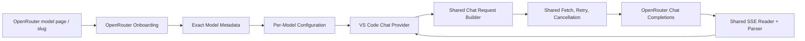

# OpenRouter Integration

How the extension integrates OpenRouter as a first-class backend: architecture, data flow, API surface, per-provider limits & pricing, cost tracking, error handling, and the decisions behind it. This documents how the integration **works** and how it's **structured**.

**Status (2026-08-21):** fully shipped and pushed. OpenRouter is a managed-remote backend alongside vLLM, llama.cpp, LM Studio, and Ollama.

---

## What OpenRouter is in this extension

OpenRouter is a **relay / model selector**, not a server you run. It proxies chat requests to any of ~415 cloud models. In this extension it behaves as:

- **A fixed managed remote** - the "server" is always `https://openrouter.ai/api`; nothing to install or run.
- **A model collection** - the dashboard renders it as a relay node with account health + one node per configured model, not a single server metric set.
- **Per-model configuration** - every OpenRouter model carries its own API key, provider pin, routing mode, and token budget, exactly like every other backend. There are **no global OpenRouter credentials or settings**.

The integration uses the **OpenAI Chat Completions** wire protocol, so chat requests and responses flow through the same data plane as every other OpenAI-compatible backend - the shared message converter, fetch/retry, SSE reader, and parser. The only OpenRouter-specific code is the *control plane*: metadata resolution, provider lists, and the account probe.

> **Headline finding (2026-08-19 research):** OpenRouter is a relay, so almost every valuable value is **model-level** (context, pricing, capabilities) or **per-request** (provider, actual cost, latency, tokens). The dashboard therefore treats OpenRouter's "server node" as a **model collection**, not a vLLM-style single-server stats view.

---

## Architecture



Only onboarding and metadata normalization are vendor-specific. Everything downstream is the shared OpenAI-compatible pipeline.

### Data flow

```
Add flow / Auto-Configure
  → GET /api/v1/models            (the catalog - public, unauthenticated)
  → normalizeOpenRouterModel      (exact-id match, build config fields)
  → save server entry + model     (registry entry, wire id, modes, limits, cost)

Chat request
  → buildRequest                  (provider.only + routing suffix applied here)
  → chatTransport                 (shared SSE stream to /api/v1/chat/completions)
  → consumeStream                 (usage.cost / usedByok captured)

Dashboard
  → engine: GET /api/v1/models    (relay catalog - per-model context+output)
  → engine: GET /api/v1/models/{id}/endpoints   (per-provider list, cached per session)
  → engine: GET /api/v1/key, /api/v1/credits    (account budget, best-effort)

Model Selector (webview, opened from an OR server row)
  → GET /api/v1/benchmarks        (quality axis + plot universe, once per open/refresh, never polled)
  → GET /api/v1/models            (list universe = ALL text-output variants; unpriced ones show at the catalog list price)
  → GET /api/v1/models/{id}/endpoints   (per-provider rates + tiers + perf stats, shared cache; only for benchmark-scored ids)
  → client-side p_eff per (model, provider), Pareto front, chart + table (plot = scored pairs only)
  → selecting a list-price row → lazy GET /api/v1/models/{id}/endpoints (shared cache) upgrades it to provider rows
  → "Use this model now" → shared add tail (duplicate gate + confirm) on the opener entry
```

---

## Key files

| File | Responsibility |
|---|---|
| `src/backends/openRouter.ts` | OpenRouter control plane: input parsing, catalog metadata resolution/normalization, provider endpoints (incl. perf stats + auth for them), account/credits probes. The ONLY vendor-specific module. |
| `src/backends/runtimeLimits.ts` | `resolveRuntimeLimits()` dispatch - the OpenRouter arm calls into `openRouter.ts`; `detectServerType()` recognizes `openrouter.ai` hosts. |
| `src/provider/requestBuilder.ts` | Applies the pinned `provider: { only: [tag] }` and the routing-mode suffix (`:nitro`/`:exacto`) to the wire id at request time. |
| `src/ui/vllmMetrics.ts` | Metrics engine - resolves per-model context + output ceiling from the relay catalog, caches per-provider `/endpoints` lists and per-model context/output per session. |
| `src/ui/dashboard.ts` | Relay tree: Account node + one node per model; per-provider limits, pricing, cost, the symmetric Attention icon, and the Model Selector entry point on OpenRouter rows. |
| `src/ui/serverSettingsView.ts` | Fetches per-model provider lists (lazily, on open) and posts them to the Model Settings webview. |
| `src/ui/modelSelectorView.ts` | Model Selector extension side: benchmarks/catalog/endpoints fan-out (endpoints only for benchmark-scored ids; every other text variant gets its catalog list-price row, upgraded by a lazy on-select endpoints request), benchmark join on `canonical_slug`, per-provider rate + tier conversion, configured-model marks, "Use this model now" (Auto/Exact routing → shared add tail on the opener entry). |
| `resources/modelSelector.js` / `.css` | Model Selector webview side: client-side cost re-derivation, Pareto scan, chart + 13-column table (multi-provider models collapse to one summary row, providers as children), keyboard row selection, calculation + disclaimer modals. |
| `resources/webview-search.js` | Shared model-list matcher (substring + subsequence): the Model Selector filter box and, through a Searcher adapter, the Model Settings dropdown's Choices.js instance - one function, both lists. |
| `resources/serverSettings.js` | Provider dropdown - shows each provider's context window, output cap, and per-1M pricing. |
| `src/provider/messageConverter.ts` | Error formatting - the single path that surfaces all OpenRouter failures (code + formatted message). |
| `src/usage/usageStore.ts` | Token/cost tracker - prefers actual `usage.cost` for OpenRouter; `usedByok` is OpenRouter's upstream-key BYOK, distinct from VS Code's `isBYOK`. |
| `scripts/openrouter-cost.mjs` | Catalog-level cost-ranking preview (calibration tool for the selector's usage profile; no provider fan-out - see its header for the honest scope). |

---

## API surface

The source of truth is OpenRouter's current OpenAPI spec (`https://openrouter.ai/docs/openapi/openapi.yaml`) and official docs (`https://openrouter.ai/docs/llms.txt`). Responses are decoded permissively - fields and enum values can be added within `v1`.

| Endpoint | Auth | Use | Status |
|---|---|---|---|
| `POST /api/v1/chat/completions` | key | Shared chat data plane; final `usage` chunk carries actual cost/tokens | ✔ shipped |
| `GET /api/v1/models` | none | **Authoritative metadata source** - the full model CATALOG. Every variant is its own entry keyed by exact `id`. | ✔ shipped (resolution source) |
| `GET /api/v1/models/{id}/endpoints` | none (we send the key) | Per-provider list (context, output cap, pricing, status, uptime) for one model. The API returned `latency_last_30m`/`throughput_last_30m` (p50 TTFT ms / tok/s) only to authenticated requests, so the shared fetch sends the first OR entry's key - any valid key sees the same global stats. | ✔ shipped (Provider dropdown + dashboard + Model Selector) |
| `GET /api/v1/key` | key | Account health - credits, limits, usage, free-tier | ✔ shipped (relay Account node) |
| `GET /api/v1/credits` | key | Account budget - total credits vs total usage | ✔ shipped (relay Account node) |
| `GET /api/v1/benchmarks?source=artificial-analysis` | key | Artificial Analysis coding/agentic/intelligence indices, joined on the catalog `canonical_slug` - the Model Selector's quality axis. Rate-limited (30/min, 500/day); fetched once per panel open/refresh, never polled. | ✔ shipped (Model Selector) |
| `GET /api/v1/model/{author}/{slug}` | none | Single-model lookup - **NOT used** (see [Exact-model endpoint](#the-exact-model-endpoint)) | ✖ rejected |
| `GET /api/v1/activity` | key (mgmt?) | Per-model daily cost/token aggregates | ⏸ deferred (undocumented + mgmt-key scope) |
| `GET /api/v1/generation?id=` | key | Full per-request diagnostics (needs `X-Generation-Id`) | ⏸ deferred (follow-up diagnostics) |

---

## Model metadata resolution (the catalog)

**Source of truth: `GET https://openrouter.ai/api/v1/models`** - the full model catalog. Every model VARIANT is its own entry keyed by its exact `id` (e.g. `author/slug:free` and `author/slug` are separate entries).

**Resolution rule: match the requested id VERBATIM.** No slug derivation, no fallback, no suffix stripping.

- A `:free` pick always resolves to the free entry - never silently to the paid model (they are separate catalog entries; live-verified `cohere/north-mini-code:free` reports `pricing: "0"`).
- The requested id is preserved for chat; variants stay intact in the wire id.
- A **malformed `200` catalog** (missing `data` array) is a transient protocol failure and THROWS - never treated as an empty authoritative catalog. Entries without a string `id` are dropped.
- An id **absent from the current snapshot** throws `OpenRouterModelNotFoundError` (the metrics engine rechecks next poll - the catalog is re-fetched, so a transiently incomplete catalog self-heals). An entry that exists but reports no window throws `PermanentContextError` (never retried). Never guess at a corrected slug.

### The exact-model endpoint

`GET /api/v1/model/{author}/{slug}` is deliberately **NOT used**: it resolves variants inconsistently (some `:free` variants 404), and deriving a lookup slug could resolve a DIFFERENT model than the user picked - silently charging for a model they didn't choose.

### Context window

Resolved from the catalog entry, **smallest positive bound wins**:

1. `per_request_limits.context_tokens` (defensive - live-verified `null` for essentially every model)
2. `context_length`
3. `top_provider.context_length`

A model with **no positive bound is not served** (strict policy - never fabricate a window).

### Output ceiling

Smallest positive of `top_provider.max_completion_tokens` / `per_request_limits.completion_tokens`. When **no** cap is reported (null for essentially every model), fall back to **10% of the context window, hard-capped at 81920** - never the full window (which guarantees prompt + output exceeds context and 400s). Degenerate caps (≥90% of the window) carry no safety information and also fall back.

### Capabilities, modes, pricing

- **Tool calling / image input** from `supported_parameters` / `architecture.input_modalities`.
- **Reasoning modes** from the `reasoning` object - effort ladder, `supports_max_tokens`, `mandatory` - serialized as raw `{ reasoning: { enabled, effort } }` params.
- **Default params** from `default_parameters` (filtered to `supported_parameters`).
- **Estimated per-1M rates** from `pricing` (per-token strings; `-1` = unknown/dynamic → not a rate). **`usage.cost` is authoritative; catalog pricing is only an estimate.**

---

## Per-provider limits & pricing (display-only)

OpenRouter exposes **per-provider** data via `GET /api/v1/models/{id}/endpoints` - and it differs wildly from the catalog-level numbers for the same model. Live example, `deepseek/deepseek-v3.2`: catalog context 163,840, but SambaNova serves only 32,768 with a 7,168 output cap; on `meta-llama/llama-3.3-70b-instruct`, Together caps output at 2,048 while CoreWeave allows 128,000.

### The core rule: display live, never persist

Per-provider limits change **daily**. Freezing them into `settings.json` would create a stored lie with an expiry date we can't honor. So:

- The **token budget always keys to the catalog context** (the general information).
- Per-provider limits live **only** as live, read-only display: pin dropdown, dashboard, and (for failures) the generic error path.
- **Never persisted, never clamped, never special-cased.**

### Where per-provider data appears

| Surface | What it shows |
|---|---|
| **Model Settings → Provider dropdown** | Each provider option shows `Ctx (tot, out)` + per-1M pricing (in/out/cache), compact in the label, exact numbers + full price precision in the hover title. |
| **Dashboard → Provider row** | The pinned provider's context window + output cap (compact), with exact numbers + an explanation in the tooltip. |
| **Dashboard → model node** | The **symmetric Attention icon** (below). |
| **Error path** | Any OpenRouter failure surfaces the server HTTP code + formatted message (`constraint_filtered` included) - the generic path, no per-error-type enrichment. |

### Fetch strategy: shared short-term cache

Provider lists come from `/api/v1/models/{id}/endpoints`. Fetched **lazily** - when the Provider/routing UI opens for a model or the model is used - then cached **per model id for 5 minutes**. The cache is shared: concurrent callers share one in-flight request, a failed id is not retried for 60 s, and a failed refresh falls back to the stale list (stale beats nothing). It is flushed whenever servers or models change - an auth rotation surfaces a fresh provider list on the next view instead of the old key's list for the rest of the TTL. Auto-routed models (no pin) pay nothing extra. The dashboard's metrics engine and Model Settings read through this one shared cache, so both views can never disagree about the provider list.

### The symmetric Attention icon

The dashboard shows a yellow `$(alert)` icon on a model node whenever **any** binding constraint pushes the effective output below the configured `maxOutputTokens`:

- **effective output = min(catalog ceiling, pinned provider cap)** - whichever is smaller is the real limit.
- The tooltip tells the truth about **which** constraint binds:
  - **Catalog ceiling binds** → silently clamped, shorter replies.
  - **Pinned provider cap binds** → requests may **fail** (the request ships the configured `max_tokens`, which the pinned provider rejects). Unpin or lower the setting.
  - **Both bind** → both are listed.

Display-only in all cases - `settings.json` is never rewritten, and a pinned provider's limit is never silently overridden.

---

## Provider pinning & routing modes

### Provider pinning (`provider.only`)

Model Settings has a **Provider dropdown** per OpenRouter model. Choosing one stores the exact `tag` (from `/endpoints`, never derived) in the model's `provider` field and applies it at request time as `provider: { only: [tag] }` in the chat body - **NOT** a model-id suffix. The wire id stays canonical.

- **Auto** (default) = let OpenRouter route.
- The dropdown lists only the providers available for that specific model - never the whole catalog.
- `allow_fallbacks: false` (strict mode) and `provider.order` (preference lists) are **not implemented** - do not add without product direction.

### Routing modes (`:nitro` / `:exacto`)

OpenRouter routes by **sorting** among eligible providers. Routing modes are model-id **suffixes** applied to the **wire id at request time only**:

- **Standard** (default, no suffix) - price-weighted load balancing.
- **Nitro** - `:nitro`: throughput-first + priority tier.
- **Exacto** - `:exacto`: quality/tool-calling-first ordering. A virtual variant; works on any model.

Design constraints:

- The base `vllmModelId` stays canonical - metadata resolution and the provider-list lookup are unaffected by the suffix.
- **A pinned provider disables routing mode** (sorting one provider is meaningless); the webview greys the Routing dropdown live.
- **Standard maps to omission on save** - the default never pollutes configs with `routingMode: "standard"`.
- **Usage/cost tracking keys on the BASE wire id**, never the suffixed id - otherwise a routed model's dashboard counters fragment.

---

## Prompt caching (Anthropic models)

The goal: stop re-billing the whole prompt on every turn. Copilot resends the full context each turn (a VS Code Copilot coding session starts at ~30k system+tools tokens and grows), and Claude-family models are the one cacheable family with **no implicit caching upstream** - without an explicit directive every turn pays full input price.

- **The wire rule** (`requestBuilder.ts`): for OpenRouter models whose WIRE id matches `^~?anthropic/`, the request body carries `cache_control: { type: "ephemeral" }` (`ttl: "1h"` variant per setting). `anthropic/*` models are served only by the Anthropic ecosystem (Anthropic, Bedrock, Vertex, Azure, Claude Platform on AWS) - the exact providers OpenRouter documents as honoring the top-level directive.
- **The economics**: first turn pays a 1.25x cache write, every later turn reads at ~0.1x, and the 5-min TTL re-arms free on each hit - a tight agent loop keeps one cache warm for the whole session. Break-even is 2 turns. The 1-hour TTL costs 2x per write and only pays off when consecutive turns sit more than 5 minutes apart. Minimum cacheable prompt is 1024-4096 tokens depending on model; Copilot prompts always clear it. Worst case is a one-shot turn: +25% on the prompt.
- **Disjoint buckets (pricing law)**: a token written to the cache pays the creation rate IN PLACE OF the input rate, never on top of it (live Sonnet 4.6: input 3.00, write 3.75 = 1.25x, write_1h 6.00 = 2x - a formula adding write to input bills 6.75 and overstates ~30%; the selector and `scripts/openrouter-cost.mjs` both carried that bug until the 2026-09-09 round-6 review). With cache activity the new-input share IS the cache delta, so it prices at the write rate; with no read share or no published write rate it prices at plain input.
- **Policy-aware pricing (selector)**: a configured model's non-default `promptCache` prices its rows under its real policy - `off` rows drop the cached share (plain input), `1h` rows pay the published `input_cache_write_1h` rate (falling back to the 5-min rate when a provider publishes none, badged either way). Base AND long-context tiers carry the 1h rate (live Claude Sonnet 4/4.5 double it above 200k: write 7.5 / write_1h 12 per M - round-7 review). When several configs share a wire id, the policy that prices a row is a prioritized ranking, never first-match and never non-default-only: every matching config counts (an omitted `promptCache` standing in as `on`), ranked by who serves the row (exact-provider pin > Auto on this entry > sibling-entry Auto), then explicit choice over omission, then - for a genuine same-rank conflict - the policy that costs MOST under the row's current profile, computed per row (with the cache-heavy default profile `off` exceeds `1h`: it forfeits the cache-read share entirely); a fixed order (`1h` > `on` > `off`) settles only exact cost ties, so the pick never depends on store order. The webview applies the same `^~?anthropic/` family gate as the request path, so an inert policy never bends a price.
- **The gate is the family prefix, by necessity**: OpenRouter exposes NO machine-readable cache-capability signal - `cache_control` appears in no model's `supported_parameters`, neither in the catalog nor in the union of per-provider endpoint params (live-verified 2026-09-09). The family check is the honest gate, not a guess list of model names.
- **Why not blanket-send**: every other cacheable family (OpenAI, DeepSeek, Gemini, Grok, Moonshot, Groq, Z.AI) already caches implicitly for free, and Anthropic-style markers get TRANSLATED on OpenAI (GPT-5.6+ bills cache writes at 1.25x even in automatic mode) - sending wide buys nothing and risks explicit-mode write billing.
- **Setting**: per-model `promptCache` (`on` default = omitted | `1h` | `off`), OpenRouter-only like `provider`/`routingMode`, set via the **Prompt cache** dropdown in Model Settings (rendered only for `anthropic/*` wires, mirroring the request-path gate). `on` maps to omission on save - same default-never-pollutes rule as routing mode. Presets may not set it (user billing decision, `presets.ts` exclusion); Auto-Configure, the Model Selector's same-entry re-configure, AND the sibling-entry duplicate-gate replace all preserve it (with `routingMode`) from the overwritten config. `off` STRIPS any `cache_control` inherited from `defaultParams`/modes within the Claude family; outside the family the whole setting is inert in both directions (a hand-written `cache_control` on another family is raw-parameter territory and survives `off`).
- **Verification**: savings land in `usage.cost` (authoritative), visible on the dashboard per model; OpenRouter's Logs pages report cache reads/writes per generation.

---

## Cost tracking

- **Actual spend**: OpenRouter returns `usage.cost` in the final stream chunk - captured, stored, and **preferred** over any token-derived estimate. Never added together with estimates.
- **`usedByok`**: OpenRouter's `is_byok` (the request was served with the user's own upstream provider key). Deliberately named `usedByok` - NOT VS Code's `isBYOK` (which means served with user-supplied credentials). Two different meanings, two distinct field names.
- **Dashboard**: relay Account node (credits/limits/free-tier from `GET /api/v1/key`; invested vs used from `GET /api/v1/credits`) + per-model cost (today/overall, actual preferred).
- **Upstream cost breakdown** (`cost_details`) was proposed then removed as dead wire surface - a documented follow-up, not a shipped field.
- The **authoritative cost ledger** (`GET /api/v1/activity`) is **deferred** - the endpoint is undocumented and requires a management-key scope the extension doesn't carry. Per-request `usage.cost` is the authoritative spend.

---

## Error handling (the single generic path)

All OpenRouter failures surface through the **same generic error path** as every backend (`formatError` → `extractServerErrorInfo` + `collectErrorMessages`):

- The server **HTTP code** is shown (`Server error [400]. …`).
- The server's **real message** is extracted from the nested error envelope - `message`, `raw`, `detail`, `reason`, `error`, `description`, `code_reason` at any depth - gathered, deduped, and formatted. **Not raw JSON.**
- Any error type (including OpenRouter's `constraint_filtered`/`excluded_by`) surfaces through this one path, provided its text lands under one of the recognized keys above.

**No per-error-type enrichment** is added - e.g. a special-cased "name the pinned provider" message on `constraint_filtered` is deliberately **not** built. The prediction surfaces (dropdown, Provider row, Attention icon) handle the *before*; the single generic error path handles the *after*. Adding a special case on top of an honest generic path would be redundant.

The pre-stream transport retries transient 5xx responses once with a bounded `Retry-After` honored when present (≤10s, cancellation-aware, never after partial output); 401/402/permanent 4xx are never retried. Free-tier rate limits surface via the account's `is_free_tier` + `limit_remaining` state.

---

## Product defaults

- **No** `HTTP-Referer`, `X-OpenRouter-Title`, `X-OpenRouter-Categories` sent automatically (users may add them per-model).
- **No** forced data-policy filters (ZDR etc.); provider data policy is the user's OpenRouter account.
- **No** `X-OpenRouter-Metadata` by default.
- **Per-chat `session_id`** comes from Copilot's stable conversation identity. Every turn and internal retry in one chat keeps the same OpenRouter routing/cache affinity; separate chats get separate ids. Callers that provide no conversation identity omit the field and use OpenRouter's own message-derived fallback.

---

## Responsibility split (who owns what)

| Concern | Owner |
|---|---|
| Provider can't fit the prompt (Auto routing) | **OpenRouter** - self-filters via `constraint_filtered`/`excluded_by`. Nothing to do. The 80/90 case. |
| Pinned provider's window/output is smaller than catalog | **User**, armed by the extension - the pin is deliberate; the extension makes the consequence visible (dropdown, dashboard, Attention icon, error path), never prevents it. |
| Context changes daily | **The extension, by refusing to persist it** - display live, never store. |
| "Is this pinned provider usable for me?" | **The user** - only the user knows their prompt sizes. |

---

## Deferred / out of scope

- **Phase 3 activity ledger** - `GET /api/v1/activity` undocumented + management-key scope. Revisit only if documented under the regular key.
- **`allow_fallbacks: false` / `provider.order`** - not implemented; do not add without product direction.
- **`X-Generation-Id` / generation diagnostics** - deferred (the stream path never reads response headers; not worth 4-layer plumbing).
- **Responses API / Agent SDK** - separate protocols; out of scope. Copilot owns the agent loop.
- **Not-yet-consumed catalog fields** - model `description` (tooltip), `created` (age), `benchmarks` (Design Arena rank), `top_provider.is_moderated`, and the remaining `pricing` members (`request`, `image`, `web_search`, `internal_reasoning`). All documented follow-ups for richer model rows. (`architecture.output_modalities`, `pricing.input_cache_write` and `pricing.overrides` ARE consumed now - the Model Selector filters on modalities and prices with write + tier overrides.)

---

## Appendix - verified API research notes

### Per-provider token evaluation (live-verified 2026-08-20)

`GET /api/v1/models/{id}/endpoints` reports per-provider `context_length` and `max_completion_tokens` that differ wildly for the same model - the catalog's single values are NOT what every provider can serve.

**`deepseek/deepseek-v3.2`** - catalog context 163,840:

| Provider | context_length | max_completion_tokens |
|---|---|---|
| GMICloud (`gmicloud/fp8`) | 163,840 | null |
| StreamLake (`streamlake/fp8`) | 128,000 | 64,000 |
| DigitalOcean | 163,840 | 28,000 |
| DeepInfra (`deepinfra/fp4`) | 163,840 | 16,384 |
| Alibaba (`alibaba/fp8`) | 131,072 | 65,536 |
| **SambaNova** | **32,768** | **7,168** |

**`meta-llama/llama-3.3-70b-instruct`** - catalog context 131,072:

| Provider | context_length | max_completion_tokens |
|---|---|---|
| Together (`together`) | 131,072 | **2,048** |
| SambaNova (`sambanova-turbo`) | 131,072 | **3,072** |
| Cloudflare | 24,000 | 24,000 |
| CoreWeave | 128,000 | 128,000 |

**Why Auto routing is safe:** OpenRouter filters providers at request time - setting `max_tokens` routes only to providers that support that response length, and the `constraint_filtered` error code's `excluded_by` vocabulary includes `context_length` (a provider whose window can't fit is excluded, not 400'd). So low-cap providers are silently dropped from the Auto pool; no per-endpoint token map is needed for Auto. The **only** place provider-level token data constrains us is a **pinned** provider (`provider.only` removes the fallback pool) - handled by the display-only surfaces above, not a clamp.

**`openrouter/auto` cannot be added:** it's a meta-model with no catalog `context_length` and empty `/endpoints` - our strict no-context-no-model policy refuses it, so it can never silently route to a tiny-context model.

### Pricing caveats

- `pricing.prompt` / `completion` are per-token USD strings; `-1` = unknown (dynamic routers) and must not become a rate.
- `pricing` can carry `overrides` entries of TWO kinds, governed by the OpenAPI `PricingOverride` schema (both kinds live-verified 2026-09-09): "an entry applies only when all of its condition fields match the request; among applicable entries, later entries win per price key; price keys absent from an entry inherit the base price". **Prompt-threshold tiers**: `min_prompt_tokens`, applied when prompt tokens are STRICTLY above it; a model can have several (qwen/qwen3.7-flash: 32k AND 256k). The Model Selector accumulates every applicable tier per key over the time-peak base, array order preserved (it is the precedence), displayed as a peak upper bound with the last applicable threshold badged. Two bugs lived here: reading only `overrides[0]` (understated 1M-context rates 50%) and selecting one tier wholesale with base-filled gaps (a later PARTIAL tier discarded an earlier tier's still-applicable field override) - both fixed 2026-09-09. **Time-of-day windows**: `utc_start`/`utc_end` are spec-documented HHMM numbers bounding the half-open [start, end), wrapping past midnight, optionally scoped by `utc_days` weekdays (unmodeled - we never read the clock). An early minutes-of-day guess (1440 cap) silently dropped the live Tencent windows (0/1600) - fixed the same day. `tencent/hy3` @ Tencent runs peak 0-1600 / off-peak 1600-0 at -37.5%. A planning view must not bake in a clock: the parser precomputes `worst_case` (highest rate per field over base + windows, via `worstCasePricing()`), and EVERY price surface displays that peak - Model Selector (clock mark on the price + detail-card badge), dashboard Pricing row, provider dropdown, Add Model labels, and the per-1M rates persisted into the model config. Off-peak savings stay the user's move: each hint says to look up the exact windows on the provider's OpenRouter page. The CATALOG payload carries the same `overrides` as `/endpoints` (live-verified 2026-09-09) - time windows are not endpoint-only.

### Rate limits

- Free variants (`:free`) are rate-limited: `< $10 credits ever purchased` → 20 req/min, 50 req/day; `≥ $10` → 20 req/min, 1000 req/day.
- Successful inference responses do **not** include `X-RateLimit-*` headers; only error responses do. 429s honor `Retry-After` when present; platform limits come with `X-RateLimit-*` on the error.
- `402 Payment Required` → account out of credits; `limit_remaining` on `/api/v1/key` tells how close.
