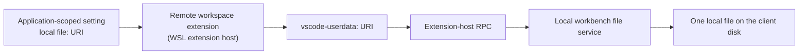

# Remote-to-Local File Bridge

**Status: PROVEN 2026-09-25.** This document records how a workspace-hosted extension running in a remote extension host reaches a file that physically lives on the local client disk, verified end to end on Windows with WSL. It exists because the answer decides architecture: it is what lets vLLM-Copilot keep workspace-only placement, and it is reusable by any future feature that needs local-disk state. The disposable probe that proved it was deleted after the run; the parts worth keeping were recovered as tracked code, and section 8 says which and how to run them.

## 1. The question

Workspace-only placement is an architecture invariant in this repo, for one reason: in a remote window the request code must execute beside the remote vLLM or OpenRouter endpoint, so `localhost:8000` keeps its intended meaning. That forces a problem. A workspace extension in a WSL window runs inside `~/.vscode-server`, where Node's `fs`, `os.homedir()`, and `globalStorageUri` all resolve to the Linux side. A configuration file the user picked on Windows lives on the Windows side. The two are different machines.

The options were: a second UI-hosted extension acting as a local bridge, a mount, a network path, a URL, or something already inside VS Code. We ruled out the first four. The fifth is this document.

## 2. The route

The local client disk is reachable through VS Code's internal `vscode-userdata:` scheme. Save a local `file:` URI in an application-scoped setting, convert it to `vscode-userdata:` for every `workspace.fs` operation, and the workbench resolves it against the local disk provider.



No second extension, no mount, no network path, no path translation.

## 3. Why it works, per VS Code source

Checked against commit `04c0d99f4fb0d8afe6ce4f0c58e31e183ac3e4b1` (VS Code 1.139.1, the build installed and tested here).

- `vscode-userdata` is a registered filesystem provider, not a convention. `FileUserDataProvider` in `src/vs/platform/userData/common/fileUserDataProvider.ts` wraps the local disk provider and its `toFileSystemResource` only swaps the scheme back to `file`. Every read, write, rename, and watch therefore lands on the local disk. It is registered in `desktop.main.ts`, `main.ts`, `cliProcessMain.ts`, and `sharedProcessMain.ts`.
- No remote extension host installs a shortcut for that scheme, so a `workspace.fs` call from a remote workspace extension crosses extension-host RPC and is served by the local workbench.
- The provider translates file-change events back to the `vscode-userdata` scheme for watched resources, so `FileSystemWatcher` events arrive for local writes made by another host.
- `scope: "application"` settings live in the local default-profile user settings file. `ConfigurationService` merges local and remote user configuration, which is why a pointer written in the local window is visible to the WSL host, while `ignoreSync: true` keeps a machine-specific path off other computers.

## 4. The acceptance test

The exact test that was demanded, and the only version that counts:

1. The local window writes a marker file on local disk and leaves it open in an editor.
2. A WSL window reads that file and alters it.
3. Nobody touches the local window. No command, no manual reload, no reopening the file.
4. The local window must see the alteration on its own, in the editor that is already open.

A weaker test is worthless here. Two WSL windows reading the same file proves nothing about local-disk routing. A local window that re-reads on demand proves nothing about automatic propagation. Disk content alone is not enough either, because the user-visible claim is about the open editor.

## 5. The evidence

Real run, 2026-09-25, VS Code 1.139.1, local Windows host plus WSL remote host, same workspace-only VSIX in both.

| Claim | Evidence |
|---|---|
| Local write to local disk | `operation: "local-wrote-token-A"`, `passed: true`, readback matched the written token |
| Pointer reached both hosts | `configBridgeProbe.localFileUri` resolved to the same `file:///c%3A/Users/diete/vllm-copilot-config-bridge-probe.json` in both the local and WSL reports |
| Remote host is workspace-hosted | WSL report context: `extensionKind: "Workspace"`, `appRoot` under `~/.vscode-server/bin/...`, `platform: "linux"` |
| WSL read the local file | WSL `readBeforeWrite.payload.token` equalled the local token A exactly |
| WSL altered and saved it | WSL wrote `state: "remote-written"` through a sibling temp file plus atomic rename; `readAfterWrite` matched |
| Local disk really changed | The file on the Windows disk contained the WSL token B and `writer: "remote:wsl"` after the run |
| Local observed it automatically | `operation: "local-observed-wsl-write"`, `passed: true`, with no local command run |
| The open editor displayed it | `localEditor.token` equalled token B, `version: 2`, `isDirty: false`, `viewColumn: 1` |

Token chain, unbroken end to end: `local-A-1790350864753-fc8e1723` written locally, read by WSL, then `wsl-B-1790350938718-1a9c0a3f` written remotely and observed locally.

## 6. API traps this cost

Three defects found while building the probe. All three passed a syntax check and a mock, and all three would have shipped a false green.

- **`vscode.context` does not exist.** Reading `vscode.context.extension.extensionKind` threw during activation, before any command was registered. The palette still showed the command, which is how it looked like a packaging problem. The real `ExtensionContext` passed to `activate` carries `extension`.
- **`createFileSystemWatcher` takes `string | RelativePattern`, never a bare `Uri`.** Passing the URI directly threw inside VS Code's own path handling (`TypeError: Cannot read properties of undefined (reading 'scheme')`). Use `new vscode.RelativePattern(uri, '*')` for one specific file. This one is invisible to mocks, because a mock has no opinion about glob patterns.
- **A launcher that returns before the workbench is not a test.** On Windows, `& Code.exe` from PowerShell does not block on the GUI process, so the harness deleted its own profile directory before the extension host could write results, and still printed exit code 0. Use `Start-Process -Wait` and require a machine-readable result artifact on disk before believing anything.

## 7. The code shapes

These are the patterns production code copies. They are illustrative and deliberately not copy-paste-ready; the live version that passed is `test/integration/remoteLocalFileBridge.live.cjs`.

**Scheme conversion, and nothing else.** VS Code's own provider is a one-liner, which is the whole reason this route works: `toFileSystemResource` in `fileUserDataProvider.ts` is `userDataResource.with({ scheme: this.fileSystemScheme })`. Do the same.

```ts
const LOCAL_USER_DATA_SCHEME = 'vscode-userdata';

function toUserDataUri(fileUri: vscode.Uri): vscode.Uri {
  return fileUri.with({ scheme: LOCAL_USER_DATA_SCHEME });
}
```

**Reject anything that is not a local `file:` URI before touching disk.** A remote workspace extension cannot expand a local `~`, and a relative or remote pointer is always a mistake.

```ts
function parseLocalPointer(configured: unknown): vscode.Uri {
  if (typeof configured !== 'string' || !configured.trim()) {
    throw new Error('No local config file is selected.');
  }
  const uri = vscode.Uri.parse(configured);
  if (uri.scheme !== 'file') {
    throw new Error(`Expected a local file: URI, got ${uri.toString()}`);
  }
  return uri;
}
```

**Feature detection, so a future VS Code leaves settings mode working.** `isWritableFileSystem` returning `undefined` means "no provider", not "read-only", and that distinction matters.

```ts
function localUserDataAvailable(): boolean {
  return vscode.workspace.fs.isWritableFileSystem(LOCAL_USER_DATA_SCHEME) === true;
}
```

**The watcher, in the one form that works.** `GlobPattern` is `string | RelativePattern`. A bare `Uri` throws inside VS Code, and a string cannot address one specific file.

```ts
// Wrong: createFileSystemWatcher(uri, false, false, false) throws.
const watcher = vscode.workspace.createFileSystemWatcher(
  new vscode.RelativePattern(toUserDataUri(fileUri), '*'),
  false, false, false,
);
watcher.onDidChange(uri => queueReload(uri));
watcher.onDidCreate(uri => queueReload(uri));
```

**Atomic write: sibling temp file, read it back, rename over the target.** Never write the target directly, or a second host can read half a JSON document.

```ts
async function writeLocalFileAtomic(fileUri: vscode.Uri, bytes: Uint8Array): Promise<void> {
  const target = toUserDataUri(fileUri);
  const temp = target.with({ path: `${target.path}.tmp` });
  await vscode.workspace.fs.writeFile(temp, bytes);
  await vscode.workspace.fs.rename(temp, target, { overwrite: true });
}
```

**The part everyone gets wrong: confirm what the user sees.** Re-reading bytes off disk proves nothing about the editor. And a closed editor is a failure, not a pass.

```ts
function openDocumentShows(fileUri: vscode.Uri, expected: string): boolean {
  const document = vscode.workspace.textDocuments.find(
    d => d.uri.toString() === fileUri.toString(),
  );
  if (!document || document.isDirty) return false;
  return document.getText().includes(expected);
}
```

`document.isDirty` is in that check on purpose: if the user has unsaved edits, the file is not showing disk state, so a reload claim would be a lie.

## 8. Rules production code inherits

- `FileSystemWatcher` on the `vscode-userdata:` URI is **required** in file mode, not optional. Without it, cross-host changes need a manual reload, which is the whole thing this document exists to avoid.
- "It worked" means the open editor shows the new content. Re-read the `TextDocument` and compare content, never just `workspace.fs` bytes.
- A closed editor is a **failure**, not a pass. Do not silently reopen the file to manufacture evidence; that hides the fact that the user was not looking at it.
- A stale editor is a failure with a clear message, and the message must name the expected token and the token still displayed.
- All `vscode-userdata:` access lives in one adapter module, with feature detection, so a future VS Code that changes or removes the provider leaves settings mode working.
- Never resolve the local file with `path`, `fs`, or `os.homedir()` in a remote host. Those all point at the wrong machine.
- Register commands before diagnostics during activation, so a throw in a startup log line can never masquerade as a missing command in the palette.

## 9. Re-running this test

The one-time probe was deleted after the run, and `temp/` is git-ignored, so it was never part of the repository. The durable half is tracked: `test/integration/remoteLocalFileBridge.live.cjs` is a live check that runs inside a real VS Code extension host, and `npm run test:bridge` launches it against a disposable profile.

That check covers the local half automatically. It asserts the `vscode-userdata:` provider exists and is writable, that a write reaches the local disk, that the sibling-temp-file rename from section 7 works, that a real `FileSystemWatcher` fires, and that an already-open editor reloads to the new token. Run it after any VS Code upgrade, and before trusting file mode, since the risk it guards is the top row of the [plan's risk table](./config-file-plan.md). It is deliberately not part of `npm test`, because it needs an installed desktop build and launches a window.

The WSL half still needs a human, because the point is that a second, genuinely different host can reach the local disk. Recreate the probe for that: a disposable workspace-only extension that writes a token locally and leaves the file open, reads and rewrites it from WSL, and only reports pass when the local watcher observed the change in the open editor. Register the commands before any diagnostic call, and treat a closed or stale editor as a failure rather than reopening the file to manufacture evidence.

Judge the whole thing by what the user sees, not by what a mock asserts.
