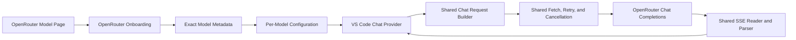

# OpenRouter First-Class Backend Plan

**Status:** Onboarding + dashboard cleanup shipped (v1.32.0 + Unreleased). Dashboard data research done → [docs/openrouter-api-research.md](./docs/openrouter-api-research.md). **Dashboard approach decided: Option A — model collection** (see below). **Phase 1 (cost data plane) and Phase 2 (model-collection dashboard) LANDED in Unreleased.** Phase 3 (activity ledger) is **DEFERRED** (endpoint undocumented + management-key scope) — see the Phase 3 note below. The OpenRouter plan's goals are complete; this document is the record.
**Date:** 2026-08-16

## Goal

Let a user select OpenRouter, paste a model slug or model-page URL, and chat with correct limits, capabilities, errors, and cost reporting without editing JSON.

This is a focused fifth-backend integration, not a transport rewrite.

## Architecture Decisions

- Use OpenAI Chat Completions. OpenRouter already matches the extension's message, tool, SSE, cancellation, and usage pipeline.
- Keep every model self-contained: backend, URL, wire model ID, headers, parameters, modes, and rates remain per-model. There are no global credentials or server settings.
- Add one OpenRouter-specific control-plane helper for input parsing and exact model metadata. Widen the existing context resolver to return runtime limits; keep the shared chat client.
- Do **not** extract a backend registry now. The current switches are small and already express real differences. Revisit only when another backend adds repeated behavior that cannot stay in those existing boundaries.
- Keep the runtime request body unchanged unless a contract test proves a difference. Current OpenRouter Chat supports `max_tokens`; the existing non-vLLM path already removes vLLM-only continuation flags.
- Use OpenRouter's website for catalog browsing and its public exact-model API for validation. Do not recreate the catalog UI or copy catalog data into presets.
- Keep credentials in per-model `requestHeaders`. They remain plaintext user settings. Opt-in raw file logging and connection diagnostics may include them on the user's own machine by design; this is not treated as automatic exfiltration. Credentials must still stay out of webview state.
- Reuse the current fetch/retry, `eventsource-parser`, SSE parser, malformed-JSON recovery, and message converter. Do not add `@openrouter/sdk` for one metadata GET.
- Defer Responses and the Agent SDK. Copilot owns the agent loop; Responses is a separate item/event protocol and should be added only for a concrete user-facing capability.

## Target Architecture



The only vendor-specific path is onboarding and metadata normalization. Chat requests and responses continue through the same data plane as the existing OpenAI-compatible backends.

---

## Verified API Contract

The source of truth is OpenRouter's current OpenAPI specification and official documentation. Decode responses permissively because fields and enum values can be added within `v1`.

| Endpoint | Use |
|---|---|
| `POST /api/v1/chat/completions` | Shared chat data plane |
| `GET /api/v1/models` | **Authoritative metadata source** — the full model CATALOG. Every model VARIANT is its own entry keyed by its exact `id` (e.g. `author/slug:free` and `author/slug` are separate entries with separate metadata). Public and unauthenticated (verified live). |
| `GET /api/v1/generation?id=...` | Deferred post-hoc generation diagnostics (see Deferred note) |
| `GET /api/v1/key` | Used — dashboard relay Account node (credits/limits/free-tier) |
| `POST /api/v1/responses` | Deferred separate protocol |

> **Note on the exact-model endpoint (`GET /api/v1/model/{author}/{slug}`):** deliberately NOT used. It resolves variants inconsistently (some `:free` variants 404), and deriving a lookup slug from the requested id could resolve a **DIFFERENT** model than the user picked — silently charging them for a model they didn't choose. Metadata is resolved deterministically from the catalog by matching the requested id **verbatim**.

`serverUrl = https://openrouter.ai/api` composes correctly with the existing `buildEndpoint()` helper.

The existing Chat body is compatible. OpenRouter documents `max_tokens`, standard OpenAI messages and tools, reasoning fields, routing controls, and plugins. Do not translate or strip fields specifically for OpenRouter unless a contract test demonstrates a rejection.

The catalog response is normalized as follows:

- Each catalog entry is keyed by its exact `id`; match the requested id **verbatim** — no slug derivation, no fallback. A `:free` pick always resolves to the free entry, never the paid model.
- Keep the requested slug as the wire ID, including aliases and variants (`:free`, dated `canonical_slug`).
- Resolve the runtime context from `per_request_limits.context_tokens` first — it is the API's enforceable per-request bound, not an invented budget — falling back to `context_length`, then `top_provider.context_length`. Reject only when **no** positive bound is reported. **Live verification (2026-08-17): `per_request_limits` is `null` for every sampled catalog model including the auto router — the field is a defensive nicety, the real chain is `context_length` → `top_provider.context_length`.**
- Compute the output ceiling from the smallest positive value among `top_provider.max_completion_tokens`, `per_request_limits.completion_tokens`, and the context-window safety bound.
- Derive tools, image input, reasoning modes, defaults, and estimated per-million USD rates from the returned model fields. Ignore unknown fields and invalid optional numbers. **Live: `pricing.prompt`/`completion` are per-token USD strings; `-1` means unknown (dynamic routers) and must not become a rate.**
- Treat `usage.cost` as the authoritative request charge; catalog pricing is only an estimate.
- A **malformed `200` catalog** (missing `data` array / invalid payload) is a transient protocol failure and THROWS — it is never treated as an empty authoritative catalog. Entries without a string `id` are dropped.
- An id **absent from the current catalog snapshot** throws `OpenRouterModelNotFoundError`. The metrics engine rechecks it on the next poll (the catalog is already re-fetched), so a transiently incomplete catalog or propagation delay self-heals. An entry that **exists but reports no window** throws `PermanentContextError` (never retried). Never guess at a corrected slug.

**Variants are separate catalog entries — resolve by exact id, no suffix stripping.** The catalog lists every variant as its own entry keyed by its exact `id`, so matching the requested id verbatim guarantees a `:free` pick resolves to the free entry (verified live: `cohere/north-mini-code:free` reports `pricing: "0"`). There is NO suffix stripping for the lookup and NO base-slug fallback — that would silently resolve a different (paid) model. `:free` ids are valid chat ids (free-router responses echo `model: "...:free"`), so `requestedId` keeps the full input for chat. This is implemented in `src/openRouter.ts` (`parseOpenRouterModelRef` + `normalizeOpenRouterFromCatalog`).

Streaming matches the shared parser: keep-alive comments, `[DONE]`, reasoning/content/tool deltas, an empty-choice final usage chunk, and top-level mid-stream errors. Bounded pre-stream `Retry-After` handling for 429/503 is landed: one retry, at most 10 seconds, cancellation-aware, and never after partial output. Preserve `error.metadata.error_type`; `X-Generation-Id` remains deferred below.

## Reuse Decision

Reuse OpenRouter's model pages, API, OpenAPI contract, and this repository's fetch/SSE/message stack. The official TypeScript SDK is Apache-2.0 and legally usable, but the audited package duplicates transport, retries, SSE parsing, and validation for one GET in an unbundled extension. Reconsider it only if it replaces a complete subsystem; do not copy generated SDK source.

Responses remains a future sibling protocol with its own converter and parser. The Agent SDK remains out because Copilot owns tool execution, approvals, and conversation state.

---

## Preparation — Step 1 (LANDED, no behavior change)

The shared context contract was widened in isolation, before any OpenRouter code, with the existing test suite as proof:

- New `RuntimeModelLimits { contextWindow: number; maxOutputTokens?: number }` in `src/types.ts`.
- The standalone resolver `resolveContextWindow(): Promise<number>` became `resolveRuntimeLimits(): Promise<RuntimeModelLimits>`. All four existing backends return `{ contextWindow }` with no output ceiling — identical numbers, zero behavior change.
- `VllmClient.getModelContextWindow()` keeps its name (stable `ProviderClient` interface) but now returns `Promise<RuntimeModelLimits>`.
- `deriveTokenBudget()` gained an optional `reportedMaxOutputTokens` clamp (0/negative degrades to 1 token; `NaN` is ignored rather than poisoning the budget); `buildModelInfo()` threads it through. Existing backends pass `undefined`, so budgets are bit-identical.
- Call sites (`discovery.ts`, `hfDiscovery.ts`, `testAndRefresh.ts`) consume `limits.contextWindow`.

OpenRouter is now just a 5th arm of an already-widened contract: its control-plane module returns both limits and discovery clamps output to the reported ceiling. No special-cased wrapper needed.

## Minimal Change Set

### Credential Hygiene (LANDED — done before this delivery, no behavior change)

Credentials stay in per-model `requestHeaders` as plaintext user settings. Raw local request/response logging and connection diagnostics are an intentional expert-mode behavior: the user explicitly enables or invokes them, the data remains on the user's machine, and the extension does not upload it. The webview remains a separate trust boundary and does not receive header values. Two low-severity hygiene fixes landed as a quick chore ahead of onboarding:

- `addServerFlow.ts` logs the complete config — including `requestHeaders` — to the output channel. That channel is the user's own machine, so this is not a vulnerability; but the extension tells users to copy the channel and share it when reporting issues, so a key can end up in a shared paste. Log a redacted projection (headers as `[REDACTED]`) so the "key never leaves trusted extension code" claim made during onboarding is actually true.
- `serverSettingsView.ts` posts full `ModelConfig[]` objects (including `requestHeaders`) to the webview. Same low severity — same-machine DOM — but defense-in-depth: send a public model projection to the webview.

Shared helper: `toPublicModelConfig` (`src/config.ts`) — `[REDACTED]`-values mode for the output channel, `{ strip: true }` for the webview. Covered in `test/configFunctions.test.ts`.

### Backlog

- **Optional sanitized diagnostics export/warning** — revisit whether to offer a redacted log export or a warning before sharing raw local diagnostics. This is a usability and sharing-safety improvement, not a correctness/security blocker under the current product decision. Do not change the existing expert-mode raw logging behavior without explicit product direction.

Connection identity reuses the existing normalized-URL + backend + deterministic header fingerprint. Do not add multi-key isolation logic for OpenRouter — one key per user is the norm, and the existing fingerprint already keeps distinct keys separate at the same URL.

### Configuration And Runtime Limits

- Add `'openrouter'` to `ServerType`, validation, and the package configuration schema.
- Continue using the existing `vllmModelId` field as the wire model ID. Its name is legacy, but adding a second field and migration would create more ambiguity than it removes.
- ✔ LANDED (Step 1): the context-only runtime contract is now a compact limits result:

```ts
interface RuntimeModelLimits {
  contextWindow: number;
  maxOutputTokens?: number;
}
```

Existing backends return their current context result and no output ceiling. The OpenRouter case resolves both limits from the shared model catalog (see below). `deriveTokenBudget()` clamps the configured output preference to the reported ceiling, preserving at least one input token. Only the OpenRouter arm remains — the contract itself is done.

### OpenRouter Control Plane

Keep OpenRouter-specific parsing and normalization in one small module — **LANDED in `src/openRouter.ts`** (see the catalog resolution above):

- Accept `author/model`, `author/model:variant`, `~author/family-latest`, or a verified `https://openrouter.ai/...` model-page URL.
- Ignore query strings, fragments, and a trailing slash on verified OpenRouter URLs. Reject unrelated hosts, reserved paths, and malformed values instead of guessing.
- Fetch `GET /api/v1/models` (the catalog) with the model's optional headers, then match the requested id **verbatim** against the catalog (`normalizeOpenRouterFromCatalog`). No per-model endpoint, no slug derivation, no fallback. The metrics engine reuses its relay `/v1/models` probe as the catalog (`resolveOpenRouterLimitsFromCatalog`) so all models resolve in one pass.
- Preserve the requested ID for chat; `requestedId` keeps the full input (variants intact).
- Normalize only fields the existing config consumes: display name, family, capabilities, reasoning modes, default parameters, estimated rates, expiration, and runtime limits.
- Do not add a catalog cache. `VllmClient` remains the sole configuration cache owner.
- Exports: `parseOpenRouterModelRef`, `normalizeOpenRouterModel`, `fetchOpenRouterModel`, `fetchOpenRouterCatalog`, `normalizeOpenRouterFromCatalog`, `resolveOpenRouterLimitsFromCatalog`, `resolveOpenRouterRuntimeLimits`. The last is the arm the shared `resolveRuntimeLimits` switch calls; the catalog variants serve the engine's shared-catalog resolution. Coverage: `test/openRouter.test.ts`.

### Reasoning Modes — LANDED (full OpenRouter `reasoning` object)

The exact-model metadata's `reasoning` object is richer than a "supports reasoning" flag — it carries `supported_efforts` (the exact effort ladder), `default_effort`, `default_enabled`, `mandatory`, and `supports_max_tokens` (Anthropic-style budget via `max_tokens`). Instead of a hardcoded "Think (High) / No Think" pair, `normalizeOpenRouterModel` now builds real modes from it:

- **Effort ladder:** one `Think (Effort)` mode per `supported_efforts` entry (skipping `none`), each `{ reasoning: { enabled: true, effort } }`. Falls back to `['high']` when the API omits the allowlist.
- **`supports_max_tokens`:** no per-effort mapping exists, so a single `Think` mode `{ reasoning: { enabled: true } }` (OpenRouter applies a default budget) + `No Think` when disableable.
- **`mandatory: true`:** no `No Think` mode at all.
- **`defaultMode`:** from `default_effort` (mapped to its generated mode), else `No Think` when `default_enabled: false` / `default_effort: 'none'`, else the first (highest) mode.

Modes serialize as raw params through `override.modelModes[selectedMode]` (see `requestBuilder.ts`) — `{ reasoning: { enabled, effort } }` and `{ reasoning: { enabled } }` both pass through unchanged. Effort values come straight from the API, so they're valid by construction.


### Onboarding

Add an explicit OpenRouter branch to the existing Add flow:

1. Open `https://openrouter.ai/models` or continue directly.
2. Paste a slug or model-page URL; clipboard reading happens only after an explicit button press.
3. **Resolve metadata first — the exact-model GET is unauthenticated (verified live), so no key is needed yet.** Show a compact confirmation: requested/canonical ID, limits, capabilities, reasoning modes, rates, and expiration when present.
4. Then prompt for an API key or reuse an existing OpenRouter connection (distinguished by URL + header fingerprint).
5. Save `serverType: 'openrouter'`, `serverUrl: 'https://openrouter.ai/api'`, the requested wire ID, headers, and normalized config fields.

Generic local-server detection remains unchanged. No OpenRouter presets or internal catalog browser are added.

### Chat, Errors, And Diagnostics

- Use the existing request body and non-vLLM continuation behavior unchanged.
- Preserve canonical `error.metadata.error_type` for pre-stream and mid-stream errors; unknown future values remain displayable.
- ✔ **LANDED:** the shared pre-stream transport retries 429/503 once, honors valid `Retry-After` values up to 10 seconds, falls back to 1.5 seconds when absent/invalid, and fails immediately for longer requested waits. Cancellation interrupts backoff; 401, 402, permanent 4xx responses, and streams after partial output are never retried.
- Do **not** retain `X-Generation-Id`. The stream path never reads response headers, so it would thread a header-read through four layers for a diagnostic nicety; router metadata is out for the same reason (cache hits omit it). No new stream plumbing.
- OpenRouter is **not** "degraded". Replace the dashboard's blanket `serverType !== 'vllm'` → degraded flag with per-backend classification: OpenRouter renders as a managed remote backend — suppress the vLLM-only metric rows as today, but label it accurately and surface token usage + actual cost. The actual-cost display becomes the headline, not a "degraded" footnote.

### Exact Cost — LANDED

- Extend `WireUsage` with optional `cost` and `usedByok`. (A `cost_details`/`WireCostDetails` wire surface was proposed and then **removed** as dead surface — never consumed — before shipping. Upstream cost breakdown is a documented follow-up, not a shipped field.)
- Add the reported-cost field to the usage store with a **single additive migration (v2 → v3)** — one store touch, not two, so cost flows end-to-end from the first OpenRouter request. Existing v1/v2 token records migrate unchanged with no fabricated actual cost.
- Store reported actual USD separately from token-derived estimates. Prefer actual cost when present and never add actual and estimated values together.
- Preserve the current configured-rate behavior for vLLM and responses without `usage.cost`.

> **BYOK naming (2026-08-19):** OpenRouter's `is_byok` means *the request was served using the user's own upstream provider key (e.g. a real OpenAI/Anthropic key routed through OpenRouter), billed directly by that provider rather than OpenRouter credits*. This is **NOT** the same as VS Code Copilot's `isBYOK` (on `LanguageModelChatInformation`), which means *served with user-supplied credentials instead of the built-in Copilot service*. To avoid two different "BYOK" meanings in one codebase, the wire type must use a **distinct field name** — `usedByok` — with a doc comment stating it is OpenRouter's upstream-key BYOK, not VS Code's.

## Dashboard — Option A (model collection)

**Decision (2026-08-19):** research → [docs/openrouter-api-research.md](./docs/openrouter-api-research.md). OpenRouter is a **relay / model selector**, not a server — almost every valuable value is model-level (context, pricing, capabilities, benchmarks) or per-request (provider, cost, latency, tokens). The dashboard therefore renders OpenRouter as a **model collection**:

- **OpenRouter server node = relay node** — account-level data only, from `GET /api/v1/key`:
  - Credits remaining / used (month); free-tier vs paid (`is_free_tier`)
  - (deferred) today's activity ledger — see Phase 3 (endpoint undocumented + management-key scope)
- **Per-model child nodes** — one per configured model, each showing model-level rows. **Shipped rows:** context window, output ceiling, capabilities, reasoning modes, cost (estimated/actual), today/overall tokens. **Planned but not shipped:** the richer rows below remain a documented follow-up (see Delivery):
  - Context window (already resolved) ✔
  - Full pricing: prompt / completion / `request` (fixed per-request cost) / cache-read, with `overrides` flagged — ⏸ not shipped
  - Capabilities (tools, vision, structured outputs) from `supported_parameters` ✔
  - Description (tooltip), Design Arena rank (if present), expiration date — ⏸ not shipped
- **Per-request** — captured from the stream's final `usage` chunk (no extra HTTP):
  - Actual cost (`usage.cost`), tokens (incl. cached/reasoning), `usedByok` flag ✔

### Phases

1. **Cost data plane** — ✔ **LANDED (Unreleased).** `WireUsage.cost`/`usedByok` → capture in `consumeStream` → usage-store v2→v3 migration → Last Request + cost tracker prefer actual cost. (`cost_details` was proposed then removed — dead wire surface, never consumed.)
2. **Model-collection dashboard restructure** — ✔ **LANDED (Unreleased).** OpenRouter relay renders as a model collection: **Account** node (credits/limits/free-tier from `GET /api/v1/key`) + **one node per configured model, as direct children of the relay server** (per-model context window, output ceiling, capabilities, reasoning modes, estimated/actual cost, today/overall tokens). The engine now resolves **per-model** context windows (relay models differ) and caches them; the old single-window resolve became a per-model map. **Known limitation:** account health reflects the server's credential (first configured model's headers) — per plan's "OR group account rows beneath separate connection/key nodes", multi-key grouping is a documented follow-up if a user actually runs mixed keys on one relay. (An initial "Model Collection" container node was removed — the count read as an index and added a nesting layer; models are direct children.)
3. **Authoritative cost ledger** — ⏸ **DEFERRED (documented, not shipped).** `GET /api/v1/activity` looked promising in research, but live verification killed it: the endpoint is **not in the public API reference** (docs page 404s; llms.txt has no activity route), and OpenRouter's actual analytics surface requires a **management-level API key** — a different key scope than the standard per-model `Authorization: Bearer` key this extension stores. Shipping code against an undocumented endpoint needing a key scope we don't carry and can't verify would be dead weight. Actual per-request cost is already authoritative via `usage.cost` (Phase 1, zero extra HTTP). Revisit only if OpenRouter documents `/api/v1/activity` under the regular key scope.

**Deferred:** generation endpoint / `X-Generation-Id` threading (richest but most plumbing) — follow-up "OpenRouter request diagnostics" feature.

### Refactor consideration

The current dashboard is server-centric (one engine per server, one metric set). OpenRouter breaks that: the engine polls `/v1/models` (the whole catalog, not "the server's models"), and context/cost/capabilities are per-model. The tree needs **per-model detail nodes under a relay server** — the natural extension of the "hide absent rows" cleanup, but it changes the tree data model (currently server → flat metric rows).

**Relay identity (2026-08-19):** credentials are per model, and multiple models at the fixed OpenRouter URL may use **different API keys**. The current engine registry (`vllmMetrics.ts`) keys by normalized URL only and the dashboard takes the *first* model's headers — so account-level data from `GET /api/v1/key` (credits, free-tier, activity) could be attributed to the wrong account when keys differ. Phase 2 must define relay identity as **normalized URL + credential fingerprint**, OR explicitly group account rows beneath separate connection/key nodes. The credential fingerprint is the existing `buildAuthHeaders`-derived header set (the connection identity the codebase already uses for same-URL key separation).

## Delivery — all shipped

All Option A delivery items are shipped in Unreleased (dashboard cleanup — no degraded, backend-aware rows, per-model context, Deep-Dive vLLM-only — was the prerequisite and is also shipped):

1. **Cost data plane (Phase 1 of Option A)** — ✔ **LANDED.** `WireUsage.cost`/`usedByok` extension (no `costDetails` — removed as dead surface), capture in `consumeStream`, LastRequest actual-cost capture, and the single usage-store migration (v2 → v3, additive). Cost is recorded from day one.
2. **Dashboard restructure (Phase 2 of Option A)** — ✔ **LANDED.** OpenRouter renders as a **model collection**: relay node with account health (`GET /api/v1/key`) + per-model detail nodes (context window, output ceiling, capabilities, reasoning modes, cost, tokens). Per-model rows are direct children of the relay node. **Scope note:** the plan's richer per-model rows — full pricing with `overrides`, model description, Design Arena rank, expiration date — are NOT in the shipped per-model node; those remain a documented follow-up if model-level detail depth is wanted.
3. **Deferred:** `GET /api/v1/activity` authoritative cost ledger — see Phase 3 deferral note (endpoint not in the public API reference; analytics requires a management key scope we don't carry).

Do not rename `VllmClient`, add a backend registry, or reorganize existing backends as part of this work. Those changes do not help the OpenRouter user path.

## Focused Tests

- Existing backend request snapshots and tests remain unchanged.
- Exact lookup normalizes context, both output-cap fields, capabilities, modes, and rates; malformed optional values stay undefined rather than becoming `NaN`.
- Slugs, page URLs, aliases, and variants round-trip to the requested wire ID; invalid hosts and paths are rejected.
- Dynamic routers with an enforceable `per_request_limits` bound resolve a real window (defensive: null in practice); models with no positive bound at all fail with an actionable message.
- OpenRouter streams cover comments, reasoning, content, tool calls, usage-only final chunks, `[DONE]`, pre-stream errors, and mid-stream errors.
- The dashboard classifies OpenRouter as a managed remote backend (not "degraded") and shows actual cost when present.
- Cancellation aborts immediately; 429/503 honor bounded `Retry-After`; auth, payment, and partial-output failures are not retried.
- The config log shows headers as `[REDACTED]`; the webview receives a public model projection with no header fields; same-URL credentials remain separate via the existing fingerprint.
- Actual cost survives reload, BYOK/missing-cost responses do not invent charges, and estimates are never double-counted.
- `npm run compile`, `npm run test:typecheck`, `npm test`, and `npm run validate-webview-js` pass.

## Acceptance Criteria

- A user can add and chat with an OpenRouter model without editing JSON.
- OpenRouter limits and capabilities come from its exact model API.
- The existing Chat Completions transport and SSE pipeline serve OpenRouter without a fork.
- Per-model credentials remain isolated and never leave trusted extension code.
- Existing vLLM, LM Studio, llama.cpp, and Ollama behavior remains compatible.
- Actual OpenRouter cost is recorded when supplied; configured rates remain estimates.
- OpenRouter renders as a managed remote backend in the dashboard (not "degraded"), with token usage and actual cost tracked.
- Responses, agent orchestration, and `X-Generation-Id` diagnostics remain out of scope.

## Product Defaults

- Do not send `HTTP-Referer`, `X-OpenRouter-Title`, or `X-OpenRouter-Categories` automatically. Users may add them in per-model headers.
- Leave provider data policy controlled by the user's OpenRouter account and request parameters; do not silently force ZDR or data-collection filters.
- Leave `X-OpenRouter-Metadata` disabled by default. Users may opt in through per-model headers.
- Do not send `session_id` until VS Code exposes a stable, appropriate conversation identifier.

## Provider Routing — Decision Record (2026-08-20, REVISED)

OpenRouter routes each request to a provider (Anthropic, OpenAI, a host, etc.). Today the extension treats the provider as invisible passthrough — the wire id is sent verbatim, and there is no way to choose a provider in the UI.

**Contract (corrected 2026-08-20):** OpenRouter selects providers via the request body's `provider` object — force one provider with `provider.only: [slug]` (plus `allow_fallbacks: false` when strict), or prefer several with `provider.order: [slug, ...]`. Only documented shortcuts such as `:nitro` and `:floor` are model-id suffixes; provider names are **not** model suffixes. The model catalog entry does not expose the per-model provider list.

**Decision (fixed — do not revisit without product direction):**
- **No provider picker in the Add Server flow.** Onboarding stays model-only.
- **Provider choice lives in Model Settings only**, as a dropdown shown **when an OpenRouter model is selected**.
- The dropdown lists **only the providers available for that specific model** (never the whole catalog), sourced from the model-endpoints API — not a model-id suffix.
- **`Auto` (default)** = let OpenRouter route; a manual choice forces routing to that provider.
- The provider is stored **per model** (a new optional `provider` field) and applied at request time as `provider.only: [slug]` (+ `allow_fallbacks: false` when strict) on the chat body — NOT as a model-id suffix. The wire model id stays the canonical identity, so metadata resolution is unaffected.

This is a future feature, not yet implemented. Full spec (API field, config, UI, request-body `provider` object, open questions): [docs/feature-ideas.md → OpenRouter Provider Selection](./docs/feature-ideas.md).
