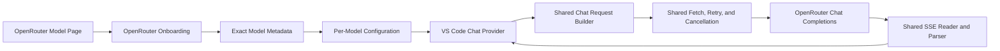

# OpenRouter First-Class Backend Plan

**Status (2026-08-21):** Onboarding, cost data plane, model-collection dashboard, provider pinning, and routing modes (Standard/Nitro/Exacto) are all SHIPPED **and pushed** (`main` @ `c70e4ab`, clean tree). Provider-level token evaluation research is done (live API verification) — see [Provider-Level Token Evaluation](#provider-level-token-evaluation-2026-08-20-verified-live-against-the-api). The **responsibility/display decision** for per-provider limits is LANDED (2026-08-21, see below) — the extension displays live and never persists, and the user owns the provider choice. Phase 3 (activity ledger) stays **DEFERRED** (undocumented endpoint + management-key scope). The plan's core goals are complete; this document is the running record.

**Where we are now → NEXT STEP (not yet implemented):** surface **per-provider** limits (`context_length` / `max_completion_tokens`) live and read-only — pin dropdown, dashboard, and an actionable `constraint_filtered` error — **never persisted, never clamped** (the old "clamp at pin time" idea is rejected — the user owns the provider choice). **Implemented 2026-08-21:** the pin dropdown and dashboard now show per-provider limits, and the dashboard flags a clamped output budget with an Attention icon (symmetric across catalog + pinned-provider caps). **The `constraint_filtered` error is COVERED by the generic OpenRouter error path** (server code + formatted message) — no further item remains (see [implementation checklist](#next-step-implementation-checklist)).

---

## Current Status & Next Steps (read this first)

### Shipped (all verified, committed, and pushed)

| Area | State | Commits |
|---|---|---|
| Onboarding + exact-model metadata | ✔ shipped (v1.32.0/v1.32.2) | — |
| Cost data plane (`usage.cost`, BYOK) | ✔ shipped (v1.32.2) | — |
| Model-collection dashboard (account + per-model nodes) | ✔ shipped (v1.32.2) | 17a7d70 |
| Provider pinning (`provider.only`) | ✔ shipped | a3e2269, 26d5b03 |
| Provider list + pricing no-stall fixes | ✔ shipped | 6e92d48 |
| **Routing modes (Standard/Nitro/Exacto)** | ✔ shipped | 6754048, 27ce297, f283bbe, d3d6157 |
| Usage tracking keys on BASE wire id (not the routing-suffixed id) | ✔ shipped (real bug fix) | f283bbe |

### Next step (identified gap, NOT yet implemented)

**Per-provider limits: lazy display, no persistence, user-owned choice.** Per-provider `context_length` / `max_completion_tokens` (from `/api/v1/models/{id}/endpoints`) will be surfaced **live and read-only** — in the pin dropdown, on the dashboard, and in an actionable `constraint_filtered` error — **never persisted to settings**. See [Provider-Level Token Evaluation](#provider-level-token-evaluation-2026-08-20-verified-live-against-the-api) and [Per-Provider Limits — Responsibility & Display Decision](#per-provider-limits--responsibility--display-decision-2026-08-21). The 80/90 use case (Auto routing) is already safe and needs nothing.

**Output-budget guard: clamp + dashboard icon (minimal).** The general/catalog output ceiling already clamps the user's `maxOutputTokens` silently in `deriveTokenBudget()` — and Copilot already advertises the clamped value. The only change is a **dashboard Attention icon** on a model when the clamp reduced the configured budget. **No popup, no session tracking, no selection tracking** (see [Output-budget guard](#output-budget-guard-clamp--dashboard-icon-general-level)). When the user changes settings in Model Settings, Copilot is refreshed automatically via the existing `onDidChangeConfiguration → clearCache() → re-discovery` chain — the clamped value is recomputed at every discovery.

### Next-step implementation checklist

The next step above decomposes into six concrete changes. Effort is **relative and non-cumulative**; they can ship independently and in any order.

| # | Change | Where | Effort | Status |
|---|---|---|---|---|
| 1 | Add `context_length` to `OpenRouterModelEndpoint` (currently captures only `maxCompletionTokens`) | `src/openRouter.ts` | S | ✔ **DONE (2026-08-21)** |
| 2 | Lazy per-session fetch + in-memory cache of `/api/v1/models/{id}/endpoints` | engine (`vllmMetrics.ts`) + webview (`serverSettingsView.ts`) | M | ✔ **already existed** — both the metrics engine and Model Settings already fetch once per session and cache in memory with retry backoff (garbage on reload). No new code needed. |
| 3 | Pin dropdown (Model Settings) shows each provider's `context_length` + `max_completion_tokens` at selection time | `resources/serverSettings.js` | M | ✔ **DONE (2026-08-21)** — each option shows `Ctx (tot, out)` + per-1M pricing (in/out/cache) compact in the label, exact numbers + full-price precision in the hover title |
| 4 | Dashboard per-model node shows the **selected** provider's limits (or general info for Auto) | `src/dashboard.ts` | M | ✔ **DONE (2026-08-21)** — the Provider row now appends the pinned provider's context + output cap (compact) with exact numbers in the tooltip |
| 5 | Actionable `constraint_filtered`/400 error | error path (`messageConverter.ts` / `formatError` / `collectErrorMessages`) | — | ✔ **COVERED BY THE GENERIC ERROR PATH — CLOSED (2026-08-21)**. The single OpenRouter error code path already extracts the server HTTP code and walks the whole error envelope (`message` / `raw` / `detail` / `reason` / `code_reason`, any depth) into a formatted message. `constraint_filtered` and every other OR error surfaces as "Server error [code]. <server's real message>" — not raw JSON. The proposed provider-name *enrichment* is dead scope: a redundant special-case on top of an honest generic path. |
| 6 | Attention icon + explanatory tooltip when effective < configured (thread `configured` vs `effective` to the dashboard) | `src/dashboard.ts` + `src/vllmMetrics.ts` | S | ✔ **DONE (2026-08-21)** — engine exposes per-model `outputByModel` (resolved with context); the model node shows a yellow `$(alert)` + tooltip when the effective output < configured. **Symmetric across all constraints:** effective = min(catalog ceiling, pinned provider cap); the tooltip distinguishes a silent catalog clamp from a pinned-provider cap that may fail |

> **Item 5 — RESOLVED (2026-08-21), no build needed.** The generic OpenRouter error path is sufficient and already shipped: `formatError()` → `extractServerErrorInfo()` surfaces the HTTP code, and `collectErrorMessages()` gathers every message-like field (`message` / `raw` / `detail` / `reason` / …) from OpenRouter's nested envelope into one formatted, deduped message. A `constraint_filtered` failure already shows the code + the server's real words. Adding provider-name enrichment would special-case one error type on top of a path that already tells the truth — rejected as over-engineering. Prediction surfaces (dropdown, symmetric Attention icon, Provider row) handle *before*; the single generic error path handles *after*.

### Deferred / out of scope (no change)

- **Phase 3 activity ledger** — `GET /api/v1/activity` undocumented + needs a management key scope we don't carry. Revisit only if documented under the regular key.
- **`allow_fallbacks: false` / `provider.order`** — not implemented; do not add without product direction.
- **`X-Generation-Id` / generation diagnostics** — deferred.
- **Responses API / Agent SDK** — separate protocols; out of scope.

---

## Provider-Level Token Evaluation (2026-08-20, verified live against the API)

### What the providers actually report

`GET /api/v1/models/{id}/endpoints` returns **per-provider** `context_length` and `max_completion_tokens` that differ wildly for the same model — the catalog's single `context_length`/`top_provider.max_completion_tokens` is NOT what every provider can serve. Live examples:

**`deepseek/deepseek-v3.2`**
| Provider | context_length | max_completion_tokens |
|---|---|---|
| GMICloud (`gmicloud/fp8`) | 163,840 | null |
| StreamLake (`streamlake/fp8`) | 128,000 | 64,000 |
| DigitalOcean | 163,840 | 28,000 |
| DeepInfra (`deepinfra/fp4`) | 163,840 | 16,384 |
| Alibaba (`alibaba/fp8`) | 131,072 | 65,536 (max_prompt_tokens 98,304!) |
| **SambaNova** | **32,768** | **7,168** |

**`meta-llama/llama-3.3-70b-instruct`**
| Provider | context_length | max_completion_tokens |
|---|---|---|
| Together (`together`) | 131,072 | **2,048** |
| SambaNova (`sambanova-turbo`) | 131,072 | **3,072** |
| Cloudflare | 24,000 | 24,000 |
| CoreWeave | 128,000 | 128,000 |

`OpenRouterModelEndpoint` currently captures `maxCompletionTokens` but **not** `context_length`, and the captured cap is never used for budget derivation.

### Conclusion 1 — Auto routing is safe, no per-endpoint token map needed

OpenRouter **already filters providers at request time** (verified in the provider-routing + errors docs):

- Setting `max_tokens` → *"OpenRouter will only route to providers that support a response of that length."*
- Context fit → the `constraint_filtered` error code's `excluded_by` vocabulary includes **`context_length`** — a provider whose window can't fit prompt+output is excluded, not 400'd.

So for **Auto** routing, the catalog-level `context_length`/`max_completion_tokens` we already use are sufficient: low-cap providers (Together 2,048, SambaNova 7,168) are silently dropped from the pool when our `max_tokens` exceeds them. We do **not** need to keep token settings per selected endpoint in memory for Auto.

### Conclusion 2 — the Auto Router cannot route you to a tiny-context model

`openrouter/auto` (and `openrouter/auto-beta`) is a **meta-model**: live-verified `GET /api/v1/models/openrouter/auto/endpoints` → `"endpoints":[]`, and the catalog entry has **no `context_length`**. Our strict no-context-no-model policy already **refuses to configure it** (`resolveOpenRouterRuntimeLimits` throws). It cannot be added, so it cannot silently route to a 10%-context model.

### Conclusion 3 — the ONE place provider-level token data constrains us

Pinning `provider.only: [tag]` removes the fallback pool. If the pinned provider's `max_completion_tokens` < our `max_tokens`, the request fails hard; if its `context_length` < our window, long prompts get `constraint_filtered` (excluded, not 400'd). That exclusion currently surfaces as a dead request with no explanation.

**Decided (2026-08-21) — no clamp, no persistence, display + user-owned choice, single generic error path.** The extension surfaces per-provider limits live (pin dropdown, dashboard) and the generic OpenRouter error path already surfaces every failure as the server code + formatted message — `constraint_filtered` included. It will **never gate, clamp, or persist** them, and adds **no per-error-type enrichment** (a special-case on top of an honest generic path would be over-engineering). Pinning a provider is an explicit user choice; the user owns the consequence. Detailed rationale: [Per-Provider Limits — Responsibility & Display Decision](#per-provider-limits--responsibility--display-decision-2026-08-21).

---

## Per-Provider Limits — Responsibility & Display Decision (2026-08-21)

### The core rule: display live, never persist

Per-provider limits change **daily** — pinning SambaNova on `deepseek-v3.2` drops the window from 163K to 32K, and either number can change tomorrow. The only way to lose to drift is to freeze the number in `settings.json`; the moment a per-provider `context_length`/`max_completion_tokens` lands in config, it's a stored lie with an expiry date we can't honor. So the token budget stays keyed to the **catalog context** (the general information) forever. Per-provider limits live **only** as live, read-only display:

- **Pin dropdown (Model Settings)** — each provider row shows its `context_length` and `max_completion_tokens` at selection time, so the user picks with their eyes open.
- **Dashboard** — the model node shows the **selected** provider's limits (or the general info for Auto).
- **Failure moment** — the generic OpenRouter error path surfaces the server code + formatted message (`constraint_filtered` included); no dead raw-JSON wall.

Nothing is ever stored, gated, or clamped. No contradiction is possible because nothing is frozen.

### Fetch strategy: lazy per-session, not per-poll

Provider-level data comes from `/api/v1/models/{id}/endpoints` — the catalog alone cannot provide it. Fetches are **lazy, once per session per model**, triggered when the user:

- **a)** opens the Provider/Auto-routing UI for that model, or
- **b)** uses (chats with) that model.

The result is cached in memory for the session and **garbage on reload** — so a stale value can never survive into a later day, and a daily context change is picked up the next time the data is needed. Cost is trivial: even ~100 prompts a session is ~100 small GETs. The 80/90 Auto-routed models (no pin) pay **zero** — only pinned models need the endpoint fetch. (A poll-time refresh can be revisited only if a live-changing value is ever shown on a dashboard that's already polling.)

### Who owns what

| Concern | Owner | Why |
|---|---|---|
| Provider can't fit the prompt (Auto routing) | **OpenRouter** | Verified — self-filters via `constraint_filtered`/`excluded_by`. Nothing to do. This is the 80/90 case. |
| Pinned provider's window/output is smaller than catalog | **User**, armed by the extension | Pinning is a deliberate choice. The extension's job is to make the consequence **visible** — the Attention icon + tooltip fires when the pinned cap binds — not to prevent it. |
| Context changes daily | **The extension, by refusing to persist it** | Display live, never store. Nothing to go stale. |
| "Is this pinned provider usable for me?" | **The user** | Only the user knows their prompt sizes. We don't, and we don't pretend to. |

### Scoping to the 80/90 use case (deliberately NOT doing)

We do **not** cater to every choice OpenRouter offers, and we do **not** gate on arbitrary floors:

- **No clamped `maxOutputTokens` at pin time** — clamps are either a stored lie or a stored third-party value; a JSON-configured pin wouldn't be covered anyway. Rejected (the old "next step").
- **No `providerOutputCap`/`providerContextWindow` config fields** — that is persistence in disguise; same drift problem, more config surface. Rejected.
- **No hard input-floor warnings (e.g. "under 80k is unusable")** — that number is a workflow judgment, not a universal law. A 32k provider is plenty for short Q&A on a small repo. A non-blocking warning at the extreme (≈ less than 40k input left after the output budget) can help the user see the number, but it is a **display** aid, not a gate.

### The extension's half of the bargain

"Let the user figure it out" is only acceptable if the failure is **explicable**. The generic OpenRouter error path makes every failure explicable: it surfaces the server HTTP code + the server's real, formatted message (from the nested error envelope — `message` / `raw` / `detail` / `reason` / `code_reason`, any depth). A pinned small-window provider does not vanish into raw JSON — the user sees the code and OpenRouter's own words about why. No per-error-type enrichment is added; the single generic path is the whole bargain.

Surfacing the truth at pin time + live on the dashboard (dropdown, Provider row, symmetric Attention icon) + at the failure moment (generic error path) is the extension's half. The provider choice itself is the user's. **Display live. Never persist. User owns the choice. One generic error path.**

### Output-budget guard: clamp + dashboard icon (symmetric across all constraints)

The user's `maxOutputTokens` setting is the **requested** budget — the guard and limit. The **general/catalog** output ceiling (OpenRouter's `top_provider.max_completion_tokens` / `per_request_limits.completion_tokens`, captured as `reportedMaxOutputTokens`) already clamps it **silently** in `deriveTokenBudget()` (output = min(configured, ceiling), with a 1-token floor and input headroom reserved). Copilot **already advertises the clamped value** — `buildModelInfo()` sets `maxOutputTokens: budget.maxOutputTokens` — so the clamp is functionally correct today; this feature is purely an *informational cue*.

**Decision (2026-08-21, symmetric):** the Attention icon fires whenever ANY binding constraint pushes the effective output below the configured budget — the catalog ceiling **or** the pinned provider's cap — and the tooltip tells the truth about each. No special-casing the pin.

- **Clamp stays, invisible code change zero** — the requested budget is reduced to the model's reported ceiling at budget-derivation time. `settings.json` is **never rewritten**; the clamp re-derives against the current ceiling on every discovery, so it cannot go stale (same drift rule as the context window).
- **Effective output = min of EVERY constraint that applies**: the catalog ceiling (from the engine) and the pinned provider's own `max_completion_tokens` (from `/endpoints`, when pinned and loaded).
- **Display: dashboard Attention icon.** When that effective output is below the configured `maxOutputTokens`, show an Attention icon (`$(alert)`) on that model's dashboard node, with a **tooltip that explains, not just shows a number**:
  - **Catalog ceiling binds** → *silently clamped* — "Configured 8192 → 4096 (the model's output ceiling). You'll get shorter replies."
  - **Pinned provider cap binds** → *may fail* — "Configured 8192, but pinned provider SambaNova caps at 7,168 — requests over this may **fail**. Unpin or lower the setting."
  - **Both bind** → effective = min of both; the tooltip lists each constraint with its own wording.
  **Stateless, always-true, no popup, no session tracking, no "selected model" tracking** (Copilot does not broadcast selection, and tracking "used this session" is exactly the state the graveyard is made of). The dashboard already shows every model; the icon appears where the user is already looking.
- **Copilot refresh on settings change — already handled.** Model Settings save → `settings.json` → `onDidChangeConfiguration` → `provider.clearCache()` → `onDidChangeLanguageModelChatInformation` fires → VS Code re-runs discovery → a fresh budget (with the current clamp) reaches Copilot. Do NOT add a second refresh mechanism — the existing chain is the path.
- **Why not deny (camp 1)?** Thousands of output tokens are rare; a denial forces a settings edit to use a model that's otherwise fully functional — a wall for a case that almost never bites. A clamp is not corruption, it's a shorter reply. Denying is for when the alternative silently corrupts; a trimmed output isn't that.
- **Why not a popup?** Popups need dedup/dismiss/session state — the maintenance graveyard. The icon is passive and always accurate. The 1% case deserves a 1% solution.

**Boundary — display-only either way.** The icon is informational in ALL cases: the catalog clamp is silent (Copilot already advertises the clamped value), and the pinned-provider cap is NOT clamped at all (a request over it may 400 / `constraint_filtered`). The extension never rewrites `settings.json` and never silently overrides a pinned provider's limit — it shows the truth (dropdown at pin time, Provider row live, icon + tooltip) and lets the user own the consequence. Same icon, honest text, one rule: **the icon fires whenever your setting isn't what you're getting.**

---

## Routing Modes: Standard / Nitro / Exacto (SHIPPED 2026-08-20)

Routing modes are how OpenRouter **sorts/chooses among providers** when routing is Auto. Verified against live docs:

- **Standard** (default, no suffix) — price-weighted load balancing.
- **Nitro** — `:nitro` suffix: sort by throughput **and** admit priority service-tier endpoints. Superset of `provider.sort: "throughput"`.
- **Exacto** — `:exacto` suffix: quality-first provider ordering from tool-calling-reliability signals. A **virtual variant** — no separate endpoint pool, works on any model.
- (`:floor` also exists — price + flex tier — deliberately NOT exposed in the UI.)

**Design (implemented):**
- These are model-id **suffixes** (`slug:nitro`, `slug:exacto`), applied to the **wire id at request time only**. The base `vllmModelId` stays canonical — catalog/metadata resolution and the provider-list lookup are unaffected.
- **Pinned provider disables routing mode** (sorting a single provider is meaningless). The webview greys the Routing dropdown live when a provider is selected — no save-and-re-render.
- **Standard maps to omission on save** — the default must not pollute every config with `routingMode: "standard"`.
- **Usage/cost tracking keys on the BASE wire id**, never the suffixed id — otherwise a routed model's dashboard counters fragment (real bug found + fixed, `f283bbe`).

Config surface: `routingMode?: 'standard' | 'nitro' | 'exacto'` per model (validated; `validateConfig` warns on anything else). Request path (`requestBuilder.ts`) appends the suffix only when OpenRouter + Auto + non-standard. Tests: `test/requestBuilder.test.ts`, `test/serverSettingsWebview.test.ts`, `test/providerAutoContinue.test.ts`.


## Goal

Let a user select OpenRouter, paste a model slug or model-page URL, and chat with correct limits, capabilities, errors, and cost reporting without editing JSON.

This is a focused fifth-backend integration, not a transport rewrite.

## Architecture Decisions

- Use OpenAI Chat Completions. OpenRouter already matches the extension's message, tool, SSE, cancellation, and usage pipeline.
- Keep every model self-contained: backend, URL, wire model ID, headers, parameters, modes, and rates remain per-model. There are no global credentials or server settings.
- Add one OpenRouter-specific control-plane helper for input parsing and exact model metadata. Widen the existing context resolver to return runtime limits; keep the shared chat client.
- Do **not** extract a backend registry now. The current switches are small and already express real differences. Revisit only when another backend adds repeated behavior that cannot stay in those existing boundaries.
- Keep the runtime request body unchanged unless a contract test proves a difference. Current OpenRouter Chat supports `max_tokens`; the existing non-vLLM path already removes vLLM-only continuation flags.
- Use OpenRouter's website for catalog browsing and its public exact-model API for validation. Do not recreate the catalog UI or copy catalog data into presets.
- Keep credentials in per-model `requestHeaders`. They remain plaintext user settings. Opt-in raw file logging and connection diagnostics may include them on the user's own machine by design; this is not treated as automatic exfiltration. Credentials must still stay out of webview state.
- Reuse the current fetch/retry, `eventsource-parser`, SSE parser, malformed-JSON recovery, and message converter. Do not add `@openrouter/sdk` for one metadata GET.
- Defer Responses and the Agent SDK. Copilot owns the agent loop; Responses is a separate item/event protocol and should be added only for a concrete user-facing capability.

## Target Architecture



The only vendor-specific path is onboarding and metadata normalization. Chat requests and responses continue through the same data plane as the existing OpenAI-compatible backends.

---

## Verified API Contract

The source of truth is OpenRouter's current OpenAPI specification and official documentation. Decode responses permissively because fields and enum values can be added within `v1`.

| Endpoint | Use |
|---|---|
| `POST /api/v1/chat/completions` | Shared chat data plane |
| `GET /api/v1/models` | **Authoritative metadata source** — the full model CATALOG. Every model VARIANT is its own entry keyed by its exact `id` (e.g. `author/slug:free` and `author/slug` are separate entries with separate metadata). Public and unauthenticated (verified live). |
| `GET /api/v1/generation?id=...` | Deferred post-hoc generation diagnostics (see Deferred note) |
| `GET /api/v1/key` | Used — dashboard relay Account node (credits/limits/free-tier) |
| `POST /api/v1/responses` | Deferred separate protocol |

> **Note on the exact-model endpoint (`GET /api/v1/model/{author}/{slug}`):** deliberately NOT used. It resolves variants inconsistently (some `:free` variants 404), and deriving a lookup slug from the requested id could resolve a **DIFFERENT** model than the user picked — silently charging them for a model they didn't choose. Metadata is resolved deterministically from the catalog by matching the requested id **verbatim**.

`serverUrl = https://openrouter.ai/api` composes correctly with the existing `buildEndpoint()` helper.

The existing Chat body is compatible. OpenRouter documents `max_tokens`, standard OpenAI messages and tools, reasoning fields, routing controls, and plugins. Do not translate or strip fields specifically for OpenRouter unless a contract test demonstrates a rejection.

The catalog response is normalized as follows:

- Each catalog entry is keyed by its exact `id`; match the requested id **verbatim** — no slug derivation, no fallback. A `:free` pick always resolves to the free entry, never the paid model.
- Keep the requested slug as the wire ID, including aliases and variants (`:free`, dated `canonical_slug`).
- Resolve the runtime context from `per_request_limits.context_tokens` first — it is the API's enforceable per-request bound, not an invented budget — falling back to `context_length`, then `top_provider.context_length`. Reject only when **no** positive bound is reported. **Live verification (2026-08-17): `per_request_limits` is `null` for every sampled catalog model including the auto router — the field is a defensive nicety, the real chain is `context_length` → `top_provider.context_length`.**
- Compute the output ceiling from the smallest positive value among `top_provider.max_completion_tokens`, `per_request_limits.completion_tokens`. When **no** cap is reported (null for essentially every model), fall back to **10% of the context window, hard-capped at 81920** (mirrors the HF auto-configure factor) — never the full window, which guarantees output+input exceeds the context on the first real request (OpenRouter 400: "...1048575 in the output").
- Derive tools, image input, reasoning modes, defaults, and estimated per-million USD rates from the returned model fields. Ignore unknown fields and invalid optional numbers. **Live: `pricing.prompt`/`completion` are per-token USD strings; `-1` means unknown (dynamic routers) and must not become a rate.**
- Treat `usage.cost` as the authoritative request charge; catalog pricing is only an estimate.
- A **malformed `200` catalog** (missing `data` array / invalid payload) is a transient protocol failure and THROWS — it is never treated as an empty authoritative catalog. Entries without a string `id` are dropped.
- An id **absent from the current catalog snapshot** throws `OpenRouterModelNotFoundError`. The metrics engine rechecks it on the next poll (the catalog is already re-fetched), so a transiently incomplete catalog or propagation delay self-heals. An entry that **exists but reports no window** throws `PermanentContextError` (never retried). Never guess at a corrected slug.

**Variants are separate catalog entries — resolve by exact id, no suffix stripping.** The catalog lists every variant as its own entry keyed by its exact `id`, so matching the requested id verbatim guarantees a `:free` pick resolves to the free entry (verified live: `cohere/north-mini-code:free` reports `pricing: "0"`). There is NO suffix stripping for the lookup and NO base-slug fallback — that would silently resolve a different (paid) model. `:free` ids are valid chat ids (free-router responses echo `model: "...:free"`), so `requestedId` keeps the full input for chat. This is implemented in `src/openRouter.ts` (`parseOpenRouterModelRef` + `normalizeOpenRouterFromCatalog`).

Streaming matches the shared parser: keep-alive comments, `[DONE]`, reasoning/content/tool deltas, an empty-choice final usage chunk, and top-level mid-stream errors. Bounded pre-stream `Retry-After` handling for 429/503 is landed: one retry, at most 10 seconds, cancellation-aware, and never after partial output. Preserve `error.metadata.error_type`; `X-Generation-Id` remains deferred below.

## Reuse Decision

Reuse OpenRouter's model pages, API, OpenAPI contract, and this repository's fetch/SSE/message stack. The official TypeScript SDK is Apache-2.0 and legally usable, but the audited package duplicates transport, retries, SSE parsing, and validation for one GET in an unbundled extension. Reconsider it only if it replaces a complete subsystem; do not copy generated SDK source.

Responses remains a future sibling protocol with its own converter and parser. The Agent SDK remains out because Copilot owns tool execution, approvals, and conversation state.

---

## Preparation — Step 1 (LANDED, no behavior change)

The shared context contract was widened in isolation, before any OpenRouter code, with the existing test suite as proof:

- New `RuntimeModelLimits { contextWindow: number; maxOutputTokens?: number }` in `src/types.ts`.
- The standalone resolver `resolveContextWindow(): Promise<number>` became `resolveRuntimeLimits(): Promise<RuntimeModelLimits>`. All four existing backends return `{ contextWindow }` with no output ceiling — identical numbers, zero behavior change.
- `VllmClient.getModelContextWindow()` keeps its name (stable `ProviderClient` interface) but now returns `Promise<RuntimeModelLimits>`.
- `deriveTokenBudget()` gained an optional `reportedMaxOutputTokens` clamp (0/negative degrades to 1 token; `NaN` is ignored rather than poisoning the budget); `buildModelInfo()` threads it through. Existing backends pass `undefined`, so budgets are bit-identical.
- Call sites (`discovery.ts`, `hfDiscovery.ts`, `testAndRefresh.ts`) consume `limits.contextWindow`.

OpenRouter is now just a 5th arm of an already-widened contract: its control-plane module returns both limits and discovery clamps output to the reported ceiling. No special-cased wrapper needed.

## Minimal Change Set

### Credential Hygiene (LANDED — done before this delivery, no behavior change)

Credentials stay in per-model `requestHeaders` as plaintext user settings. Raw local request/response logging and connection diagnostics are an intentional expert-mode behavior: the user explicitly enables or invokes them, the data remains on the user's machine, and the extension does not upload it. The webview remains a separate trust boundary and does not receive header values. Two low-severity hygiene fixes landed as a quick chore ahead of onboarding:

- `addServerFlow.ts` logs the complete config — including `requestHeaders` — to the output channel. That channel is the user's own machine, so this is not a vulnerability; but the extension tells users to copy the channel and share it when reporting issues, so a key can end up in a shared paste. Log a redacted projection (headers as `[REDACTED]`) so the "key never leaves trusted extension code" claim made during onboarding is actually true.
- `serverSettingsView.ts` posts full `ModelConfig[]` objects (including `requestHeaders`) to the webview. Same low severity — same-machine DOM — but defense-in-depth: send a public model projection to the webview.

Shared helper: `toPublicModelConfig` (`src/config.ts`) — `[REDACTED]`-values mode for the output channel, `{ strip: true }` for the webview. Covered in `test/configFunctions.test.ts`.

### Backlog

- **Optional sanitized diagnostics export/warning** — revisit whether to offer a redacted log export or a warning before sharing raw local diagnostics. This is a usability and sharing-safety improvement, not a correctness/security blocker under the current product decision. Do not change the existing expert-mode raw logging behavior without explicit product direction.

Connection identity reuses the existing normalized-URL + backend + deterministic header fingerprint. Do not add multi-key isolation logic for OpenRouter — one key per user is the norm, and the existing fingerprint already keeps distinct keys separate at the same URL.

### Configuration And Runtime Limits

- Add `'openrouter'` to `ServerType`, validation, and the package configuration schema.
- Continue using the existing `vllmModelId` field as the wire model ID. Its name is legacy, but adding a second field and migration would create more ambiguity than it removes.
- ✔ LANDED (Step 1): the context-only runtime contract is now a compact limits result:

```ts
interface RuntimeModelLimits {
  contextWindow: number;
  maxOutputTokens?: number;
}
```

Existing backends return their current context result and no output ceiling. The OpenRouter case resolves both limits from the shared model catalog (see below). `deriveTokenBudget()` clamps the configured output preference to the reported ceiling, preserving at least one input token. Only the OpenRouter arm remains — the contract itself is done.

### OpenRouter Control Plane

Keep OpenRouter-specific parsing and normalization in one small module — **LANDED in `src/openRouter.ts`** (see the catalog resolution above):

- Accept `author/model`, `author/model:variant`, `~author/family-latest`, or a verified `https://openrouter.ai/...` model-page URL.
- Ignore query strings, fragments, and a trailing slash on verified OpenRouter URLs. Reject unrelated hosts, reserved paths, and malformed values instead of guessing.
- Fetch `GET /api/v1/models` (the catalog) with the model's optional headers, then match the requested id **verbatim** against the catalog (`normalizeOpenRouterFromCatalog`). No per-model endpoint, no slug derivation, no fallback. The metrics engine reuses its relay `/v1/models` probe as the catalog (`resolveOpenRouterLimitsFromCatalog`) so all models resolve in one pass.
- Preserve the requested ID for chat; `requestedId` keeps the full input (variants intact).
- Normalize only fields the existing config consumes: display name, family, capabilities, reasoning modes, default parameters, estimated rates, expiration, and runtime limits.
- Do not add a catalog cache. `VllmClient` remains the sole configuration cache owner.
- Exports: `parseOpenRouterModelRef`, `normalizeOpenRouterModel`, `fetchOpenRouterModel`, `fetchOpenRouterCatalog`, `normalizeOpenRouterFromCatalog`, `resolveOpenRouterLimitsFromCatalog`, `resolveOpenRouterRuntimeLimits`. The last is the arm the shared `resolveRuntimeLimits` switch calls; the catalog variants serve the engine's shared-catalog resolution. Coverage: `test/openRouter.test.ts`.

### Reasoning Modes — LANDED (full OpenRouter `reasoning` object)

The exact-model metadata's `reasoning` object is richer than a "supports reasoning" flag — it carries `supported_efforts` (the exact effort ladder), `default_effort`, `default_enabled`, `mandatory`, and `supports_max_tokens` (Anthropic-style budget via `max_tokens`). Instead of a hardcoded "Think (High) / No Think" pair, `normalizeOpenRouterModel` now builds real modes from it:

- **Effort ladder:** one `Think (Effort)` mode per `supported_efforts` entry (skipping `none`), each `{ reasoning: { enabled: true, effort } }`. Falls back to `['high']` when the API omits the allowlist.
- **`supports_max_tokens`:** no per-effort mapping exists, so a single `Think` mode `{ reasoning: { enabled: true } }` (OpenRouter applies a default budget) + `No Think` when disableable.
- **`mandatory: true`:** no `No Think` mode at all.
- **`defaultMode`:** from `default_effort` (mapped to its generated mode), else `No Think` when `default_enabled: false` / `default_effort: 'none'`, else the first (highest) mode.

Modes serialize as raw params through `override.modelModes[selectedMode]` (see `requestBuilder.ts`) — `{ reasoning: { enabled, effort } }` and `{ reasoning: { enabled } }` both pass through unchanged. Effort values come straight from the API, so they're valid by construction.


### Onboarding

Add an explicit OpenRouter branch to the existing Add flow:

1. Open `https://openrouter.ai/models` or continue directly.
2. Paste a slug or model-page URL; clipboard reading happens only after an explicit button press. A **pasted model-page URL bypasses the catalog typeahead** (it's an explicit model reference) and resolves directly to the confirmation dialog, so the user actively confirms the model instead of it flashing and auto-accepting. A bare `/api` base or bare `author/slug` still shows the typeahead for an explicit pick.
3. **Resolve metadata first — the exact-model GET is unauthenticated (verified live), so no key is needed yet.** Show a compact confirmation: requested/canonical ID, limits, capabilities, reasoning modes, rates, and expiration when present.
4. Then prompt for an API key or reuse an existing OpenRouter connection (distinguished by URL + header fingerprint).
5. Save `serverType: 'openrouter'`, `serverUrl: 'https://openrouter.ai/api'`, the requested wire ID, headers, and normalized config fields.

Generic local-server detection remains unchanged. No OpenRouter presets or internal catalog browser are added.

### Chat, Errors, And Diagnostics

- Use the existing request body and non-vLLM continuation behavior unchanged.
- Preserve canonical `error.metadata.error_type` for pre-stream and mid-stream errors; unknown future values remain displayable.
- ✔ **LANDED:** the shared pre-stream transport retries 429/503 once, honors valid `Retry-After` values up to 10 seconds, falls back to 1.5 seconds when absent/invalid, and fails immediately for longer requested waits. Cancellation interrupts backoff; 401, 402, permanent 4xx responses, and streams after partial output are never retried.
- Do **not** retain `X-Generation-Id`. The stream path never reads response headers, so it would thread a header-read through four layers for a diagnostic nicety; router metadata is out for the same reason (cache hits omit it). No new stream plumbing.
- OpenRouter is **not** "degraded". Replace the dashboard's blanket `serverType !== 'vllm'` → degraded flag with per-backend classification: OpenRouter renders as a managed remote backend — suppress the vLLM-only metric rows as today, but label it accurately and surface token usage + actual cost. The actual-cost display becomes the headline, not a "degraded" footnote.

### Exact Cost — LANDED

- Extend `WireUsage` with optional `cost` and `usedByok`. (A `cost_details`/`WireCostDetails` wire surface was proposed and then **removed** as dead surface — never consumed — before shipping. Upstream cost breakdown is a documented follow-up, not a shipped field.)
- Add the reported-cost field to the usage store with a **single additive migration (v2 → v3)** — one store touch, not two, so cost flows end-to-end from the first OpenRouter request. Existing v1/v2 token records migrate unchanged with no fabricated actual cost.
- Store reported actual USD separately from token-derived estimates. Prefer actual cost when present and never add actual and estimated values together.
- Preserve the current configured-rate behavior for vLLM and responses without `usage.cost`.

> **BYOK naming (2026-08-19):** OpenRouter's `is_byok` means *the request was served using the user's own upstream provider key (e.g. a real OpenAI/Anthropic key routed through OpenRouter), billed directly by that provider rather than OpenRouter credits*. This is **NOT** the same as VS Code Copilot's `isBYOK` (on `LanguageModelChatInformation`), which means *served with user-supplied credentials instead of the built-in Copilot service*. To avoid two different "BYOK" meanings in one codebase, the wire type must use a **distinct field name** — `usedByok` — with a doc comment stating it is OpenRouter's upstream-key BYOK, not VS Code's.

## Dashboard — Option A (model collection)

**Decision (2026-08-19):** research → [docs/openrouter-api-research.md](./docs/openrouter-api-research.md). OpenRouter is a **relay / model selector**, not a server — almost every valuable value is model-level (context, pricing, capabilities, benchmarks) or per-request (provider, cost, latency, tokens). The dashboard therefore renders OpenRouter as a **model collection**:

- **OpenRouter server node = relay node** — account-level data only, from `GET /api/v1/key`:
  - Credits remaining / used (month); free-tier vs paid (`is_free_tier`)
  - (deferred) today's activity ledger — see Phase 3 (endpoint undocumented + management-key scope)
- **Per-model child nodes** — one per configured model, each showing model-level rows. **Shipped rows:** context window, output ceiling, capabilities, reasoning modes, cost (estimated/actual), today/overall tokens. **Planned but not shipped:** the richer rows below remain a documented follow-up (see Delivery):
  - Context window (already resolved) ✔
  - Full pricing: prompt / completion / `request` (fixed per-request cost) / cache-read, with `overrides` flagged — ⏸ not shipped
  - Capabilities (tools, vision, structured outputs) from `supported_parameters` ✔
  - Description (tooltip), Design Arena rank (if present), expiration date — ⏸ not shipped
- **Per-request** — captured from the stream's final `usage` chunk (no extra HTTP):
  - Actual cost (`usage.cost`), tokens (incl. cached/reasoning), `usedByok` flag ✔

### Phases

1. **Cost data plane** — ✔ **LANDED (v1.32.2).** `WireUsage.cost`/`usedByok` → capture in `consumeStream` → usage-store v2→v3 migration → Last Request + cost tracker prefer actual cost. (`cost_details` was proposed then removed — dead wire surface, never consumed.)
2. **Model-collection dashboard restructure** — ✔ **LANDED (v1.32.2).** OpenRouter relay renders as a model collection: **Account** node (credits/limits/free-tier from `GET /api/v1/key`) + **one node per configured model, as direct children of the relay server** (per-model context window, output ceiling, capabilities, reasoning modes, estimated/actual cost, today/overall tokens). The engine now resolves **per-model** context windows (relay models differ) and caches them; the old single-window resolve became a per-model map. **Known limitation:** account health reflects the server's credential (first configured model's headers) — per plan's "OR group account rows beneath separate connection/key nodes", multi-key grouping is a documented follow-up if a user actually runs mixed keys on one relay. (An initial "Model Collection" container node was removed — the count read as an index and added a nesting layer; models are direct children.)
3. **Authoritative cost ledger** — ⏸ **DEFERRED (documented, not shipped).** `GET /api/v1/activity` looked promising in research, but live verification killed it: the endpoint is **not in the public API reference** (docs page 404s; llms.txt has no activity route), and OpenRouter's actual analytics surface requires a **management-level API key** — a different key scope than the standard per-model `Authorization: Bearer` key this extension stores. Shipping code against an undocumented endpoint needing a key scope we don't carry and can't verify would be dead weight. Actual per-request cost is already authoritative via `usage.cost` (Phase 1, zero extra HTTP). Revisit only if OpenRouter documents `/api/v1/activity` under the regular key scope.

**Deferred:** generation endpoint / `X-Generation-Id` threading (richest but most plumbing) — follow-up "OpenRouter request diagnostics" feature.

### Refactor consideration

The current dashboard is server-centric (one engine per server, one metric set). OpenRouter breaks that: the engine polls `/v1/models` (the whole catalog, not "the server's models"), and context/cost/capabilities are per-model. The tree needs **per-model detail nodes under a relay server** — the natural extension of the "hide absent rows" cleanup, but it changes the tree data model (currently server → flat metric rows).

**Relay identity (2026-08-19):** credentials are per model, and multiple models at the fixed OpenRouter URL may use **different API keys**. The current engine registry (`vllmMetrics.ts`) keys by normalized URL only and the dashboard takes the *first* model's headers — so account-level data from `GET /api/v1/key` (credits, free-tier, activity) could be attributed to the wrong account when keys differ. Phase 2 must define relay identity as **normalized URL + credential fingerprint**, OR explicitly group account rows beneath separate connection/key nodes. The credential fingerprint is the existing `buildAuthHeaders`-derived header set (the connection identity the codebase already uses for same-URL key separation).

## Delivery — all shipped

All Option A delivery items are shipped in v1.32.2 (dashboard cleanup — no degraded, backend-aware rows, per-model context, Deep-Dive vLLM-only — was the prerequisite and is also shipped):

1. **Cost data plane (Phase 1 of Option A)** — ✔ **LANDED.** `WireUsage.cost`/`usedByok` extension (no `costDetails` — removed as dead surface), capture in `consumeStream`, LastRequest actual-cost capture, and the single usage-store migration (v2 → v3, additive). Cost is recorded from day one.
2. **Dashboard restructure (Phase 2 of Option A)** — ✔ **LANDED.** OpenRouter renders as a **model collection**: relay node with account health (`GET /api/v1/key`) + per-model detail nodes (context window, output ceiling, capabilities, reasoning modes, cost, tokens). Per-model rows are direct children of the relay node. **Scope note:** the plan's richer per-model rows — full pricing with `overrides`, model description, Design Arena rank, expiration date — are NOT in the shipped per-model node; those remain a documented follow-up if model-level detail depth is wanted.
3. **Deferred:** `GET /api/v1/activity` authoritative cost ledger — see Phase 3 deferral note (endpoint not in the public API reference; analytics requires a management key scope we don't carry).

Do not rename `VllmClient`, add a backend registry, or reorganize existing backends as part of this work. Those changes do not help the OpenRouter user path.

## Focused Tests

- Existing backend request snapshots and tests remain unchanged.
- Exact lookup normalizes context, both output-cap fields, capabilities, modes, and rates; malformed optional values stay undefined rather than becoming `NaN`.
- Slugs, page URLs, aliases, and variants round-trip to the requested wire ID; invalid hosts and paths are rejected.
- Dynamic routers with an enforceable `per_request_limits` bound resolve a real window (defensive: null in practice); models with no positive bound at all fail with an actionable message.
- OpenRouter streams cover comments, reasoning, content, tool calls, usage-only final chunks, `[DONE]`, pre-stream errors, and mid-stream errors.
- The dashboard classifies OpenRouter as a managed remote backend (not "degraded") and shows actual cost when present.
- Cancellation aborts immediately; 429/503 honor bounded `Retry-After`; auth, payment, and partial-output failures are not retried.
- The config log shows headers as `[REDACTED]`; the webview receives a public model projection with no header fields; same-URL credentials remain separate via the existing fingerprint.
- Actual cost survives reload, BYOK/missing-cost responses do not invent charges, and estimates are never double-counted.
- `npm run compile`, `npm run test:typecheck`, `npm test`, and `npm run validate-webview-js` pass.

## Acceptance Criteria

- A user can add and chat with an OpenRouter model without editing JSON.
- OpenRouter limits and capabilities come from its exact model API.
- The existing Chat Completions transport and SSE pipeline serve OpenRouter without a fork.
- Per-model credentials remain isolated and never leave trusted extension code.
- Existing vLLM, LM Studio, llama.cpp, and Ollama behavior remains compatible.
- Actual OpenRouter cost is recorded when supplied; configured rates remain estimates.
- OpenRouter renders as a managed remote backend in the dashboard (not "degraded"), with token usage and actual cost tracked.
- Responses, agent orchestration, and `X-Generation-Id` diagnostics remain out of scope.

## Product Defaults

- Do not send `HTTP-Referer`, `X-OpenRouter-Title`, or `X-OpenRouter-Categories` automatically. Users may add them in per-model headers.
- Leave provider data policy controlled by the user's OpenRouter account and request parameters; do not silently force ZDR or data-collection filters.
- Leave `X-OpenRouter-Metadata` disabled by default. Users may opt in through per-model headers.
- Do not send `session_id` until VS Code exposes a stable, appropriate conversation identifier.

## Provider Routing — Decision Record (2026-08-20, REVISED; IMPLEMENTED 2026-08-20)

OpenRouter routes each request to a provider (Anthropic, OpenAI, a host, etc.). Before this feature the extension treated the provider as invisible passthrough — the wire id was sent verbatim with no way to choose a provider in the UI. Now Model Settings exposes a per-model Provider dropdown.

**Contract (corrected 2026-08-20):** OpenRouter selects providers via the request body's `provider` object — force one provider with `provider.only: [slug]` (plus `allow_fallbacks: false` when strict), or prefer several with `provider.order: [slug, ...]`. Only documented shortcuts such as `:nitro` and `:floor` are model-id suffixes; provider names are **not** model suffixes. The model catalog entry does not expose the per-model provider list — the model-endpoints API (`GET /api/v1/models/{id}/endpoints`) does.

**Decision (fixed — do not revisit without product direction):**
- **No provider picker in the Add Server flow.** Onboarding stays model-only.
- **Provider choice lives in Model Settings only**, as a dropdown shown **when an OpenRouter model is selected**.
- The dropdown lists **only the providers available for that specific model** (never the whole catalog), sourced from the model-endpoints API — not a model-id suffix.
- **`Auto` (default)** = let OpenRouter route; a manual choice forces routing to that provider.
- The provider is stored **per model** (a new optional `provider` field) and applied at request time as `provider.only: [slug]` on the chat body — NOT as a model-id suffix. The wire model id stays the canonical identity, so metadata resolution is unaffected.

**Shipped scope (2026-08-20, commits a3e2269 + 26d5b03):** `provider.only` only — `allow_fallbacks: false` (strict mode) and `provider.order` (preference lists) are NOT implemented. Do not add them without product direction. Full spec, implementation notes, and the pricing follow-up: [docs/feature-ideas.md → OpenRouter Provider Selection](./docs/feature-ideas.md).

**Routing modes (2026-08-20, commits 6754048 → d3d6157):** Standard/Nitro/Exacto are model-id **suffixes** (`:nitro`/`:exacto`) applied to the wire id at request time when routing is Auto — NOT provider names (provider names are never model suffixes; `:nitro`/`:exacto`/`:floor` are the only documented shortcuts). See [Routing Modes](#routing-modes-standard--nitro--exacto-shipped-2026-08-20) at the top.

**Per-provider limits — display-only, decided (2026-08-21):** provider-level token evaluation (see [Provider-Level Token Evaluation](#provider-level-token-evaluation-2026-08-20-verified-live-against-the-api)) confirmed the pinned provider's `max_completion_tokens` / `context_length` can be below our budget/window. With the fallback pool removed by `provider.only`, that's a hard failure or a `constraint_filtered` exclusion. **Decided: no clamp, no persistence, no per-error-type enrichment** — the extension surfaces per-provider limits live (pin dropdown, dashboard) and the single generic OpenRouter error path surfaces any failure as the server code + formatted message (`constraint_filtered` included). The user owns the provider choice. See [Per-Provider Limits — Responsibility & Display Decision](#per-provider-limits--responsibility--display-decision-2026-08-21) and the [implementation checklist](#next-step-implementation-checklist).
