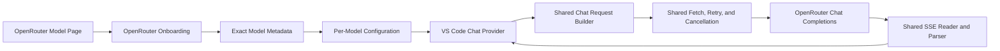

# OpenRouter First-Class Backend Plan

**Status:** Implementation ready; production work not started
**Date:** 2026-08-16

## Goal

Let a user select OpenRouter, paste a model slug or model-page URL, and chat with correct limits, capabilities, errors, and cost reporting without editing JSON.

This is a focused fifth-backend integration, not a transport rewrite.

## Architecture Decisions

- Use OpenAI Chat Completions. OpenRouter already matches the extension's message, tool, SSE, cancellation, and usage pipeline.
- Keep every model self-contained: backend, URL, wire model ID, headers, parameters, modes, and rates remain per-model. There are no global credentials or server settings.
- Add one OpenRouter-specific control-plane helper for input parsing and exact model metadata. Widen the existing context resolver to return runtime limits; keep the shared chat client.
- Do **not** extract a backend registry now. The current switches are small and already express real differences. Revisit only when another backend adds repeated behavior that cannot stay in those existing boundaries.
- Keep the runtime request body unchanged unless a contract test proves a difference. Current OpenRouter Chat supports `max_tokens`; the existing non-vLLM path already removes vLLM-only continuation flags.
- Use OpenRouter's website for catalog browsing and its public exact-model API for validation. Do not recreate the catalog UI or copy catalog data into presets.
- Keep credentials in per-model `requestHeaders`. They remain plaintext user settings and must never reach logs or webview state.
- Reuse the current fetch/retry, `eventsource-parser`, SSE parser, malformed-JSON recovery, and message converter. Do not add `@openrouter/sdk` for one metadata GET.
- Defer Responses and the Agent SDK. Copilot owns the agent loop; Responses is a separate item/event protocol and should be added only for a concrete user-facing capability.

## Target Architecture



The only vendor-specific path is onboarding and metadata normalization. Chat requests and responses continue through the same data plane as the existing OpenAI-compatible backends.

---

## Verified API Contract

The source of truth is OpenRouter's current OpenAPI specification and official documentation. Decode responses permissively because fields and enum values can be added within `v1`.

| Endpoint | Use |
|---|---|
| `POST /api/v1/chat/completions` | Shared chat data plane |
| `GET /api/v1/model/{author}/{slug}` | Public exact-model lookup for onboarding and refresh — **singular `model`**, unauthenticated, returns `{ "data": { ...model fields... } }` (verified live) |
| `GET /api/v1/generation?id=...` | Optional post-hoc generation diagnostics |
| `GET /api/v1/key` | Optional key-limit diagnostics |
| `POST /api/v1/responses` | Deferred separate protocol |

`serverUrl = https://openrouter.ai/api` composes correctly with the existing `buildEndpoint()` helper.

The existing Chat body is compatible. OpenRouter documents `max_tokens`, standard OpenAI messages and tools, reasoning fields, routing controls, and plugins. Do not translate or strip fields specifically for OpenRouter unless a contract test demonstrates a rejection.

The exact-model response is normalized as follows:

- Unwrap the top-level `data` object; ignore unknown fields and invalid optional numbers.
- Keep the requested slug as the wire ID, including aliases and variants (`:free`, `~latest`, dated `canonical_slug`).
- Require a positive `context_length`; use `top_provider.context_length` only as fallback. Reject dynamic routers without a fixed context instead of inventing a budget.
- Compute the output ceiling from the smallest positive value among `top_provider.max_completion_tokens`, `per_request_limits.completion_tokens`, and the context-window safety bound.
- Derive tools, image input, reasoning modes, defaults, and estimated per-million USD rates from the returned model fields. Ignore unknown fields and invalid optional numbers.
- Treat `usage.cost` as the authoritative request charge; catalog pricing is only an estimate.

Streaming already matches the shared parser: keep-alive comments, `[DONE]`, reasoning/content/tool deltas, an empty-choice final usage chunk, and top-level mid-stream errors. Preserve `error.metadata.error_type`, honor bounded `Retry-After` on pre-stream 429/503 responses, never retry after partial output, and retain `X-Generation-Id` for redacted diagnostics.

## Reuse Decision

Reuse OpenRouter's model pages, API, OpenAPI contract, and this repository's fetch/SSE/message stack. The official TypeScript SDK is Apache-2.0 and legally usable, but the audited package duplicates transport, retries, SSE parsing, and validation for one GET in an unbundled extension. Reconsider it only if it replaces a complete subsystem; do not copy generated SDK source.

Responses remains a future sibling protocol with its own converter and parser. The Agent SDK remains out because Copilot owns tool execution, approvals, and conversation state.

---

## Minimal Change Set

### Security First

Fix two existing credential-boundary problems before adding another authenticated backend:

- `addServerFlow.ts` must not log a complete config containing `requestHeaders`.
- `serverSettingsView.ts` must send a public model projection to the webview, never full `ModelConfig` objects containing headers.
- Update Auth and server grouping must distinguish connections by normalized URL, backend, and the existing deterministic header fingerprint. Two OpenRouter keys at the same URL must remain isolated.

### Configuration And Runtime Limits

- Add `'openrouter'` to `ServerType`, validation, and the package configuration schema.
- Continue using the existing `vllmModelId` field as the wire model ID. Its name is legacy, but adding a second field and migration would create more ambiguity than it removes.
- Evolve the context-only runtime contract into a compact limits result:

```ts
interface RuntimeModelLimits {
  contextWindow: number;
  maxOutputTokens?: number;
}
```

Existing backends return their current context result and no output ceiling. The OpenRouter case calls the exact-model endpoint and returns both limits. `deriveTokenBudget()` clamps the configured output preference to the reported ceiling, preserving at least one input token. This is the only shared contract change required.

### OpenRouter Control Plane

Keep OpenRouter-specific parsing and normalization in one small module:

- Accept `author/model`, `author/model:variant`, `~author/family-latest`, or a verified `https://openrouter.ai/...` model-page URL.
- Ignore query strings, fragments, and a trailing slash on verified OpenRouter URLs. Reject unrelated hosts, reserved paths, and malformed values instead of guessing.
- Fetch `GET /api/v1/model/{author}/{slug}` with each path segment encoded and with the model's optional headers.
- Preserve the requested ID for chat. The exact endpoint already reports current limits, pricing, and capabilities for `~latest` aliases; retain `alias_target` only for confirmation and diagnostics.
- Normalize only fields the existing config consumes: display name, family, capabilities, reasoning modes, default parameters, estimated rates, expiration, and runtime limits.
- Do not add a catalog cache. `VllmClient` remains the sole configuration cache owner.

### Onboarding

Add an explicit OpenRouter branch to the existing Add flow:

1. Open `https://openrouter.ai/models` or continue directly.
2. Paste a slug or model-page URL; clipboard reading happens only after an explicit button press.
3. **Resolve metadata first — the exact-model GET is unauthenticated (verified live), so no key is needed yet.** Show a compact confirmation: requested/canonical ID, limits, capabilities, reasoning modes, rates, and expiration when present.
4. Then prompt for an API key or reuse an existing OpenRouter connection (distinguished by URL + header fingerprint so two keys stay isolated).
5. Save `serverType: 'openrouter'`, `serverUrl: 'https://openrouter.ai/api'`, the requested wire ID, headers, and normalized config fields.

Generic local-server detection remains unchanged. No OpenRouter presets or internal catalog browser are added.

### Chat, Errors, And Diagnostics

- Use the existing request body and non-vLLM continuation behavior unchanged.
- Preserve canonical `error.metadata.error_type` for pre-stream and mid-stream errors; unknown future values remain displayable.
- Extend shared retry handling to honor a bounded `Retry-After` for pre-stream 429/503 responses. Never retry 401, 402, invalid 4xx responses, cancellation, or a stream after partial output.
- Retain `X-Generation-Id` in redacted diagnostics. The current stream path never reads response headers, so this is small net-new plumbing — keep it optional. Router metadata likewise remains optional and cannot be required because cache hits omit it.
- OpenRouter servers will show the dashboard's existing `serverType !== 'vllm'` → "degraded" flag. That is correct (no vLLM metrics exist for OpenRouter); document it so it is not reported as a bug later.

### Exact Cost

- Extend `WireUsage` with optional `cost`, `is_byok`, and cost-detail fields.
- Add the reported-cost field to the usage store **additively first**; only version the store schema if the shape actually has to change. Existing v1/v2 token records must migrate unchanged with no fabricated actual cost.
- Store reported actual USD separately from token-derived estimates. Prefer actual cost when present and never add actual and estimated values together.
- Preserve the current configured-rate behavior for vLLM and responses without `usage.cost`.

## Delivery

Ship two reviewable changes:

1. **Core OpenRouter support:** credential-boundary fixes, config/schema support, runtime limits, exact metadata, onboarding, chat/error fixtures, and estimated rates.
2. **Exact cost and documentation:** usage-store migration, reported-cost UI, diagnostics, README/configuration/usage docs, and changelog.

Do not rename `VllmClient`, add a backend registry, or reorganize existing backends as part of this work. Those changes do not help the OpenRouter user path.

## Focused Tests

- Existing backend request snapshots and tests remain unchanged.
- Exact lookup normalizes context, both output-cap fields, capabilities, modes, and rates; malformed optional values stay undefined rather than becoming `NaN`.
- Slugs, page URLs, aliases, and variants round-trip to the requested wire ID; invalid hosts and paths are rejected.
- Dynamic routers without a fixed context fail with an actionable message.
- OpenRouter streams cover comments, reasoning, content, tool calls, usage-only final chunks, `[DONE]`, pre-stream errors, and mid-stream errors.
- Cancellation aborts immediately; 429/503 honor bounded `Retry-After`; auth, payment, and partial-output failures are not retried.
- Header values appear in neither output/file logs nor webview messages; same-URL credentials remain separate.
- Actual cost survives reload, BYOK/missing-cost responses do not invent charges, and estimates are never double-counted.
- `npm run compile`, `npm run test:typecheck`, `npm test`, and `npm run validate-webview-js` pass.

## Acceptance Criteria

- A user can add and chat with an OpenRouter model without editing JSON.
- OpenRouter limits and capabilities come from its exact model API.
- The existing Chat Completions transport and SSE pipeline serve OpenRouter without a fork.
- Per-model credentials remain isolated and never leave trusted extension code.
- Existing vLLM, LM Studio, llama.cpp, and Ollama behavior remains compatible.
- Actual OpenRouter cost is recorded when supplied; configured rates remain estimates.
- Responses and agent orchestration remain out of scope.

## Product Defaults

- Do not send `HTTP-Referer`, `X-OpenRouter-Title`, or `X-OpenRouter-Categories` automatically. Users may add them in per-model headers.
- Leave provider data policy controlled by the user's OpenRouter account and request parameters; do not silently force ZDR or data-collection filters.
- Leave `X-OpenRouter-Metadata` disabled by default. Users may opt in through per-model headers.
- Do not send `session_id` until VS Code exposes a stable, appropriate conversation identifier.
